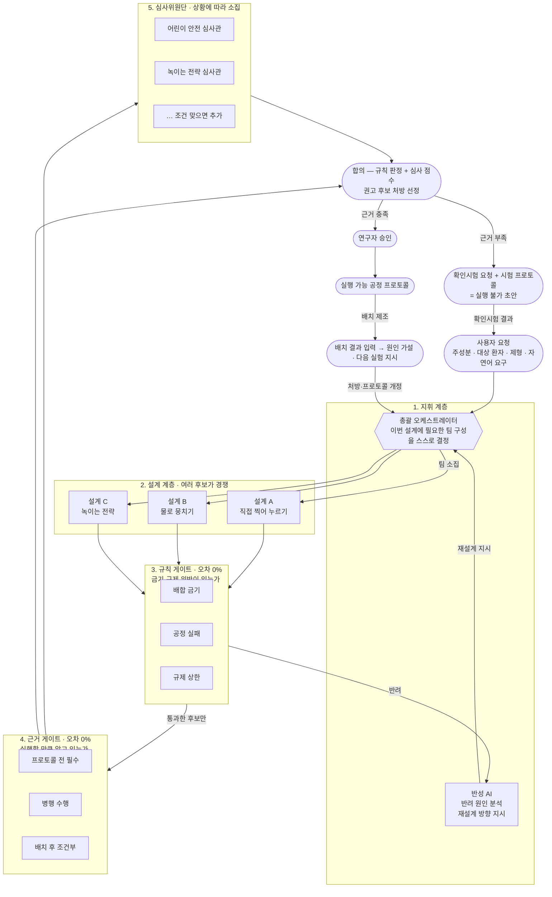

# Formula 1 — 실패를 미리 겪어보는 AI 제형 설계 시스템

> 약을 실제로 만들어 보기 전에, 여러 AI가 서로 견제하며 "이 처방은 왜 실패할지"를 미리 찾아내고 스스로 고쳐 나가는 시스템입니다.
>
> 제4회 인공지능 신약개발 경진대회 출품작 · 팀 **Formula 1**

**바로 써 보기 → <https://zihwan.com/formula1>**

---

## 한눈에 보기

분자식을 넣으면 컴퓨터가 그 분자의 작용기를 계산하고, 처방을 만들기 전에 이 약이 어떤 부류인지부터 정합니다(BCS/DCS 용해도·투과도, 고체상, 가용화 전략 필요 여부, ASD 공정). 그다음 출처가 붙은 규칙표들이 정해진 순서대로 처방을 검사합니다. 검사를 통과한 처방만 상황에 맞게 불려 온 AI 심사관이 순위를 매기고, 반려되면 AI가 이유를 읽고 다시 설계합니다.

그다음이 이 시스템의 두 번째 축입니다. **값을 모른다고 멈추지 않습니다.** 계산값 → 예측식(ESOL·GSE 등) → 실측값 3단계 중 있는 것까지만 쓰고, 실측이 없으면 후보에 "잠정(provisional)" 표시를 단 채로 그대로 진행합니다. 판정이 실제로 갈리는 지점에서만 구체적인 실측을 요청하고(**절대 그래프를 막지 않습니다**), 값이 들어오면 처음부터 다시 돌리는 대신 필요한 만큼만 다시 계산합니다 — 전략 집합이 그대로면 신뢰도만, 바뀌면 그때만 새로 생성합니다.

**후보 목록 다음도 있습니다(2026-09-24, v6.1).** 연구자가 후보 하나를 고르면 그 처방이 불변 Handoff로 고정되고, 별도의 **개발 스튜디오**가 CQA 계약 → FMEA → 요인·수준 → DoE 설계 → 결과 입력 → 모델 진단 → 불확실성을 반영한 잠정 design space → 독립 확인배치까지 이어 가서 **VERIFIED 운전 영역과 그 성립 조건**을 냅니다. 숫자는 결정론 통계 엔진이, 판정은 새 룰북(171개 규칙)이, 승인은 연구자가 합니다 — [15장](#15-후보-이후--개발-스튜디오-v61).

이 전 과정이 웹 화면에서 실시간으로 보이고, **API 키 없이도 전부 동작합니다.** (이전 버전에 있었던 근거 게이트 승인·배치 등록·AI 진단으로 이어지는 장기 실행 워크플로는 이번 v3 개편으로 범위 밖으로 빠졌습니다 — 코드는 지우지 않고 보존했습니다. 자세한 내용은 [4장](#4-전체-흐름--게이트-둘-루프-둘) 끝에 있습니다.)

## 목차

1. [무엇이 문제인가](#1-무엇이-문제인가)
2. [챗봇에게 맡기면 안 되는 이유](#2-챗봇에게-맡기면-안-되는-이유)
3. [핵심 아이디어 — 창의는 AI가, 검증은 규칙이](#3-핵심-아이디어--창의는-ai가-검증은-규칙이)
4. [전체 흐름 — 게이트 둘, 루프 둘](#4-전체-흐름--게이트-둘-루프-둘)
5. [입구 — 분자 구조부터 계산한다](#5-입구--분자-구조부터-계산한다)
6. [검사에는 순서가 있다](#6-검사에는-순서가-있다)
7. [실제로 이렇게 돕니다 (시연 시나리오 3개)](#7-실제로-이렇게-돕니다)
8. [실행 전의 절반 — 알고 있어야 실행할 수 있다](#8-실행-전의-절반--알고-있어야-실행할-수-있다)
9. [만든 뒤의 절반 — 다음 실험을 지시한다](#9-만든-뒤의-절반--다음-실험을-지시한다)
10. [우리가 쓴 룰북](#10-우리가-쓴-룰북)
11. [이 시스템의 차별점](#11-이-시스템의-차별점)
12. [기술 구조](#12-기술-구조-개발자용)
13. [직접 실행해 보기](#13-직접-실행해-보기)
14. [현재 상태와 남은 일](#14-현재-상태와-남은-일)
15. [후보 이후 — 개발 스튜디오 (v6.1)](#15-후보-이후--개발-스튜디오-v61)

---

## 1. 무엇이 문제인가

새로운 약 하나를 세상에 내놓기까지 보통 10년이 넘게, 수조 원이 듭니다. 그런데 이 과정이 "약효 성분을 찾는 일"로 끝나지 않습니다. 약효를 내는 주성분을 찾았더라도 사람이 삼킬 수 있는 형태 — 알약, 캡슐, 시럽 — 로 만들어야 비로소 약이 됩니다. 이 단계를 **제형 설계**라고 부릅니다.

문제는 주성분 하나로는 알약이 굳지 않는다는 점입니다. 그래서 여러 첨가제를 섞는데, 바로 그 조합에서 사고가 납니다.

| 사고 유형 | 무슨 일이 생기나 |
|---|---|
| 화학적 충돌 | 주성분과 첨가제가 반응해 약이 갈색으로 변하거나 분해된다 |
| 공정 실패 | 가루를 눌러 알약으로 찍을 때 부서지거나 기계에 들러붙는다 |
| 규제 초과 | 나라마다 정한 첨가제 상한을 넘긴다. 어린이용은 기준이 훨씬 엄격하다 |

지금까지 제약 현장은 이걸 **실험실에서 직접 만들어 보고, 실패하면 다시 설계하는** 방식으로 풀었습니다. 한 번 실험에 드는 시간과 비용이 크고, 그 시행착오를 수십 번 반복합니다. 이 값비싼 시행착오를 실험실이 아니라 **컴퓨터 안에서 미리 끝내자**는 것이 이 프로젝트의 출발점입니다.

## 2. 챗봇에게 맡기면 안 되는 이유

"AI가 똑똑하니 좋은 처방을 물어보면 되지 않나?" 여기에 함정이 있습니다.

거대언어모델은 말을 아주 그럴듯하게 합니다. 그런데 그럴듯한 것과 실제로 맞는 것은 다릅니다. 이런 AI는 **없는 사실을 자신 있게 지어내는 일(환각)** 이 있습니다. 일어나지 않는 화학 반응을 매끄럽게 설명하고, 만들 수 없는 처방을 태연히 제시하며, 심지어 규제 수치까지 지어냅니다. "이 첨가제는 15mg까지 괜찮다"고 단언하지만 실제 기준은 10mg일 수 있습니다.

제약에서 이런 실수는 곧 제품 폐기와 허가 반려입니다. 그래서 이 분야에는 "그럴듯함"이 아니라 **"확실히 맞음"** 이 필요합니다.

## 3. 핵심 아이디어 — 창의는 AI가, 검증은 규칙이

그래서 역할을 둘로 나눴습니다.

> **새로운 처방을 상상하고 만드는 일은 AI에게,
> 그것이 맞는지 검사하는 일은 절대 틀리지 않는 규칙에게 맡긴다.**

이렇게 나누는 이유가 분명합니다. 첨가제와 공정 조건의 조합은 사실상 천문학적입니다. 이 넓은 공간에서 쓸 만한 후보를 상상하고, 서로 부딪히는 목표(안정성·복용 편의·생산 단가·규제 통과) 사이에서 타협점을 찾고, 규칙집에 없는 새로운 상황까지 판단하는 일은 규칙만으로는 못 합니다. AI가 잘하는 일입니다.

반대로 "이 첨가제가 어린이 상한을 넘는가" 같은 판단은 계산기처럼 언제나 똑같이 내려야 합니다. 여기에 AI의 추측이 끼어들면 위험해집니다.

| 성격 | 예시 | 담당 |
|---|---|---|
| 숫자로 답이 떨어지는 것 | "이 첨가제가 10mg 이하인가" | 규칙 기반 검사기 (계산) |
| 맥락을 읽어야 하는 것 | "이 조합이 어린이가 먹기에 자연스러운가" | 심사 AI (판단) |

규칙은 "이건 틀렸어"까지만 말할 수 있고 새로운 답을 만들지는 못합니다. 둘은 경쟁이 아니라 서로의 빈틈을 메우는 **역할 분담**입니다.

## 4. 전체 흐름 — 게이트 둘, 루프 둘

가장 큰 특징은 **AI 구성이 고정돼 있지 않다**는 점입니다. 미리 정해 둔 AI를 매번 똑같이 돌리는 게 아니라, 요청이 들어올 때마다 그 상황에 필요한 전문가를 그때그때 불러 팀을 새로 꾸립니다. 어린이용 약이면 어린이 안전을 볼 심사관을, 잘 녹지 않는 약이면 녹이는 전략을 볼 심사관을 부르는 식입니다.



**지휘 계층**이 요청을 읽고 어떤 전문가 팀이 필요한지 정합니다. 검증이 실패로 끝나면 반성 AI가 원인을 짚어 다시 설계하도록 되돌립니다.

**설계 계층**은 초안을 하나만 만들지 않습니다. 서로 다른 전략으로 후보를 동시에 만들어 경쟁시키고, 검증을 가장 잘 통과한 후보가 살아남습니다.

**검증은 게이트 두 개로 나뉩니다.** 이 분리가 이 시스템의 뼈대입니다.

| 게이트 | 묻는 것 | 통과의 뜻 | 못 통과하면 |
|---|---|---|---|
| 규칙 게이트 | 지금 아는 정보 안에 금기·규제 위반이 있는가 | 명시적 위반을 **발견하지 못했다** | **반려** → 재설계 |
| 근거 게이트 | 그 전략을 실행할 만큼 실제로 알고 있는가 | 선행 근거가 확보돼 있다 | **보류** → 확인시험 먼저 |

규칙 게이트를 통과했다는 것은 "안전이 확정됐다"가 아닙니다. 신약 주성분은 애초에 자료 자체가 없어서 위반이 잡히지 않는 경우가 많습니다 — 수분·열 안정성도 모르는 주성분에 "물로 뭉치기" 공정을 그대로 내보내면, 그 프로토콜은 검증된 것이 아니라 **모르는 것을 모른 채 지나간 것**입니다. 그래서 판정을 하나 더 두고, 이 게이트에는 **반려 권한 대신 보류 권한**을 줬습니다. 자세한 내용은 [8장](#8-실행-전의-절반--알고-있어야-실행할-수-있다)에 있습니다.

**심사위원단**은 맥락을 읽어야 하는 부분을 담당하되 **반려 권한이 없습니다** — 점수는 통과한 후보들 사이의 순위 결정에만 씁니다.

**되먹임도 두 개입니다.** 확인시험 결과는 입력·근거 계층으로 돌아가고(실행 전), 배치 결과는 설계·프로토콜 개정으로 돌아갑니다(실행 후). 돌아가는 곳이 다르므로 화면의 입력창도 둘로 나눠 두었습니다.

### 심사관은 고정 명단이 없습니다

명단에 여섯 명이 등록돼 있고, 조건이 맞는 사람만 그 자리에서 만들어집니다.

| 심사관 | 소집 조건 |
|---|---|
| 어린이 안전 | 대상이 어린이일 때 |
| 녹이는 전략 | 잘 녹지 않는 약이거나 코팅이 필요할 때 |
| 공정 실현성 | 항상 |
| 규제 취지 | 숫자로 못 끊은 규제 판단이 남았을 때 |
| 문헌 조사 | 룰북이 모르는 성분이 처방에 있을 때 |
| 고령자 안전 | 대상이 고령자일 때 |

어린이용 요청에서는 어린이 안전 심사관이 들어오고 고령자 심사관은 **아예 만들어지지 않습니다.** 요청을 고령자용으로 바꾸면 반대가 됩니다.

### v3 업데이트 (2026-09-18) — 처방을 만들기 전에 분류부터, 그리고 출력 경계는 후보 목록에서 끝난다

위 다이어그램과 [8장](#8-실행-전의-절반--알고-있어야-실행할-수-있다)·[9장](#9-만든-뒤의-절반--다음-실험을-지시한다)은 이 프로젝트가 대회 출품 이후 실제로 구축했던 **v2 설계**(근거 게이트 → 연구자 승인 → 배치 등록 → 결과 판정 → AI 진단 → 원인 확정까지 이어지는 장기 실행 워크플로)를 그대로 서술합니다. v3 설계 문서는 이 시스템이 답해야 할 질문을 다시 정의했습니다 — **"이 약을 어떻게 분류하고, 어떤 전략 후보를 낼 것인가"**까지가 범위이고, 처방이 나온 뒤의 승인·제조·진단 워크플로는 범위 밖입니다. 그래서 이번 배포부터:

- **설계 계층(②) 앞에 페이즈 게이트가 새로 들어갑니다.** 후보를 만들기 전에 RDKit 계산값(D0·SLAD·Tg 여유 등)을 전부 채우고, BCS/DCS 용해도·투과도 분류 → 고체상(결정형/무정형) → 가용화 전략 필요 여부 → ASD 공정 신호를 순서대로 판정합니다. 이 판정은 **계산값 → 예측식(ESOL·GSE 등) → 실측값** 3단계 중 있는 것까지만 쓰고, 실측이 없으면 "잠정(provisional)"이라고 표시한 채 그대로 진행합니다(반려 권한 없음 — 전략 후보의 범위만 좁히거나 넓힙니다).
- **근거 게이트·연구자 승인·배치 등록·배치 결과·AI 진단(8·9장 전부)은 이번 배포에서 껐습니다.** 코드는 지우지 않고 주석 처리로 남겨 두었습니다(`formula/lifecycle/`, `formula/evidence/gate.py` 사용부, `web/server.py`의 `/api/projects/*`·`/api/runs/{id}/confirmation`·`/approve`·`/wetlab`) — 필요해지면 그대로 되살릴 수 있습니다.
- **대신 lab-in-the-loop의 의미가 바뀌었습니다.** v2에서는 "배치를 만들고 실험 결과를 읽어 다음 실험을 지시하는" 사후 루프였다면, v3에서는 **"값을 몰라도 후보부터 내고, 전략이 실제로 갈리는 지점의 값만 되묻는"** 설계 이전 루프입니다. 이 요청은 그래프를 절대 막지 않습니다(불변식 `pending_narrow`/`pending_refinements`는 항상 진행) — 값이 들어오면 `POST /api/runs/{id}/measurements`가 그래프를 처음부터 다시 돌리는 대신, 전략 집합(`plan_signature`)이 그대로면 신뢰도만 다시 계산하고(LLM 호출 0회), 전략 집합 자체가 바뀔 때만 새로 생성합니다. 그 결과 각 후보는 `confidence: grounded | provisional`과 `pending_refinements`(아직 못 채운 요청 목록)를 달고 나옵니다.
- **출력 경계가 "권고 후보 처방 목록"에서 끝납니다.** 위 다이어그램의 합의(CO) 이후 화살표 — 확인시험 요청/연구자 승인/배치 제조/원인 가설 — 는 지금 라이브 화면에는 없습니다. 화면·시연 시나리오는 이 경계에 맞춰 다시 구성했습니다([7장](#7-실제로-이렇게-돕니다)).

## 5. 입구 — 분자 구조부터 계산한다

검사를 시작하려면 "이 약이 어떤 작용기를 가졌는가"를 먼저 알아야 합니다. 유당이 위험한지 아닌지는 약에 아민기가 있느냐에 달려 있기 때문입니다. 이걸 사람이 손으로 적으면 틀립니다. 실제로 이 프로젝트의 초기 데모가 그렇게 틀렸습니다.

입력 단계는 다섯 갈래로 나뉩니다.

```
분자식 (SMILES)
   │
   ├─ 1. 구조 품질 검사    파싱·염·전하·입체중심이 온전한가
   ├─ 2. 분자 특성값 계산   35종 (분자량 · 극성표면적 · 수소결합 밀도 …)
   ├─ 3. 구조 패턴 검출     82종 (아민 · 가수분해 · 산화 · 광분해 …)
   ├─ 4. 물성 예측         용해도·투과도 → BCS 등급 (교차검증)
   └─ 5. 문헌 조사         PubChem 식별정보 + 제형·안정성 논문
```

### 구조 패턴 82종 — 무엇이 있고 무엇이 위험한가를 나눕니다

기준서(v1.1)에 맞춰 구조 패턴을 82종으로 넓혔습니다. 핵심은 개수가 아니라 **판정을 세 등급으로 나눈 것**입니다.

| 등급 | 뜻 | 개수 | 허용되는 해석 |
|---|---|---|---|
| 구조 사실 | 이 작용기가 있다 | 18 | 존재 확인까지만 |
| 조건부 경고 | 조건이 맞으면 위험해질 수 있다 | 52 | 조건과 시험을 찾아본다 |
| 높은 경고 | 구조만으로도 주의가 큰 부위 | 12 | 그래도 단독으로 공정을 배제하지 않는다 |

**"조건"이 무엇인지도 함께 저장합니다.** 예를 들어 에스터가 검출되면 "가수분해 가능"이라고만 하지 않고, 그것이 위험이 되려면 무엇이 필요한지(수분·pH·온도·시간)와 무엇으로 확인할 수 있는지(pH·온도별 수계 스트레스 시험)를 같이 답니다. 구조 하나로 결론을 내지 않겠다는 원칙이 데이터 구조에 박혀 있는 셈입니다.

분야별로는 질소·아민 18종, 니트로사민 7종, 산과 염기 8종, 가수분해 14종, 산화 10종, 반응성 8종, 금속 결합 6종, 광분해 10종, 고체 특성 1종입니다.

### 세분화하면서도 기존 판정을 깨지 않았습니다

기준서는 아민을 `1차 지방족`·`2차 지방족`·`3차 지방족`·`방향족`으로 나누라고 요구합니다. 그런데 배합 금기 규칙표는 여전히 `primary_amine`·`secondary_amine`이라는 이름으로 연결돼 있습니다.

그래서 패턴 목록에 "이 패턴은 규칙표의 어느 이름과 연결되는가"를 적는 칸을 두었습니다. 화면에는 세분화된 이름이 나오고, 규칙표와는 기존 이름으로 연결됩니다. 테스트가 이걸 고정합니다.

### 고리 크기까지 봅니다

같은 패턴이라도 고리 크기에 따라 위험이 다릅니다. 4각 고리 β-lactam은 구조적 긴장 때문에 훨씬 불안정한데, 5각 γ-lactam은 평범한 고리 아미드입니다. 패턴만으로는 둘이 구분되지 않아서 **고리 정보를 후처리로 봅니다.**

```
2-azetidinone (4각)  → β-lactam · 높은 경고
2-pyrrolidone (5각)  → γ-lactam · 구조 사실
아목시실린           → β-lactam 검출 → 안정성 시험이 자동으로 필수 등급이 됨
```

### 구조 패턴을 화면에서 직접 검사할 수 있습니다

판정을 믿으려면 "그 패턴이 정말 이 분자에 있는가"를 사람이 확인할 수 있어야 합니다.

- 규칙표가 쓰는 패턴을 버튼으로 제공하고, 각 패턴이 **어떤 규칙을 발동시키는지** 함께 보여줍니다
- 직접 쓴 패턴도 대 볼 수 있고, 맞은 부분이 구조 그림에 강조됩니다
- 염은 판정 계층과 똑같이 **본체를 추출한 뒤** 매칭합니다

### 예측값은 두 모델로 교차검증하고, 불일치 자체를 신호로 씁니다

용해도 예측은 특히 불확실합니다. 그래서 단일 모델의 점 추정값을 믿는 대신 **두 모델의 예측이 얼마나 벌어지는지**를 봅니다.

```
두 모델의 용해도 예측 차이 ≥ 1 log  →  예측을 신뢰하지 않음
                                    →  실험 용해도 측정을 "필수" 시험으로 올림
```

예측 모델이 아직 연결되지 않은 상태에서는 **숫자를 지어내지 않습니다.** "미연결"이라고 표시하고, 그것도 자료 요청으로 이어집니다. 자료가 없다는 것은 안전하다는 뜻이 아니기 때문입니다.

용해도와 투과도가 모두 있으면 **BCS 등급**을 도출해 이후 전략 선택(녹이는 전략이 필요한가)이 참조합니다. 이것도 예측 기반 사전 분류이며 규제 판정을 대체하지 않는다고 화면에 명시합니다.

### 구조 경고가 시험 등급을 올립니다

지금까지 확인시험 목록은 모든 고형 경구 약에 대해 고정이었습니다. 그러면 에스터를 가진 약과 안 가진 약이 같은 시험을 받습니다 — 구조를 계산해 놓고 그 결과를 시험 선택에 쓰지 않는 셈입니다.

이제 구조 경고가 등급을 **자동으로 올립니다.**

| 검출된 구조 | 올라가는 시험 | 권장 → 필수 |
|---|---|---|
| 가수분해 가능 부위 | 소규모 stress stability | ✓ |
| 수분 반응성 부위 | 축약 수분 민감성 시험 | ✓ |
| 광분해 우선순위 신호 | 광안정성 (ICH Q1B) | ✓ |
| 아민 | 부형제 배합적합성 시험 | ✓ |
| 니트로사민 전구체 | NDSRI 위험평가 | 신규 추가 |
| 고반응성 부위 | ICH M7 변이원성 평가 | 신규 추가 |

무엇이 왜 올라갔는지도 함께 표시합니다. 투여경로가 고형 경구가 아니면 고체 특성화 시험(XRPD 등)의 비중을 낮춥니다.

### 이미 아는 실측값은 처음부터 넣을 수 있습니다 (선택)

빈칸으로 두면 시스템은 그 값을 **모른다고 판정하고 확인시험을 먼저 요청**합니다. 이미 측정한 값이 있다면 첫 화면의 **실험 데이터 입력**에 넣으면 되고, 그만큼 선행 시험이 줄어듭니다.

| 넣는 값 | 무엇이 달라지나 |
|---|---|
| 안식각 · 압축성 지수 · Hausner 비 | 유동성 등급이 실측으로 산출되어 **공정 경로 결정**이 바뀝니다 |
| 용량/용해도 부피 · 흡수율 | BCS 등급이 **실측 기반**으로 확정됩니다(예측 등급은 확정으로 쓰지 않습니다) |
| 실험 용해도 · 수계 잔존율 · 시험 완료 여부 | 해당 **선행 확인시험 요구가 충족**됩니다 |
| 흡습성 · 광분해 · 열/수분 민감 | 포장 규칙과 경로 규칙(RTE004·RTE005)이 발동합니다 |

두 가지 원칙이 여기에 걸려 있습니다. **실측값은 추정보다 우선**하므로 RDKit 계산값이 사용자 입력을 덮어쓰지 않고, 목록에 없는 이름은 **받지 않습니다** — 이 값들은 규칙 조건식이 평가되는 문맥에 그대로 합쳐지기 때문에, 임의 키를 허용하면 판정 문맥 자체를 바꿀 수 있습니다.

### 문헌 조사

설계를 시작하기 전에 이 약물에 대해 이미 알려진 것을 모읍니다. **PubChem**에서 식별정보와 보고된 물성을, **Europe PMC**에서 제형·안정성 논문을 가져옵니다. 둘 다 공개 데이터베이스이고 인증 키가 필요 없습니다. 결과가 없으면 없다고 표시하고 넘어갑니다.

## 6. 검사에는 순서가 있다

규칙표를 아무 순서로나 돌릴 수 없습니다. "직접 찍어 누르기 규칙"은 그 공정이 선택된 뒤에야 의미가 있고, 그 선택은 가루가 잘 흐르는지 등급이 나온 뒤에야 가능합니다. 그래서 규칙표마다 순서가 붙어 있고, **앞 단계가 만든 값이 뒷 단계의 발동 조건으로 흘러갑니다.**

```
0  참조 자료         첨가제 목록 · 특성값 정의 · 구조 패턴 정의
5  주성분 특성 경고   경고 구간 판단
10 가루 흐름 등급     안식각 48도 ──→ 흐름 "나쁨"
11 공정 경로 결정              └─→ 직접 찍어 누르기 배제
20 배합 금기 (1대1)  ← 성분 자체를 바꿔야 하는 반려라 앞에 온다
21 어린이 안전 상한
22 색소 · 향료
30 여러 성분 상호작용
40 선택된 공정의 세부 규칙  ← 위에서 정한 공정을 참조
45 첨가제 배합비
50 코팅 · 잔류용매
60 녹는 정도 분류 → 전략
70 포장 · 안정성 · 분석법
```

폴더 번호만 보면 규제가 마지막 같지만, 실제로는 **어린이 안전이 21번으로 앞에서 돕니다.** 값 몇 개를 조정해서 해결되는 문제가 아니라 성분 자체를 바꿔야 하는 반려라, 무거운 공정 계산을 하기 전에 먼저 걸러내는 편이 낫기 때문입니다.

## 7. 실제로 이렇게 돕니다

화면 위쪽의 **시연 시나리오** 버튼을 누르면 바로 실행되고, 실행되는 동안 오른쪽에 "지금 어느 계층이 무엇을 왜 하는지" 해설이 단계별로 뜹니다. 세 가지 모두 실제로 돌려서 어떤 경로를 밟는지 확인한 것입니다.

### 시나리오 1 · 규칙이 AI를 막는 순간 (약 1분)

현장 사정 때문에 **유당을 반드시 써야 한다**고 못 박고 어린이용 플루옥세틴 정제를 요청합니다. 설계 AI는 그 제약을 지키고, 규칙표가 막습니다.

```
[구조]   플루옥세틴 → 2차 아민 검출
[설계]   제약대로 유당을 넣은 처방 생성
[규칙]   INC002 반려 — 2차 아민이 유당과 반응해 갈변
         규칙표가 제시한 대안: 만니톨
[판정]   이 제약을 유지하는 한 통과하는 처방이 없다
```

여기서 중요한 건 마지막 줄입니다. "유당을 빼라"는 재설계 지시와 "유당을 반드시 넣어라"는 제약이 서로 부딪히므로, 시스템은 헛되게 다시 설계하지 않고 **제약 자체가 불가능하다는 결론과 대체 첨가제를 냅니다.** 연구자가 들어야 할 답은 "다시 설계했다"가 아니라 "이건 안 되고 대신 이걸 쓰라"입니다.

### 시나리오 2 · 요청에 따라 팀이 바뀐다 (약 2분)

어린이용 바나나향 아세트아미노펜 정제를 요청합니다. 대상이 어린이라서 어린이 안전 심사관이 생성되고, 명단의 다른 심사관들은 조건에 맞지 않아 만들어지지 않습니다. 아세트아미노펜이 아미드라서 유당 금기에 걸리지 않는 것도 왼쪽 구조 플래그에서 함께 확인됩니다.

### 시나리오 3 · 값을 몰라도 후보부터, 갈리는 지점만 되묻는다 (약 1~2분)

성인용 이부프로펜 정제를 요청합니다(1회 투여 200mg을 미리 넣어 둡니다 — dose_mg가 있어야 DCS 분류에 필요한 용량–용해도 비를 계산할 수 있습니다). 설계가 끝나면 페이즈 게이트가 계산 가능한 값을 전부 채우고 BCS/DCS·고체상·가용화 신호를 판정해 **후보를 먼저 냅니다.** 값이 없다고 멈추지 않습니다. 판정이 실제로 갈리는 지점(예: 결정형·녹는점을 모름)에서만 화면의 **데이터 요청** 패널에 구체적 실측을 요청하고, 시연은 그중 하나에 예시값을 자동으로 넣어 제출합니다. 그래프를 다시 돌리지 않고 그 자리에서 재계산돼, 남은 요청이 줄고 후보의 신뢰도 태그(`grounded`/`provisional`)가 갱신되는 것을 볼 수 있습니다 — v3 업데이트가 4장 끝에 있습니다.

## 8. 실행 전의 절반 — 알고 있어야 실행할 수 있다

> ⚠️ **v2 설계 · 2026-09-18부터 라이브 화면에서 비활성화.** 이 장이 서술하는 근거 게이트·연구자 승인 워크플로는 v3에서 범위 밖으로 빠졌습니다(코드는 주석 처리로 보존 — [4장](#4-전체-흐름--게이트-둘-루프-둘) 끝의 "v3 업데이트" 항목 참고). "실행할 만큼 아는가"라는 질문 자체는 v3의 페이즈 게이트·데이터 요청으로 형태를 바꿔 이어지고 있습니다.

규칙 게이트를 통과한 처방에 대해 시스템은 질문을 하나 더 던집니다.

> **"금기는 없다. 그런데 이 전략을 실제로 실행할 만큼 알고 있는가?"**

두 질문은 완전히 다릅니다. 규칙표는 *알고 있는 값*에 대해서만 위반을 판정합니다. 값 자체가 없으면 규칙은 아무것도 잡지 못하고, 그 침묵이 "안전하다"로 읽힙니다. 신약 주성분에서는 이게 일상입니다 — 수분 안정성 자료도, 배합적합성 자료도, 실험 용해도도 없는 상태로 개발이 시작되기 때문입니다.

그래서 **근거 충족 게이트(Evidence Readiness Gate)** 를 규칙 게이트 뒤에 둡니다.

```
규칙 게이트   금기가 있는가          → 있으면 반려 (재설계로)
근거 게이트   알고 있는가            → 모르면 보류 (확인시험 먼저)
배치 후 진단  실제로 무엇이 일어났나  → 원인 가설 · 후속 시험 (9장)
```

### 모든 시험을 먼저 시키지는 않습니다

"확실하지 않으면 다 시험하라"는 안전해 보이지만 개발을 멈춥니다. 그래서 요구를 **선택된 전략에 미치는 영향**으로 세 갈래로 나눕니다.

| 시점 | 뜻 | 출력 |
|---|---|---|
| **프로토콜 전 필수** | 결과가 없으면 전략 자체가 바뀔 수 있다 | 처방 초안 + 확인시험 요청 + 시험 프로토콜. **실행 가능 프로토콜은 내지 않는다** |
| **병행 수행** | 전략은 그대로, 세부 조건 최적화에 필요하다 | 공정 프로토콜 + 병행 시험 + **중단/변경 기준** |
| **배치 후 조건부** | 첫 배치 결과에 따라 필요해진다 | 9장의 lab-in-the-loop이 그대로 담당 |

예를 들어 이런 경우가 "프로토콜 전 필수"입니다.

- 수계로 뭉치는 공정인데 주성분의 **수분·가수분해 안정성** 근거가 없다
- 분해되기 쉬운 부위가 있는데 **강제분해 프로파일**이 없다
- 염 형태 주성분을 물과 함께 쓰는데 **염 전환 위험** 자료가 없다
- 난용성 전략을 골랐는데 **실험 용해도**가 없거나 예측 모델끼리 어긋난다
- BCS 등급이 **예측 기반**이라 전략 판단의 근거가 되지 못한다
- 아민 주성분과 환원당이 같은 처방에 있는데 **배합적합성** 근거가 없다

### 근거 요구도 데이터입니다

이 게이트 역시 코드가 아니라 표로 관리합니다. `evidence_requirements.csv` 한 행이 요구 하나이고, 발동 조건·충족 조건·시점·근거·**어떤 확인시험으로 해결되는지**가 한 줄에 들어 있습니다. 지금 16개 요구가 등록돼 있습니다(선행 7 · 병행 4 · 배치 후 5).

핵심 제약이 하나 있습니다.

> **요구는 실제 확인시험 66종 안의 시험만 가리킬 수 있습니다.**
> 없는 시험을 가리키는 행은 읽는 단계에서 버려집니다.

규칙표에 적용한 "근거 없는 규칙은 실행되지 않는다"를 요구 쪽에도 그대로 적용한 것입니다. 그래서 모든 확인시험 요청에는 방법·측정 변수·판정 기준·ICH/USP 출처가 붙어 나갑니다. "더 알아보세요"가 아니라 "이 시험을 이렇게 하세요"가 됩니다.

### 상태가 셋으로 나뉩니다

| 상태 | 뜻 |
|---|---|
| **실행 불가 초안** | 선행 근거가 비어 있음. 처방과 근거는 보이지만 실행하면 안 됨 |
| **검토용 프로토콜** | 선행 근거 충족. 연구자 검토 대기 |
| **실행 가능 프로토콜** | 연구자가 승인함. 누가 언제 승인했는지 함께 기록 |

**시스템은 스스로 마지막 칸으로 넘어가지 않습니다.** 근거가 다 채워져도 승인은 사람이 합니다. 근거가 빈 상태에서 승인을 요청하면 서버가 거부합니다(409) — 이 게이트가 형식적인 표시로 남지 않도록 코드로 막아 뒀습니다.

### 확인시험 결과는 입력 계층으로 돌아갑니다

연구자가 선행 시험 결과를 넣으면 근거 판정을 **그 자리에서 다시 계산**합니다. 이 계층은 결정론이라 LLM 호출이 한 번도 없고, 같은 입력이면 같은 판정이 나옵니다.

- 결과가 **적합**이면 근거가 채워지고 상태가 "검토용 프로토콜"로 올라갑니다
- 결과가 **부적합**이면 근거가 채워진 게 아니라 **전제가 부정된 것**입니다. 상태는 실행 불가로 유지되고, 그 전략은 배제 대상으로 표시됩니다

수치로 답이 나오는 시험은 그 값이 **입력 계층의 실측값 자리에 그대로 꽂힙니다.** 예를 들어 실험 용해도를 0.12 mg/mL로 넣으면 `solubility_mg_per_ml`이 채워지고, 그 뒤로는 "결과를 제출했으니 충족"이 아니라 **값 자체가 근거**가 됩니다 — 처음부터 그 값을 알고 시작한 경우와 똑같은 상태가 됩니다. "확인시험 결과가 입력 계층으로 돌아간다"는 말이 문장이 아니라 데이터 이동으로 구현된 지점입니다.

이 되먹임은 배치 결과 되먹임과 **돌아가는 곳이 다릅니다.** 확인시험 결과는 "무엇을 아는가"를 바꾸므로 입력·근거 계층으로, 배치 결과는 "무엇이 잘못됐는가"를 알려 주므로 설계·프로토콜 개정으로 갑니다. 그래서 화면의 입력창도 둘로 나뉘어 있습니다.

## 9. 만든 뒤의 절반 — 다음 실험을 지시한다

> ⚠️ **v2 설계 · 2026-09-18부터 라이브 화면에서 비활성화.** 이 장이 서술하는 배치 등록·결과 판정·AI 진단(경쟁 가설) 워크플로도 v3에서 범위 밖으로 빠졌습니다(코드는 주석 처리로 보존 — [4장](#4-전체-흐름--게이트-둘-루프-둘) 끝의 "v3 업데이트" 항목 참고). 지금 화면의 "Lab-in-the-loop"은 이 장이 아니라 v3의 **비차단 데이터 요청**([7장 시나리오 3](#7-실제로-이렇게-돕니다))을 가리킵니다.

8장까지가 **만들기 전**입니다. 근거가 채워지고 연구자가 승인해 실행 가능한 프로토콜이 나가면, 연구자는 벤치에서 배치를 제조합니다. 나머지 절반은 그 뒤에 옵니다.

AI가 결과 데이터를 직접 해석하고 **다음 실험을 지시**하며, 사람은 벤치에서 그 실험을 수행합니다. 사람이 판단의 병목이 아니라 실행 주체로 들어오는 구조입니다. FutureHouse와 옥스퍼드대, 포덤대 연구진이 다중 에이전트 시스템 로빈(Robin)에서 제시한 **lab-in-the-loop** 패러다임을 적용했습니다.

연구자는 실험 노트를 **문장으로** 적어 넣습니다.

> "30분 용출 62%로 목표에 못 미쳤다. 정제 경도는 38N, 마손도 1.2%. 6개월 가속 조건에서 총 불순물이 0.9%까지 올랐고 정제 표면이 약간 갈변했다."

그러면 세 단계가 돌고, **각 단계의 담당이 다릅니다.** 설계 루프와 똑같은 역할 분담입니다.

| 단계 | 담당 | 하는 일 | 지켜야 하는 제약 |
|---|---|---|---|
| 1. 판독 | AI | 문장에서 측정값을 뽑는다 | **문장에 적힌 수치만.** 없는 값은 지어내지 않고, 못 읽은 표현은 못 읽었다고 표시한다 |
| 2. 판정 | 규칙 | 규격 이탈을 계산한다 | 같은 데이터면 항상 같은 해석. AI가 개입하지 않는다 |
| 3. 지시 | AI + 참조 자료 | 다음에 할 실험을 고르고 가설을 세운다 | **후보는 실제 확인시험 66종뿐.** 목록 밖 시험은 화면에 나가기 전에 버려진다 |

위 예시를 넣으면 측정값 4개(용출 62 · 경도 38 · 마손도 1.2 · 불순물 0.9)와 관찰 1건(갈변)을 판독하고, 규칙이 4건 이탈을 판정한 뒤 다음 실험을 지시합니다.

```
가설  고분자 점도가 높아 주성분 방출이 억제되어 30분 용출이 미달하고,
      정제 강도 부족이 마손도 초과로 이어진 것으로 보인다.

1  M9 비교 용출 시험        근거 ICH M9 3.2
2  용출 프로파일 시험       근거 FDA dissolution guidance
3  강제 분해 시험           근거 ICH Q14/Q2
```

**모든 "다음 실험"에 출처가 붙습니다.** 시험 후보를 실제 확인시험 목록으로 묶어 둔 결과이고, 규칙표에 적용한 원칙("근거 없는 규칙은 실행되지 않는다")을 실험 지시에도 똑같이 적용한 것입니다. AI는 **고를 뿐 발명하지 못합니다.**

### 실험은 하루 만에 안 끝난다 — 그래서 시스템이 진행 상황을 기억합니다

여기까지는 "결과를 넣으면 다음 실험을 알려 준다"는 **한 번의 판정**을 설명한 것입니다. 그런데 실제 개발은 한 번으로 끝나지 않습니다. 배치를 승인하고, 실제로 만들고, 시험하고, 결과를 확인하고, 필요하면 원인을 가려낼 추가 시험까지 하는 데 며칠에서 몇 주가 걸립니다. 그동안 서버가 재시작되거나 담당자가 컴퓨터를 바꿔도 **"이 처방은 지금 어느 단계에 있고, 다음에 누가 무엇을 해야 하는지"는 사라지면 안 됩니다.**

그래서 승인·배치 등록·결과 제출·원인 확정 같은 사건을 프로세스 메모리가 아니라 **데이터베이스에 하나씩 순서대로 기록**합니다. 화면에는 그 기록을 읽어 "다음 할 일"을 보여 주는 작업함이 붙습니다. 같은 요청을 실수로 두 번 보내도(예: 버튼을 두 번 눌러도) 기록은 한 번만 반영됩니다 — 요청마다 고유 키를 붙여 중복을 걸러 내기 때문입니다.

```
설계 → 규칙 검증 → 근거 확인 → 프로토콜 작성 → 연구자 승인 → (여기서 며칠~몇 주 경과 가능) →
배치 제조 → 결과 제출 → 연구자가 원자료와 대조해 확정 → 규격 판정
```

### 첫 실패에서는 처방을 바꾸지 않습니다

규격 판정에서 이탈이 나왔을 때 제일 위험한 반응은 "바로 고치는 것"입니다. 예를 들어 **30분 용출이 58%로 목표(80%)에 못 미쳤다**고 합시다. 이 증상 하나만으로는 원인을 알 수 없습니다 — 결합제 점도가 높아 방출이 억제됐을 수도, 붕해가 늦어졌을 수도, 입자가 굵어 표면적이 부족했을 수도 있습니다. 이 중 아무거나 짚어서 처방을 고치면 두 가지가 겹쳐 틀릴 확률이 높습니다: **원인을 잘못 짚을 확률**과 **다음 배치에서도 같은 문제가 반복될 확률**입니다.

그래서 이탈이 확인되면 재설계 대신 이 순서를 강제합니다.

| 단계 | 담당 | 하는 일 |
|---|---|---|
| 1. 결과 확인 | 연구자 | AI가 원자료·자연어에서 옮긴 수치를 사람이 대조해 확정한다. **확정 전 값은 판정에 쓰이지 않는다** |
| 2. 규격 판정 | 결정론 · 후보별 규격 | 이 후보에 지정된 목표와만 비교한다 (다른 제품 기준이 섞이지 않는다) |
| 3. 원인 가설 | AI | 이탈을 설명할 수 있는 후보 원인을 **최대 3개**, 서로 경쟁하는 형태로 제시한다. 이 시점의 가설은 전부 "제안"일 뿐, 어느 것도 처방을 바꿀 권한이 없다 |
| 4. 구별시험 승인 | 연구자 | 가설들을 갈라낼 수 있는 확인시험(66종 목록 안에서만)을 골라 승인한다 |
| 5. 원인 확정 | 연구자 + 시험 결과 | 시험 결과가 가설 하나를 지지할 때만 그 가설이 "원인"이 된다 |
| 6. 재설계 | AI, 확정된 원인만 반영 | 원인 하나에 대응하는 만큼만 처방을 고친다 |

원인이 확정되면 그제야 재설계가 시작되는데, 이때도 **기존 후보를 고쳐 쓰지 않습니다.** 원래 후보(v1)는 "왜 실패했는지"를 보여 주는 기록으로 그대로 남고, 원인 하나만 반영한 **새 버전(v2)**이 부모-자식 관계로 만들어집니다. 그리고 v2는 특별 취급을 받지 않습니다 — 배합금기 게이트도, 근거 충족 게이트도 방금 태어난 신규 후보와 똑같이 처음부터 다시 통과해야 합니다. 국소적인 수정이라고 검증을 건너뛰면, 그 수정이 다른 곳에서 새 금기를 만들었는지 확인할 방법이 없기 때문입니다.

이 6단계 중 **1, 4, 5, 6은 전부 사람이 누르는 버튼입니다.** 시스템이 대신 다음 단계로 넘어가는 지점은 하나도 없습니다.

### 실제로 이렇게 흐릅니다

위 표의 흐름을 실제로 실행해 확인한 경로입니다 (이부프로펜 성인용 속방정 예시).

```
연구자가 프로토콜 승인 → 배치 batch-01 등록 → 벤치에서 제조
→ "30분 용출 58%로 미달. 경도는 65N으로 다소 높음" 결과 제출
→ 연구자가 원자료와 대조해 값 확정
→ 규격 판정: 용출 이탈 확인
→ AI가 가설 제시 (예: "결합제 점도가 높아 방출이 억제됐을 가능성")
    + 이 가설을 가릴 확인시험 후보
→ 연구자가 확인시험 승인 → 시험 수행 → 결과 확정
→ 연구자가 원인 확정
→ 자식 후보(v2) 생성 — 부모(v1)는 그대로 보존
→ v2가 규칙 게이트·근거 게이트를 처음부터 다시 통과
```

### 상태는 열일곱 가지로 나뉘고, 화면은 그중 지금 위치만 보여 줍니다

설계 중 · 규칙 검증 중 · 근거 확인 중 · 선행 근거 대기 · 후보 비교 중 · 프로토콜 보완 필요 · 프로토콜 승인 대기 · 실험 실행 가능 · 배치 결과 대기 · 결과값 사람 확인 대기 · 규격 판정 중 · 실패 원인 진단 중 · 구별시험 결과 대기 · 확인된 원인으로 재설계 · 목표 충족 · **전문가 이관** · **고정 제약 충돌**. 마지막 두 상태가 중요합니다 — 근거 확인 라운드, 배치 반복, 진단 라운드 각각에 별도의 횟수 한도가 있고, 한도를 넘으면 AI가 계속 재시도하는 대신 **사람에게 이관**합니다. 어떤 종류의 실패가 반복되는지 원인별로 구분해 세기 때문에, "왜 막혔는지"를 이관 시점에 바로 알 수 있습니다.

### Robin(FutureHouse)의 프롬프트에서 무엇을, 왜 가져왔는가

**쉽게 말하면 이렇습니다.** "AI에게 어떻게 시키느냐"도 설계의 일부입니다. 예를 들어 "왜 실패했을까?"라고만 물으면 AI는 그럴듯한 답 하나를 만들고, 그 답을 이탈 지표 수만큼 복사해서 마치 여러 이유를 생각한 것처럼 보여줄 수 있습니다 — 실제로 이 시스템이 그랬습니다. 그런데 실험 결과 하나가 나왔을 때 진짜 원인 후보는 보통 여러 개입니다(용출이 낮으면 "결합제가 너무 많아서"일 수도, "붕해가 늦어서"일 수도, "제조 중 오염됐을 수도" 있습니다). 그래서 **"AI에게 서로 다른 이유를 진짜로 여러 개 생각하게 만드는 지시문 작성법"** 을, 마침 그 방법을 공개한 실제 신약개발 AI 연구를 찾아 참고했습니다.

그 연구가 **Robin**입니다. 비영리 연구소 FutureHouse가 만들고 2026년 국제 학술지 **Nature**([논문](https://www.nature.com/articles/s41586-026-10652-y) · [arXiv](https://arxiv.org/abs/2505.13400))에 실린 AI 시스템으로, 사람 개입 없이 가설을 세우고 실험을 제안해서 노년 실명의 주요 원인인 **황반변성 치료 후보 약물(ripasudil)을 실제로 찾아낸** 사례로 유명합니다. FutureHouse는 이 시스템이 AI에게 내리는 지시문(프롬프트) 원문을 통째로 공개했습니다(GitHub `Future-House/robin`, `robin/prompts.py`, 835줄) — 그래서 요약이나 논문 초록이 아니라 **그 원문을 직접 읽고**, 우리 진단·심사·설계 프롬프트에 실제로 반영했습니다. 아래는 아이디어를 어렴풋이 흉내 낸 게 아니라 **문장 단위로 대조하며 가져온 것**만 정리한 표입니다(개발자용 세부 내용이니, 요지만 필요하면 바로 다음 소제목인 "10. 우리가 쓴 룰북"으로 넘어가셔도 됩니다).

| Robin의 프롬프트 패턴 | 원문 근거 | 이 시스템에 적용한 곳 | 적용 전/후 |
|---|---|---|---|
| **"정확히 N개의 *구별되는* 아이디어"를 배열로 강제** | `CANDIDATE_GENERATION_SYSTEM_MESSAGE`가 "Generate exactly {num_candidates} distinct ideas"를 명시하고, 각 후보를 독립된 JSON 객체로 강제 | `formula/feedback/labloop.py`의 진단 가설(`Directive.hypotheses`) | **전**: 가설 문장 하나를 이탈 지표 수만큼 복제해 화면에 뿌렸다(가설이 여러 개처럼 보여도 실제 원인은 하나). **후**: 가설마다 서로 다른 문장 + 그 가설만 가르는 시험을 요구한다. 실제 이부프로펜 시나리오로 확인 — 용출 미달 + 불순물 초과 2개 이탈에 대해 결정형 변화·교차오염·pH 민감성 3~4개의 실제로 다른 가설이 나온다. |
| **"필요 없으면 만들지 않는다"** | `FOLLOWUP_SYSTEM_MESSAGE`: "It is not necessary to propose a follow-up experiment if there is nothing significant to follow up on" | 같은 `Directive` 프롬프트에 "경쟁할 원인이 실제로 하나뿐이면 가설도 하나만 낸다 — 개수를 채우려고 억지로 쪼개지 않는다" | 이탈이 없으면 가설 배열은 비운다. 개수를 채우려고 가짜 원인을 만들지 않는다(3장에서 설명한 "AI는 판정하지 않는다" 원칙과 같은 결의 제약). |
| **명시적으로 우선순위를 매긴 평가 기준** | `CANDIDATE_RANKING_SYSTEM_PROMPT`: "Prioritize your evaluation based on these key criteria..." — 근거 강도(최우선) → 기전 명확성 → 안전성 → 실현 가능성 → 참신성(마지막) 순으로 번호를 매겨 명시 | `formula/agents/judge.py`의 심사관 공통 rubric | 심사관마다 "당신의 도메인 관점에서 평가하라"는 한 줄뿐이던 지시를, 근거 강도 → 잔여 위험 → 실현 가능성 → 참신성(참신함만으로 점수를 올리지 않는다) 순서의 공통 채점 기준으로 바꿨다. Robin은 A/B 두 후보를 직접 비교하지만, 우리 심사관은 후보 하나씩 절대 점수(0.0~1.0)를 매기므로 — 순서 자체는 그대로 가져오되 "비교" 대신 "절대 채점"에 맞춰 옮겼다(아래 "가져오지 않은 것" 참고). |
| **근거로만 판단, 표현으로 판단하지 않는다** | 같은 프롬프트: "based strictly on the presented scientific evidence... not on the persuasive quality or wording" | 같은 judge.py rubric | "표현의 설득력이 아니라 제시된 근거로 판단한다"를 그대로 옮겨 붙였다. |
| **생성 결과가 검색된 근거에 뿌리내리게 한다** | `CANDIDATE_QUERY_GENERATION_*`이 후보 생성 *전에* 문헌 검색 질의를 먼저 만들고, 생성 프롬프트가 그 결과(`{therapeutic_candidate_review_output}`)를 입력으로 받는 2단계 구조 | `formula/agents/generator.py`의 rationale 지시 | 설계 에이전트는 원래도 RAG 근거를 먼저 받고 나서 생성하는 순서였다(우리가 새로 만든 게 아니라 이미 같은 구조였다) — 다만 *rationale에 그 근거를 실제로 반영하라*는 명시적 지시가 없었다. "근거에 없는 일반론만으로 채우지 않는다. 심사관이 근거와 대조해 평가한다"는 문장을 추가했다. |

**가져오지 않은 것도 있습니다 — 그리고 그 이유가 이 시스템의 제약과 관련이 있습니다.**

- **자유 텍스트 어세이 제안.** Robin의 후속 실험 프롬프트는 "RNA-seq", "Flow Cytometry" 같은 어세이 이름을 모델이 자유롭게 적게 합니다. 우리는 그 반대로 갑니다 — 확인시험은 **`confirmation_test_master.csv`의 실제 66종 안에서만** 고르게 하고, 목록 밖 시험은 화면에 나가기 전에 버립니다. 자유 텍스트는 재현 가능한 근거(ICH/USP 출처, 판정 기준)를 남기지 못하기 때문에, 이 지점은 Robin보다 우리 쪽 제약이 더 엄격합니다.
- **쌍대비교 + Bradley–Terry 순위 집계.** Robin의 후보 순위는 절대 점수가 아니라, 무작위로 뽑은 쌍(A vs B)마다 "누가 더 나은가"를 판정시킨 뒤 `choix.ilsr_pairwise`(Bradley–Terry류 모델)로 전체 순위를 통계적으로 합산합니다. 이 방식은 후보가 많을 때 절대 점수보다 안정적이라고 알려져 있습니다. 검토는 했지만 **채택하지 않았습니다** — 쌍마다 별도 LLM 호출이 필요해 후보 수가 늘수록 호출 수가 제곱으로 늘고, 이 시스템은 Groq 무료 티어의 분당 토큰 한도가 이미 빠듯합니다(아래 14장 참고). 대신 같은 판정 호출 안에서 형제 후보를 참고 정보로 주는 방향으로 절충할 수 있는지는 검토 중이며, 지금은 **결정론적 가중평균**(`formula/agents/consensus.py`)을 그대로 유지합니다 — 심사관 점수는 통과 후보 사이의 순위에만 쓰이고 반려 권한이 없다는 원칙([11장](#11-이-시스템의-차별점))은 어느 쪽을 택해도 바뀌지 않습니다.

## 10. 우리가 쓴 룰북

약학 도메인 데이터는 두 명이 서로 다른 방식으로 설계해 왔습니다. 표 42개를 받아 **33개를 쓰고 있습니다.** 무엇을 쓰고 무엇을 안 썼는지, 그리고 그 이유를 밝힙니다.

기준은 하나입니다.

> **행마다 출처와 검증 상태가 적힌 표만 처방을 반려할 수 있다.**

### 판정에 쓰는 표 — 이도영 담당 (27개, 규칙 363행)

행마다 조치 방법과 검증 상태가 붙어 있어서 이 기준을 만족합니다. 그래서 배합 금기·공정·규제·어린이 안전 판정은 전부 여기서 나옵니다.

| 폴더 | 표 수 | 내용 |
|---|---|---|
| `00_master` | 4 | 첨가제 목록 · 특성값 정의 · 구조 패턴 정의 · 물성 추정 |
| `01_route_decision` | 2 | 가루 흐름 등급 · 공정 경로 분기 |
| `02_incompatibility` | 2 | 1대1 배합 금기 · 여러 성분 상호작용 |
| `03_process` | 8 | 직접 찍어 누르기 · 뭉치기 · 코팅 · 캡슐 · 배합비 · 잔류용매 |
| `04_biopharmaceutics` | 6 | 녹는 정도 분류와 전략 · 용출 · 분석법 |
| `05_regulatory` | 5 | 어린이 안전 · 색소와 향료 · 안정성 · 포장 |

여기에 엔진 설정 표 2개(심사관 명단, 합의 가중치)와 **구조 패턴 목록(82종)** 을 런타임에 읽습니다. 구조 패턴 목록은 기준서 v1.1을 표로 옮긴 것으로, 패턴마다 어떤 규칙을 발동시키는지·위험이 되려면 무슨 조건이 필요한지·무슨 시험으로 확인하는지가 함께 적혀 있습니다.

가장 자주 발동하는 것은 어린이 안전(46행)과 1대1 배합 금기(15행)입니다.

### 참고 자료로 쓰는 표 — 조하준 담당 (3개)

출처는 붙어 있지만 "위반하면 어떻게 처리할지"가 행마다 적혀 있지 않습니다. 
그래서 반려를 만드는 자리에는 넣지 않고, 정보를 공급하는 자리에 넣었습니다.

| 표 | 행 수 | 어디에 쓰나 |
|---|---|---|
| 주성분 특성 임계값 | 62 | 물성 경고 구간 표시 |
| FDA 첨가제 목록 | 1,796 | 룰북이 모르는 성분인지 판별 |
| 확인시험 목록 | 66 | **다음 실험 지시의 후보 목록** · 근거 게이트의 확인시험 요청 후보 |

여기에 우리가 만든 표가 하나 더 있습니다.

| 표 | 행 수 | 어디에 쓰나 |
|---|---|---|
| 근거 요구 목록 (`evidence_requirements.csv`) | 16 | 근거 충족 게이트 — 어떤 전략에 어떤 근거가 언제 필요한지 |

각 행은 발동 조건·충족 조건·시점(선행/병행/배치 후)·위 66종 중 어느 확인시험으로 해결되는지·ICH/USP 근거를 담고 있습니다. 없는 시험을 가리키는 행은 읽는 단계에서 버려집니다.


## 11. 이 시스템의 차별점

### 규칙을 코드가 아니라 데이터로 관리한다

보통 이런 검사 시스템은 규칙을 프로그램 코드에 하나하나 적습니다. 그러면 규칙을 더할 때마다 개발자가 코드를 고쳐야 하고, 규칙을 가장 잘 아는 약학 전문가는 부탁만 할 수 있습니다.

우리는 뒤집었습니다. 규칙은 표로 관리하고, 그 표가 "숫자로 판단할 것"인지 "말로 판단할 것"인지만 설정 파일에 한 줄 적으면 시스템이 알맞은 검사에 자동으로 연결합니다. **규칙을 추가하는 일이 코딩이 아니라 데이터 입력**이 됩니다.

### 같은 입력이면 항상 같은 판정

숫자로 판단하는 검사에는 AI 추측이 전혀 들어가지 않습니다. 같은 처방을 백 번 검사하면 백 번 같은 결과가 나옵니다. 이 재현성은 나중에 규제 기관을 설득할 때 가장 확실한 근거가 됩니다.

### 근거가 없는 규칙은 실행되지 않는다

가장 특이한 지점입니다. 규칙표의 각 줄에는 그 수치를 **어디서 가져왔는지**가 적혀 있고, 추적에 실패한 것은 실패했다고 정직하게 기록돼 있습니다. 엔진은 그 기록을 읽고 스스로 판단합니다.

| 근거 상태 | 엔진 동작 |
|---|---|
| 검증됨 | 그대로 판정에 사용 — 반려를 만들 수 있다 |
| 잠정값 | 사용하되 결과에 "잠정" 표기 |
| 미검증 | **반려는 못 시킴** — 심사관에게 넘김 |
| 사람 판단 필요 | 사람에게 넘김 |
| 출처 못 찾음 · 규칙 아님 | **읽는 단계에서 아예 제외** |

이 정책은 만들어지자마자 **우리 자신의 데모를 반려했습니다.** 초기 데모의 두 번째 반려 사유였던 "어린이 계면활성제 상한 초과"는, 출처를 추적해 보니 그 기준이 피부에 바르는 경우에만 해당하고 먹는 약의 어린이 상한은 존재하지 않아 폐기된 행이었습니다. 근거 없는 판정은 하지 않는다는 원칙이 우리 편의보다 먼저 적용된 셈이고, 그것이 이 프로젝트가 팔려는 바로 그 가치입니다.

### 통과와 실행 가능을 구분한다

대부분의 검증 시스템은 "통과/반려" 두 칸입니다. 그런데 규칙이 아무것도 못 잡는 이유는 둘입니다 — **문제가 없거나, 판단할 자료가 없거나.** 이 둘을 같은 칸에 넣으면 자료가 없는 쪽이 통과로 읽힙니다.

그래서 판정을 두 축으로 나눴습니다.

| | 금기 판정 | 근거 판정 |
|---|---|---|
| 묻는 것 | 위반이 있는가 | 알고 있는가 |
| 권한 | 반려 | 보류 |
| 출력 | 재설계 지시 | 확인시험 요청 + 시험 프로토콜 |

그 결과 시스템의 출력이 "최종 처방"이 아니라 **권고 후보 처방 + 그 처방의 실행 상태**가 됩니다. 근거가 비어 있으면 실행 불가 초안으로 내고, 연구자가 승인해야 실행 가능 프로토콜이 됩니다.

### "규칙이 안 걸렸다"와 "문제가 없다"는 다릅니다

앞 절이 자료의 문제라면, 이 절은 **엔진 자신의 문제**입니다. 검사 계층이 무언가를 못 찾았을 때 그것을 합격으로 출력하면, 규칙표가 아무리 정확해도 화면에는 통과가 뜹니다. 2026년 8월, 실제로 그런 신고가 들어왔습니다 — 플루옥세틴(2차 아민, 유당과의 갈변 반응으로 논문까지 있는 바로 그 분자)에 유당을 넣었는데 게이트가 통과를 냈습니다. 재현해 보니 규칙도 구조 인식도 멀쩡했고, 원인은 세 군데의 **조용한 통과**였습니다.

| 어디서 | 무슨 일이 있었나 | 지금은 |
|---|---|---|
| 성분 이름 대조 | 룰북은 `Lactose monohydrate`, 처방은 `유당`. 글자가 같은지만 봤기 때문에 둘은 만난 적이 없다 | 두 부형제 마스터(영문·국문·이명)를 사전으로 삼아 대조. 계열명(`유당`)이면 발동시키되 "등급 미지정"을 판정문에 적는다 |
| 구조 해석 실패 | SMILES의 `O`를 숫자 `0`으로 친 오타 → 구조를 못 읽음 → 작용기 0개 → 구조 기반 금기가 하나도 발동 안 함 → 통과 | 입력 즉시 사유와 함께 되돌려 준다. 구조를 못 얻은 채 실행되면 게이트가 **통과가 아니라 사람 이관**을 낸다 |
| 부형제 마스터 조회 | 존재하지 않는 칸 이름을 찾고 있어서 사전이 늘 비어 있었다 → "룰북 밖 조합" 신호가 영원히 거짓 | 같은 사전을 쓴다. 주성분은 부형제가 아니므로 신호 계산에서 제외한다 |

세 건의 모양이 같습니다. **찾지 못한 것을 없다고 보고했습니다.** 그래서 이 시스템에서 미탐은 오탐과 같은 무게의 사고로 다루고, 회귀 시험도 양쪽을 같이 고정합니다 — `유당`·`Lactose, NF`·`유당수화물`이 전부 반려로 걸리는지와 함께, 만니톨(이 규칙이 권하는 대체품)과 전분글리콜산나트륨이 **걸리지 않는지**도 못 박습니다. 미탐을 막겠다고 오탐을 만들면 그건 반대 방향의 같은 사고이기 때문입니다.

### 규칙표가 늘어나도 검사 함수는 여덟 개

규칙표 종류가 몇 개로 늘어나도 새 함수를 짜지 않습니다. 설정 파일에 "이 표는 이 함수에 이 칸을 이렇게 연결하라"고 적는 것으로 끝납니다.

| 검사 방식 | 하는 일 | 예시 |
|---|---|---|
| 두 성분 조합 금기 | 성분 쌍의 금기 탐지 | 유당 + 2차 아민 → 갈변 |
| 여러 성분 조합 금기 | 성분 묶음이 함께 있을 때의 금기 | 아민염 + 당 + 알칼리 활택제 |
| 임계값 | 수치 기준 검사 | 흐름 지수 20 이하 |
| 범위 | 허용 범위 이탈 | 붕해제 1~15% |
| 필수 성분 강제 | 특정 조건일 때 필수 성분 | 잘 안 녹는 약 → 녹이는 전략 필수 |
| 조건부 금지 | 특정 속성일 때 옵션 금지 | 습기 먹는 약 → 습기 통하는 포장 금지 |
| 구간 조회 | 구간으로 파생값 산출 | 안식각 48도 → 흐름 "나쁨" |
| 결정 트리 | 조건 분기로 공정 확정 | 흐름 나쁨 → 직접 찍어 누르기 배제 |

## 12. 기술 구조 (개발자용)

에이전트 오케스트레이션은 [LangGraph](https://github.com/langchain-ai/langgraph) 기반입니다. 총괄·설계·규칙검사·근거검사·심사 노드가 하나의 그래프를 이루고, 후보 설계와 심사관 평가는 `Send`로 병렬 팬아웃됩니다. 검증 실패 시 반성 단계를 거쳐 설계로 되돌아가는 루프가 있으며 최대 5회로 제한됩니다.

```
intake → route → generate ─(N개 병렬)→ gate ─┬─ 통과 → evidence → summon ─(M명 병렬)→ consensus
                    ↑                        │
                    └──────── reflect ←──────┘  (반려 · 최대 5회)
```

`gate`와 `evidence`는 둘 다 순수 파이썬입니다. 실행 전 루프(확인시험 결과 → 근거 재평가 → 승인)는 그래프를 다시 돌리지 않고 그 판정 위에서 계산되므로 LLM 호출이 0회입니다.

| 엔드포인트 | 하는 일 | 되먹임 지점 |
|---|---|---|
| `GET /api/runs/{id}/evidence` | 후보별 근거 판정 + 확인시험 프로토콜 | — |
| `POST /api/runs/{id}/confirmation` | 확인시험 결과 → 근거 재평가 | 입력·근거 계층 |
| `POST /api/runs/{id}/approve` | 연구자 승인 → 실행 가능 프로토콜 | — (근거 미충족이면 409) |
| `POST /api/runs/{id}/wetlab` | 배치 결과 → 판정 → 다음 실험 지시 | 설계·프로토콜 개정 |

LLM은 프로바이더에 묶이지 않습니다. Anthropic Claude와 Groq 무료 티어를 같은 인터페이스로 감싸고, 라이브 배포는 무료 티어로 돕니다. 처방과 판정은 전부 **구조화 출력**으로 받아 파싱 실패라는 실패 모드를 없앴습니다.

무료 티어에서 실제로 겪은 제약이 하나 있습니다. Groq는 `max_tokens`도 분당 토큰 한도에 포함해 계산하고, 병렬 팬아웃이 동시에 한도를 때리면 호출이 거절됩니다. 그러면 호출부가 규칙 기반 대체값으로 내려가 **가짜 점수가 화면에 남습니다.** 그래서 클라이언트가 모델별 분당 토큰을 직접 회계하고, 예산이 있는 모델을 배정받을 때까지 순번을 기다립니다. 실측으로 대체값 4건 → 0건이 됐고 실행 시간도 240초 → 123초로 줄었습니다.

```
Formula1/
├─ config/
│  ├─ rulebook_manifest.yaml   규칙 카탈로그 — 어떤 표를 어떤 검사에 연결할지
│  ├─ packaging_categories.yaml 포장 식별자 사전
│  └─ prompts/                  심사관 평가 기준
├─ database/                    약학 팀이 공급하는 규칙표
│  ├─ 00_master ~ 06_config     정본 룰북 (판정 권한)
│  ├─ reference/                참조 자료 (조회 전용)
│  └─ legacy/                   초기 버전 (회귀 비교용)
├─ formula/
│  ├─ contracts.py              데이터 계약 · 근거 정책
│  ├─ chem/                     분자 계산 (특성값 · 구조 패턴 · 추정 · 2D 그림)
│  ├─ checkers/                 여덟 개 검사 함수 + 우선순위 실행
│  ├─ agents/                   LLM 노드 (해석 · 설계 · 심사 · 반성) + 합의
│  ├─ evidence/                 근거 충족 게이트 (실행 전 루프 · LLM 없음)
│  ├─ rag/                      근거 검색 (문서 2,083개)
│  ├─ orchestrator/             LangGraph 그래프 · 상태 · 이벤트 버스
│  └─ feedback/                 lab-in-the-loop (판독 · 판정 · 다음 실험 지시)
├─ web/
│  ├─ server.py                 FastAPI + 실시간 스트림
│  └─ static/                   빌드 단계 없는 대시보드
└─ tests/
   ├─ (pytest 89개)             구조 패턴 진리표 · 검사 방향 · 근거 정책 · 근거 게이트 · 시나리오
   └─ browser/                  실제 브라우저 검증 (화면 동작 · 보안 · 반응형)
```

## 13. 직접 실행해 보기

**라이브: <https://zihwan.com/formula1>** — 설치 없이 바로 씁니다.

**API 키 없이도 전부 돌아갑니다.** `GROQ_API_KEY`(무료)나 `ANTHROPIC_API_KEY`가 없으면 LLM 단계가 규칙 기반 대체로 내려가고, 규칙 검사·분자 계산·합의는 원래대로 동작합니다. 시연 중 네트워크나 키 문제로 데모가 멈추지 않게 하려는 설계입니다. 대체값이 쓰인 경우에는 화면에 **표시가 붙습니다** — 실제 심사 소견과 구분되게 하려는 것입니다.

화면 구성은 **입력·행동이 가운데 넓은 칸, 관측은 오른쪽 좁은 칸**으로 나뉩니다(2026-09 재배치). 맨 위 입력줄(자연어 요구·SMILES·필수 부형제)과 실험 데이터 입력은 그대로 최상단에 있고, 실행 후에는 가운데 넓은 칸에 후보 처방과 합의 결과, 그 아래로 **근거 충족 게이트**(확인시험 요청·결과 입력·승인)와 **장기 실행 작업함**(프로토콜 승인·배치 등록·결과 확인·진단·원인 확정을 며칠에 걸쳐 이어 가는 패널)이 차례로 옵니다 — 값을 넣고 버튼을 누르는 자리를 전부 가운데로 모았습니다. 왼쪽 좁은 칸은 분자 구조·특성값 같은 참고 자료, 오른쪽 좁은 칸은 에이전트 그래프·아키텍처 해설·실행 트레이스처럼 **지켜보기만 하는** 화면입니다. 트레이스의 규칙 이름을 클릭하면 **원본 표의 행과 출처 문헌**이 열립니다.

## 14. 현재 상태와 남은 일

**가장 최근에 바뀐 것 (2026-09-24)** — 후보 목록 이후의 절반을 **별도 그래프(`ExperimentalDevelopmentGraph`)**로 새로 만들었습니다. v2의 장기 실행 워크플로를 되살린 것이 아니라, DoE 에이전트 아키텍처 명세 v6.1과 인계 패키지(룰북 30종·규칙 171개·골든 테스트)를 그대로 이행한 것입니다. 화면도 두 단계 탭(① 후보 탐색 → ② 개발 스튜디오)으로 나눴고, 스튜디오는 "시스템이 묻고 연구자가 답하는" 질문 카드가 중심입니다. 자세한 내용은 [15장](#15-후보-이후--개발-스튜디오-v61).

**가장 최근에 바뀐 것 (2026-09-18)** — v3 설계 문서를 그대로 이행하면서 이 시스템이 답하는 질문 자체를 좁혔습니다. 아래 "첫째~넷째"가 서술하는 근거 게이트 승인·배치·진단 워크플로는 대회 이후 v2에서 실제로 완성한 기능이지만, v3는 출력 경계를 "권고 후보 처방 목록"에서 끊고 그 워크플로를 범위 밖으로 뺐습니다. 대신 설계 계층 앞에 BCS/DCS·고체상·가용화·ASD 페이즈 게이트가 새로 들어갔고, lab-in-the-loop은 "배치 결과를 읽고 다음 실험을 지시하는" 사후 루프에서 "값을 몰라도 후보부터 내고 갈리는 지점만 비차단으로 되묻는" 설계 이전 루프로 바뀌었습니다. v2 코드는 지우지 않고 주석 처리로 남겨 뒀습니다 — 자세한 내용과 이유는 [4장](#4-전체-흐름--게이트-둘-루프-둘) 끝의 "v3 업데이트" 항목에 있습니다.

**그 이전에 바뀐 것** — 아래 네 가지입니다.

첫째, 검증을 게이트 두 개로 나눴습니다. 기존에는 규칙 검사를 통과하면 곧바로 공정 프로토콜이 나갔는데, 이는 최소한의 사전 자료가 이미 있다는 전제 위에서만 안전합니다. 신약 주성분에서는 수분·열 안정성이나 배합적합성 자료가 없는데도 습식과립 같은 공정이 그대로 나갈 수 있었습니다. 이제 규칙 게이트 뒤에 **근거 충족 게이트**가 붙어, 선행 근거가 비면 실행 가능한 프로토콜 대신 확인시험 요청을 냅니다.

둘째, 배치 이후 lab-in-the-loop을 **한 번의 판정에서 며칠에 걸친 장기 실행 워크플로**로 확장했습니다. 이전에는 결과를 넣으면 그 자리에서 다음 실험을 제안하는 것으로 끝났지만, 이제는 프로토콜 승인 → 배치 등록 → 결과 제출 → 연구자 확인 → 규격 판정 → (이탈 시) 원인 가설 → 구별시험 승인 → 원인 확정 → 버전이 붙은 자식 후보 생성 → 전체 재검증까지, 각 단계를 SQLite에 이벤트로 기록해 서버가 재시작돼도 이어 갑니다. 같은 요청이 중복 도착해도 한 번만 반영되고(idempotency key), 승인이나 원인 확정처럼 되돌리기 어려운 전환은 전부 연구자의 명시적 조작입니다. 9장에 이 흐름의 전체 그림이 있습니다.

셋째, Robin(FutureHouse)의 공개 프롬프트를 실제로 읽고 진단·심사 프롬프트를 고쳤습니다. 가장 큰 변화는 진단 가설입니다 — 이전에는 "다음 실험 지시" 한 문장을 이탈 지표 수만큼 복제해 여러 개처럼 보이게 했는데, 지금은 서로 다른 원인을 설명하는 가설을 실제로 여러 개 만들고 가설마다 그것만 가를 수 있는 확인시험을 따로 배정합니다. 자세한 대조표는 9장의 "Robin의 프롬프트에서 무엇을, 왜 가져왔는가"에 있습니다.

넷째 — 이번 점검 과정에서 찾은 **실제 운영 버그**입니다. Groq 무료 티어 모델 세 개 중 두 개(`llama-3.3-70b-versatile`, `llama-3.1-8b-instant`)가 그사이 Groq 카탈로그에서 내려가 404를 내고 있었는데, 폴백 로직이 404를 "다음 모델로 넘어갈 사유"로 보지 않고 그 자리에서 포기하도록 짜여 있었습니다. 두 모델이 항상 최우선 순위였기 때문에, **사실상 모든 LLM 호출이 조용히 결정론 대체값으로 떨어지고 있었습니다** — 화면에는 그 표시가 정직하게 붙었지만(13장), 왜 항상 대체값인지는 원인을 직접 추적하기 전에는 알 수 없었습니다. 살아있는 모델(`openai/gpt-oss-120b`, `openai/gpt-oss-20b`)로 교체하고 404도 재시도 대상에 넣은 뒤 재검증하니, 심사관 점수가 후보마다 다르게 갈리고(예: 0.26~0.68) 진단 가설도 실제로 서로 다른 기전(결정형 변화·교차오염·pH 민감성)을 냈습니다 — 이 저장소가 "결정론 대체값은 절대 진짜처럼 위장하면 안 된다"는 원칙을 지키고 있었기 때문에 문제가 있다는 신호 자체는 늘 화면에 있었던 셈이지만, 원인을 이번에 처음 추적했습니다.

**남은 일** — 근거 요구표는 16행으로 시작했습니다. 확인시험 마스터 66종 중 요구와 연결된 것은 아직 일부라, 약학 팀과 함께 요구 항목을 넓히는 것이 다음 순서입니다. 또 **물성 예측 모델 연결**이 가장 큽니다. 용해도·투과도·pKa 예측기(ADMET-AI, SolTranNet, QupKake)를 붙일 자리와 교차검증 로직은 완성돼 있지만, 모델 자체는 아직 연결하지 않았습니다. 무게가 큰 의존성이 따라오므로 배포 정책을 정한 뒤 붙일 예정입니다. 그때까지는 "미연결"로 표시하고 실측 자료를 요청합니다. 그 밖에 환자 체중 입력을 받아 체중 기반 어린이 규칙을 활성화하고, 규제 사용한도 9,071행의 연결 방식을 정하는 것이 남았습니다. 문헌 조사와 규제 취지 심사관의 소집 신호는 현재 게이트 결과에서 파생하는 1차 구현이라 정의를 다듬을 여지가 있습니다.

장기 실행 작업함 쪽에서 남은 일도 셋 있습니다. 후보별 CQA 규격은 지금 설계 시점에 후보마다 따로 스냅숏을 떠서(다른 제품 기준과 섞이지 않도록) 저장하지만, 그 원천 값 자체는 아직 제품별로 세분화되지 않은 공통 개발 규격표에서 옵니다 — 실제 제품별 목표치는 약학 팀 검토가 필요합니다. 설비 검증도 "등록된 설비를 쓰는가"만 확인할 뿐, 등록 설비의 운전 범위(예: RPM·용량 상한)까지 대조하는 단계는 아직 없습니다. 그리고 원인이 확정된 뒤의 재설계는 지금 하나의 경로(재설계 에이전트 재호출)로 단순화돼 있어서, 설계서 §5.2가 그리는 것처럼 "이 원인이면 Gate 3A로, 저 원인이면 Phase 6 공정으로"처럼 원인 종류별로 정확히 다른 지점까지 되돌아가는 것은 다음 단계입니다.

Robin 쪽에서 검토했지만 채택하지 않은 것도 하나 있습니다 — 쌍대비교(A vs B) + 통계적 순위 집계(`choix.ilsr_pairwise`)로 심사를 바꾸는 안입니다. 후보 수가 늘수록 LLM 호출이 제곱으로 늘어 이미 빠듯한 무료 티어 분당 토큰 한도를 넘길 위험이 커서 보류했습니다(자세한 이유는 9장 표 아래). 확인시험 마스터에 물리적 QC 시험(정제 경도·마손도)이 비어 있는 것도 이번에 확인한 자료 공백입니다 — 억지로 채우지 않고 근거 게이트와 같은 원칙대로 "대응 시험 없음"을 정직하게 반영해 두었습니다.

## 15. 후보 이후 — 개발 스튜디오 (v6.1)

> 명세: [`docs/doe_v6.1/formula1-doe-agent-architecture-v6.1.md`](docs/doe_v6.1/formula1-doe-agent-architecture-v6.1.md) · 인계 문서: [`docs/doe_v6.1/HANDOFF.md`](docs/doe_v6.1/HANDOFF.md) · 룰북: [`database/07_doe/`](database/07_doe/README.md)

### 무엇을 하나

후보 처방은 "이렇게 만들면 될 것 같다"까지입니다. 실제 개발은 어떤 품질 특성(CQA)을 어떤 **절대 규격**으로 볼지 정하고, 실패 원인을 짚고(FMEA), 바꿀 변수와 범위를 정해 실험계획을 세우고, 결과로 모델을 만들어 **규격을 동시에 만족하는 영역**을 찾은 뒤, **새로 만든 독립 배치**가 그 예측대로 나오는지 확인해야 끝납니다. 개발 스튜디오는 이 과정을 상태기계로 옮긴 것입니다.

```
① 후보 탐색 (CandidateDiscoveryGraph) ──► 연구자가 후보 하나 선택 ──► 불변 Handoff (candidate_id@version, fingerprint)
                                                                        │
② 개발 스튜디오 (ExperimentalDevelopmentGraph)                           ▼
   진입 Readiness → CQA 계약 → FMEA → 요인·수준 → 설계 선택 ─┬─ Screening → 효과구간 판정 ─┐
                                                              └─ RSM 직행 (3요인 이하 + 사전근거) ◄┘
   → 결과 제출·확인·품질 게이트 → 모델 진단(연구자 판단) → 잠정 영역(PROVISIONAL)
   → 확인계획 잠금 → 독립 확인배치 3점 → 2×2 판정 → VERIFIED 영역 + 성립 조건(scope)
       실패 시: 영역 INVALIDATED → 진단(경쟁 가설) → 보강·범위 재설정·후보 개정(child candidate)
```

두 그래프는 내부 상태를 공유하지 않습니다. 후보 1위가 자동으로 넘어오지도 않습니다 — 후보 카드의 **이 후보로 개발 착수**를 눌러야 시작합니다.

### 세 가지 원칙

1. **숫자는 코드가, 설명은 LLM이.** 설계행렬·alias·회귀계수·진단·예측구간·영역·판정·상태 승격은 결정론 엔진(`formula/qbd/`)이 합니다. LLM은 FMEA 누락 가설과 확인 실패 시 경쟁 원인가설만 내고, 그 출력은 근거 등급 `LLM_HYPOTHESIS`로 고정됩니다.
2. **모든 판정은 룰북이.** `database/07_doe/`의 22개 규칙 CSV(171개 규칙) + 마스터 7종 + manifest가 판정 권한 전부입니다. 조건식은 Python `eval`이 아니라 **AST 화이트리스트 평가기**로 돌고(허용되지 않은 문법이 CSV에 들어오면 로드 자체가 실패), 값이 없으면 "미발화"가 아니라 규칙마다 정한 결측 처리(`RECORD_NOT_CHECKED`, `REQUEST_DATA` …)를 적용합니다. 여러 규칙이 동시에 발화하면 전부 기록하고 가장 강한 효과 하나로 전이하며, 다음 상태는 전이표(`backtrack_routing_rules.csv`)에서만 찾습니다 — 표에 없으면 사람 판단(human triage)으로 갑니다.
3. **연구자가 승인한다.** 모든 `WAITING_*_APPROVAL` 상태에 승인과 반려가 있습니다. 경고는 사유를 남기면 넘길 수 있고, 차단·무효화는 누구도 override할 수 없습니다. 연구자는 판단을 바꿀 수 있지만 **근거 등급은 바꿀 수 없습니다** — 데이터로만 올라갑니다.

### 영역은 평균이 아니라 미래 배치로

잠정 영역은 모델 평균의 신뢰구간이 아니라 **미래 배치의 예측분포**(반응별 t 분포, 척도 √(평균 SE² + 잔차분산))로 계산합니다. 반응별 통과확률을 곱한 공동확률이 0.90 이상인 격자점이 영역이고(반응 간 독립 가정 — MVP 근사로 정책에 기록), 분모는 **설계점 convex hull 안의 격자점**입니다. 권장 setpoint는 domain 경계에서 0.1 coded 이상 떨어진 점 중 공동확률이 가장 높은 곳입니다. 확인점 예측구간은 필수 확인점 × DoE 반응 전체를 한 family로 묶은 Bonferroni 동시구간이고, **첫 결과가 들어오기 전에 잠깁니다.**

### 데모 — Lornoxicam 분산정 (Almotairi 2022, 실측 15 run)

스튜디오의 **데모 시작**은 논문 Table 3 실측값을 사전 적재하지 않고, 연구자가 결과 제출 화면으로 CSV를 올리는 방식으로 진행합니다(논문의 회귀식·ANOVA·최적점은 쓰지 않음). 엔진이 낸 값은 인계 패키지의 골든 값과 일치합니다(`tests/test_doe_engine.py`, `tests/test_development_study.py`).

| 항목 | 값 |
|---|---|
| 설계 | 3요인 + 사전근거 승인 → RSM 직행, Box–Behnken 15 run |
| 마손도 | 전체 이차 예측 R² 0.251 → `MODEL_FLAGGED` → 연구자 선형 축소 → 0.824 |
| DE30 · 분산시간 | R² 0.970 / 예측 R² 0.765 · R² 0.990 / 0.865 (분산시간은 `NON_BINDING`) |
| supported domain | 격자 9,261점 중 7,501점 |
| 평균 기준 통과 → 공동확률 ≥ 0.90 | **77.2% → 47.6%** (경계 주도 CQA: DE30) |
| 권장 setpoint | MCC:만니톨 2.7 · 혼합 12.5분 · 크로스포비돈 6.8 %, 공동확률 0.991 |
| 확인 PI | 3점 × 4반응 = 12개 비교, 개별 99.58% · setpoint DE30 82.3 (71.9–92.8) |

DE30 ≥ 75 %, 조성 비율(API 4 %·SLS 1 %·MgSt 1 %)과 정제 중량 200 mg은 **연구자 입력 가정**이며 화면에 가정으로 표시됩니다.

### 구현하면서 명세와 다르게 나온 것

- **함량균일성(AV) 모델에도 과적합 flag가 섭니다.** 명세 §19는 "예측력 낮음 경고"만 적었지만, 룰북 MV006(조정 R² − 예측 R² > 0.20)대로면 0.885 − 0.481로 flag 대상입니다. 데모에서는 연구자가 사유를 달고 수용(`ACCEPTED_WITH_FLAGS`)합니다 — 골든 영역이 AV 전체 이차모형을 그대로 쓰므로 이 판단과 일치합니다.
- **"영향점 run 12"는 run 3과 run 12의 정확한 동률입니다**(Cook's D 1.066). 참조 구현의 argmax가 부동소수점 끝자리로 12를 골랐을 뿐이라, 둘 다 flag하고 어느 것도 지우지 않습니다.
- **시연용 합성값으로는 VERIFIED가 나오지 않습니다.** 확인배치에 `SYNTHETIC_DEMO`나 문헌값을 넣으면 VR015가 확인 판정 자체를 거부합니다. VERIFIED는 실제 독립 배치의 실측으로만 나옵니다.
- **production 모드는 아무것도 막지 않습니다.** 171개 규칙이 전부 `DRAFT_PENDING_REVIEW`라 APPROVED 규칙만 집행하는 production에서는 집행 규칙이 0개입니다(명세상 정상). 화면은 demo(sandbox) 모드로 돌고, 집행 중인 규칙 수가 항상 보입니다.

### 화면

맨 위 **① 후보 탐색 → ② 개발 스튜디오** 탭이 곧 두 그래프입니다. 스튜디오의 주인공은 가운데 **질문 카드**입니다 — 지금 상태에서 시스템이 연구자에게 묻는 것과 입력 폼, 승인·반려 버튼이 있고, 규칙이 막으면 어느 규칙이 왜 막았는지가 카드 안에 바로 뜹니다(그게 곧 다음에 넣을 값입니다). 그 아래에 시스템 판정과 연구자 결정이 번갈아 쌓이는 대화 기록, 왼쪽에 단계 레일, 오른쪽에 결과(모델 표·영역 단면 지도·확인점)·규칙 판정 전체·lineage가 대화를 따라 채워집니다. 데모의 **데모 입력 채우기**는 폼을 채우기만 하고, 제출은 항상 연구자가 누릅니다.

### API

| Method | Endpoint | 책임 |
|---|---|---|
| POST | `/api/candidates/{id}/development-studies` | `{run_id, candidate_version}` → 불변 Handoff + study |
| POST | `/api/development-studies/demo/lornoxicam` | §19 데모 study |
| GET | `/api/development-studies/{id}` | state + 지금 연구자에게 묻는 것(`prompt`) |
| POST | `/api/development-studies/{id}/actions/{action}` | 연구자 행동 — `required_data`, `cqa_edit`/`cqa_approve`, `fmea_edit`/`fmea_approve`, `factor_data`/`factor_approve`, `plan_approve`, `results_submit`/`results_confirm`, `model_reduce`/`model_accept`/`model_approve`, `region_approve`, `vplan_lock`, `verification_submit`/`verification_confirm`, `finalize`, `directive_approve`, `override`, 각 `*_reject` 등 |
| GET | `/api/development-studies/{id}/trace` | §18 역추적 식별자 + 이벤트·결정 원장 |
| GET | `/api/development-studies/{id}/region-slice` | 공동확률 영역 단면 |

모든 mutation은 `Idempotency-Key`(같은 키는 한 번만 반영), `Expected-State-Version`(오래된 버전이면 409), `Actor-ID` 헤더를 받습니다. 명세 §13의 자원별 경로(`/api/doe-plans/{id}/approve` 등)는 study 단위 행동 하나로 모았습니다.

### 모듈

```
formula/development/  rules.py (manifest 로더·AST 평가기·집행기) · states.py (§5.1 전이 표)
                      service.py (오케스트레이터·artifact→RuleContext 매핑) · store.py (SQLite 이벤트·결정 원장)
                      handoff.py (Handoff·fingerprint·데모) · contracts.py (§10 Pydantic 계약)
formula/qbd/          doe.py (BBD·CCD·FCCD·2^(4-1)·PB12 생성·alias·검증 context)
                      analysis.py (OLS·PRESS·Cook's D·pure error·LOF·screening 효과)
                      design_space.py (convex hull domain·공동확률·setpoint·확인점·family PI)
                      cqa.py · fmea.py · factors.py (CQA mapper · FMEA engine · RangeProposer)
formula/agents/development.py   FMEA 가설 · 진단 에이전트 (LLM + 결정론 대체)
```

통계 엔진은 numpy + scipy만 씁니다. 인계 패키지가 제안한 pyDOE3·statsmodels·plotly는 런타임에 쓰지 않았습니다 — MVP 설계는 교과서 표 그대로라 직접 생성하는 편이 "특정 패키지가 설계 타당성을 보장한다고 가정하지 않는다"(§12.2)를 지키기 쉽고, 골든 값은 statsmodels 참조 구현(`tests/golden/compute_lornoxicam_golden.py`)과 대조해 확인했습니다. 영역 단면은 SVG로 그립니다.

### 아직 하지 않은 것

- 명세 §12의 범위 밖 항목(Control strategy, NOR, 스케일업, mixture·split-plot·D-optimal·DSD 설계, 다변량 공동확률)은 만들지 않았고, 해당 설계는 DV013이 실행을 막습니다.
- **study 저장소는 파드의 `/tmp` SQLite**라 파드가 재시작되면 진행 중인 study가 사라집니다. 운영에는 PVC 또는 PostgreSQL(§12.1)이 필요합니다.
- screening core 재사용 증강(DS011)은 아직 없습니다 — screening 뒤 RSM은 새 설계(face-centered CCD)로 계획합니다. 증강은 블록 중심점 2개 + 실패 확인점 표적 run의 단순 형태입니다.
- 설명(explanation) 에이전트는 LLM을 부르지 않고 엔진 수치로 쓴 결정론 문장만 냅니다. 판별시험 결과 입력(`WAITING_DISCRIMINATING_TESTS`)은 상태만 있고 화면 흐름은 없습니다.
- 룰·마스터의 수치(부형제 범위, 약전 기준, 서지)는 전부 원문 대조 전(`TO_VERIFY`)이고, 시험법 반복정밀도·설비 능력은 비어 있습니다 — 그래서 HIGH_PURE_ERROR(SA008)와 범위 폭 검사(FR008)는 `NOT_CHECKED`, run sheet 설비 용량(RS003)은 발행 보류로 동작합니다. 과학 수치 행의 `validation_status` 상향은 약학 담당 검토 몫입니다.
