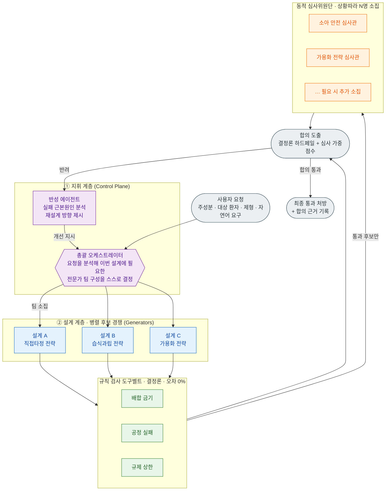
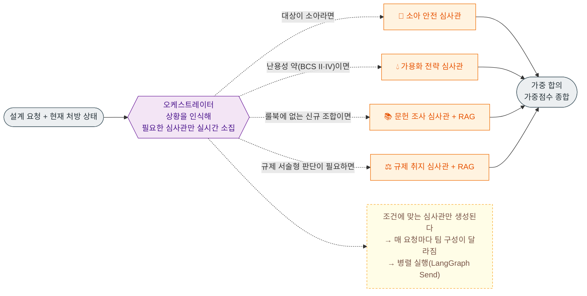

# Formula 1 — 실패를 미리 겪어보는 AI 제형(製劑) 설계 시스템

> 약을 실제로 만들어 보기 전에, 컴퓨터 안에서 여러 AI가 서로 견제하며 "이 처방은 왜 실패할지"를 미리 찾아내고 스스로 고쳐 나가는 시스템입니다.
>
> 제4회 인공지능(AI) 신약개발 경진대회 출품작 · 팀 **Formula 1**

---

## 목차
1. [배경 — 신약개발은 왜 이렇게 어렵고 느린가](#1-배경--신약개발은-왜-이렇게-어렵고-느린가)
2. [문제 — 그냥 챗봇에게 맡기면 안 되는 이유](#2-문제--그냥-챗봇에게-맡기면-안-되는-이유)
3. [핵심 아이디어 — 창의는 AI가, 검증은 규칙이](#3-핵심-아이디어--창의는-ai가-검증은-규칙이)
4. [기본 개념 쉽게 이해하기](#4-기본-개념-쉽게-이해하기)
5. [시스템 구조](#5-시스템-구조) — [입구의 분자 계산](#53-입구에는-분자-구조-계산이-있다) · [검사 순서](#54-검사는-순서가-있다)
6. [실제 동작 예시 — 이 시스템이 우리 데모를 반려한 이야기](#6-실제-동작-예시--소아용-해열제-설계하기)
7. [이 시스템의 진짜 차별점](#7-이-시스템의-진짜-차별점) — [근거 없는 규칙은 실행되지 않는다](#근거가-없는-규칙은-실행되지-않는다)
8. [기술 구조 (개발자용 요약)](#8-기술-구조-개발자용-요약)
9. [현재 진행 상황과 남은 일](#9-현재-진행-상황과-로드맵) · [Lab-in-the-loop](#9-1-lab-in-the-loop--만든-뒤의-절반)
10. [직접 실행해 보기](#10-직접-실행해-보기)

> **한 줄 요약** — 분자식(SMILES)에서 시작해 RDKit이 작용기를 계산하고, 출처가 붙은 규칙표 30종이
> 우선순위 순서대로(13단계 그룹) 처방을 검증하며, 통과한 후보만 상황에 맞게 소집된 AI 심사관이 순위를 매깁니다.
> 반려되면 반성 에이전트가 재설계를 지시하고, 이 전 과정이 웹 화면에서 실시간으로 보입니다.
> 만든 뒤에는 실험 결과를 자연어로 넣으면 AI가 해석하고 **다음 실험을 지시**합니다(lab-in-the-loop).
> **API 키 없이도 전부 동작합니다.**

---

## 1. 배경 — 신약개발은 왜 이렇게 어렵고 느린가

새로운 약 하나를 세상에 내놓기까지는 보통 10년이 넘는 시간과 수조 원의 비용이 듭니다. 수많은 후보 물질 중에서 실제로 약이 되어 살아남는 것은 극소수이고, 나머지는 개발 도중에 대부분 실패합니다.

이 긴 과정이 "약효 성분을 찾는 일"만으로 끝난다고 생각하기 쉽지만, 사실 그 뒤가 더 만만치 않습니다. 약효를 내는 주성분을 찾았더라도, 그것을 사람이 실제로 삼킬 수 있는 형태 — 정제(알약)나 캡슐, 시럽 — 로 만들어야 비로소 약이 됩니다. 이 단계를 **제형(製劑, formulation) 설계**라고 부릅니다.

문제는 주성분 하나만으로는 알약이 굳지 않는다는 데 있습니다. 그래서 여러 **첨가제(부형제)**를 섞는데, 이 조합에서 온갖 사고가 터집니다. 어떤 주성분과 어떤 첨가제를 같이 넣으면 서로 반응해 약이 갈색으로 변하거나 분해되고(화학적 충돌), 가루를 눌러 알약으로 찍을 때 부서지거나 기계에 들러붙기도 하며(공정 실패), 게다가 나라마다 "이 첨가제는 하루에 이만큼 넘게 넣으면 안 된다"는 안전 기준까지 지켜야 합니다(규제 초과). 특히 어린이용 약은 이 기준이 훨씬 더 엄격합니다.

지금까지 제약 현장은 이런 문제를 실험실에서 직접 만들어 보고, 실패하면 다시 설계하는 방식으로 풀어 왔습니다. 한 번 실험하는 데 드는 시간과 비용이 크고, 그 시행착오를 수십 번 반복합니다. **이 값비싼 시행착오를 실험실이 아니라 컴퓨터 안에서 미리 끝내자**는 것이 이 프로젝트의 출발점입니다.

---

## 2. 문제 — 그냥 챗봇에게 맡기면 안 되는 이유

"요즘 AI가 똑똑하니, 챗GPT 같은 것에게 좋은 약 처방을 물어보면 되지 않나?" 하고 생각할 수 있습니다. 하지만 여기에는 함정이 있습니다.

챗GPT 같은 거대언어모델(LLM)은 말을 아주 그럴듯하게 합니다. 그런데 그럴듯하게 말하는 것과 실제로 맞는 것은 전혀 다른 문제입니다. 이런 AI는 종종 **환각(hallucination)**, 즉 존재하지 않는 사실을 자신 있게 지어내는 현상을 보입니다. 실제로는 일어나지 않는 화학 반응을 매끄럽게 설명하고, 물리적으로 만들 수 없는 처방을 태연히 제시하며, 심지어 규제 수치까지 지어냅니다. "이 첨가제는 15mg까지 괜찮다"고 단언하지만 실제 안전 기준은 10mg일 수 있는 것입니다.

제약에서 이런 실수는 곧 제품 폐기와 허가 반려로 이어집니다. 그래서 이 분야에는 "그럴듯함"이 아니라 **"확실히 맞음"**이 필요합니다. 창의적인 아이디어를 내는 능력과, 그 아이디어가 안전하고 규정에 맞는지 빈틈없이 검증하는 능력은 서로 다른 일이고, 후자를 말 잘하는 AI에게 통째로 맡기는 것은 위험합니다.

---

## 3. 핵심 아이디어 — 창의는 AI가, 검증은 규칙이

그래서 우리는 역할을 둘로 나눴습니다.

> **새로운 처방을 상상하고 만드는 일은 AI에게 맡기고,
> 그것이 맞는지 검사하는 일은 "절대 틀리지 않는 규칙"에게 맡긴다.**

이렇게 나누는 데는 분명한 이유가 있습니다. 첨가제와 공정 조건의 조합은 사실상 천문학적인 경우의 수를 이룹니다. 이 방대한 공간에서 쓸 만한 후보를 상상해 내고, 서로 부딪히는 목표들(안정성·복용 편의·생산 단가·규제 통과) 사이에서 타협점을 찾고, 규칙집에 미처 담기지 않은 새로운 상황까지 판단하는 일은 창의와 추론의 영역입니다. 이건 규칙만으로는 결코 할 수 없고, AI가 잘하는 일입니다.

반대로 "SLS는 소아 기준 10mg를 넘으면 안 된다" 같은 판단은 계산기처럼 언제나 똑같이, 한 치의 오차도 없이 내려야 합니다. 여기에 AI의 추측이 끼어들면 오히려 위험해집니다.

정리하면, 규칙은 "이건 틀렸어"라고 확실하게 알려 주는 안전장치(가드레일)이고, AI 에이전트는 그 안전장치 안에서 "그럼 무엇을 만들어야 하는가"에 답하는 주체입니다. 규칙은 틀린 것을 걸러낼 뿐 새로운 답을 만들어 내지는 못합니다. 둘은 경쟁 관계가 아니라 서로의 빈틈을 메우는 역할 분담입니다.

---

## 4. 기본 개념 쉽게 이해하기

### 4.1 "에이전트"가 뭔가요?

챗봇은 질문을 하면 답을 한 번 해 주고 끝납니다. 반면 **에이전트(agent)**는 여기서 한 걸음 더 나아가, 스스로 목표를 세우고 필요한 도구를 써 가며 일을 진행하고, 중간 결과를 살펴 부족하면 방향을 바꿔 다시 시도합니다. 비유하자면 챗봇이 "질문에 답해 주는 안내 데스크"라면, 에이전트는 "맡은 일을 끝까지 책임지고 처리하는 담당 직원"에 가깝습니다.

### 4.2 왜 하나가 아니라 여러 에이전트인가?

실제 제약 회사에서도 한 사람이 모든 일을 다 하지는 않습니다. 처방을 설계하는 사람, 그 처방이 공정상 실제로 만들어질 수 있는지 따지는 사람, 규제를 감사하는 사람이 따로 있고, 서로 다른 시각에서 견제하며 완성도를 높입니다. 우리 시스템도 마찬가지로 역할을 나눈 여러 에이전트가 협업하고 견제합니다. 한 에이전트가 놓친 문제를 다른 에이전트가 잡아내는 구조입니다.

### 4.3 이 프로젝트의 핵심 — "숫자로 판단할 것"과 "말로 판단할 것"

이 프로젝트에서 가장 중요한 생각은, 모든 검사를 성격에 따라 두 종류로 나눈다는 것입니다. 어떤 검사는 숫자만 보면 답이 딱 떨어집니다("SLS가 10mg 이하인가?"). 반면 어떤 검사는 맥락을 읽고 판단해야 합니다("이 첨가제 조합이 어린이가 먹기에 자연스러운가?"). 앞의 것은 계산기가 맡는 게 맞고, 뒤의 것은 전문가의 눈이 필요합니다.

| 성격 | 예시 질문 | 판단 방법 | 담당 |
|---|---|---|---|
| 숫자로 판단 가능 | "SLS가 10mg 이하인가?", "유동성 지수가 25를 넘는가?" | 계산기처럼 항상 똑같이, 틀림없이 | 규칙 기반 검사기 (자동 계산) |
| 말로 판단해야 함 | "이 조합이 소아에게 적절한가?", "규제 가이드라인의 취지에 맞는가?" | 전문가의 눈으로 맥락을 읽어 | 심사 에이전트 (AI 판단) |

그래서 우리 시스템은 새로운 규칙표가 들어올 때마다 그것이 "숫자로 판단할 것"인지 "말로 판단할 것"인지를 보고, 알맞은 검사 방식에 자동으로 연결합니다. 이 자동 연결이 시스템 전체를 떠받치는 뼈대이며, 자세한 이야기는 [7장](#7-이-시스템의-진짜-차별점)에서 다시 다룹니다.

---

## 5. 시스템 구조

이 시스템의 가장 큰 특징은 에이전트 구성이 고정돼 있지 않다는 점입니다. 미리 정해 둔 몇 개의 AI를 매번 똑같이 돌리는 것이 아니라, 설계 요청이 들어올 때마다 그 상황에 꼭 필요한 전문가들을 그때그때 불러 모아 팀을 새로 꾸립니다. 소아용 약이면 소아 안전을 볼 심사관을, 잘 녹지 않는 약이면 가용화 전략을 볼 심사관을 부르는 식입니다. 사건마다 필요한 전문가로 태스크포스를 새로 짜는 모습과 비슷해서, 우리는 이를 **자기조직형 멀티 에이전트(Self-Organizing Multi-Agent)**라고 부릅니다.

### 5.1 전체 구조 — 세 개의 계층



맨 위 **지휘 계층**에서는 총괄 오케스트레이터가 요청을 읽고 이번 설계에 어떤 전문가 팀이 필요한지 판단해 전체를 지휘합니다. 검증이 실패로 끝나면 곁에 있는 반성 에이전트가 왜 실패했는지 근본 원인을 짚어 내고, 그 교훈을 담아 처음부터 다시 설계하도록 되돌립니다.

가운데 **설계 계층**은 초안을 하나만 만들지 않습니다. 여러 설계 에이전트가 직접타정, 습식과립, 가용화처럼 서로 다른 전략으로 후보를 동시에 만들어 경쟁시키고, 검증을 가장 잘 통과하는 후보가 살아남습니다.

아래 **검증 계층**은 두 축으로 나뉩니다. 왼쪽의 규칙 검사 도구벨트는 숫자로 판단하는 규칙을 계산기처럼 확실하게 처리하며, AI의 추측이 들어가지 않아 몇 번을 돌려도 같은 결과가 나옵니다. 오른쪽의 동적 심사위원단은 말로 판단해야 하는 부분을, 상황에 맞는 심사관만 그때그때 불러 평가합니다. 마지막으로 합의 도출 단계가 이 두 결과를 종합해 최종 통과와 반려를 결정합니다.

### 5.2 핵심 — 심사관을 상황에 따라 실시간으로 소집한다

이 부분이 단순한 "AI 하나에 검사 함수 몇 개 붙인 것"과 결정적으로 다른 지점입니다. 심사위원단에는 고정된 명단이 없습니다. 오케스트레이터가 지금의 요청과 처방 상태를 살펴, 조건에 맞는 심사관만 그 자리에서 만들어 냅니다.



이 방식은 세 가지를 함께 가져다줍니다. 첫째, 지금 상황과 무관한 심사는 아예 만들지 않고 필요한 심사관들만 동시에 판단하게 하므로 낭비가 없고 빠릅니다. 둘째, 나중에 "고령자 안전 심사관" 같은 새 전문가가 필요해지면 소집 조건 한 줄만 더하면 되고 시스템 구조를 뜯어고칠 필요가 없습니다. 셋째, 이 구조는 "그래서 왜 굳이 에이전트냐"는 물음에 대한 답이기도 합니다. 규칙만으로는 "틀렸다"까지만 말할 수 있지만, 룰북에 없는 새로운 상황을 판단하고 충돌하는 목표들 사이에서 타협점을 찾는 일은 상황에 맞게 소집되는 에이전트만이 해낼 수 있기 때문입니다.

### 5.3 입구에는 분자 구조 계산이 있다

앞의 그림에는 한 가지가 빠져 있습니다. **검사가 시작되려면 "이 약이 어떤 작용기를 가졌는가"를 먼저 알아야 합니다.** 유당이 위험한지 아닌지는 약에 아민기가 있느냐에 달려 있으니까요.

이걸 사람이 손으로 적어 넣으면 틀립니다 — 실제로 이 프로젝트의 초기 데모가 그렇게 틀렸고, 그 이야기는 6장에 있습니다. 그래서 지금은 **분자식(SMILES)에서 시작합니다.**

```
SMILES  CC(=O)Nc1ccc(O)cc1
   │
   ├─ descriptor 9종 계산       분자량 151.2 · logP 1.35 · TPSA 49.3 …
   ├─ 염 제거 → parent 추출     besylate·HCl 같은 염은 벗겨낸 뒤 매칭
   ├─ SMARTS 구조 플래그         is_amide_not_amine ● / has_primary_amine ○
   │    └─ fr_* 카운트와 교차검증  불일치하면 경고
   └─ 물성 추정 (저신뢰)         용해도·투과도 → **BCS 분류 확정에는 쓰지 않음**
```

마지막 줄이 중요합니다. RDKit으로 계산한 logP에서 용해도를 추정할 수는 있지만 그건 어디까지나 경향일 뿐이고, 약대생 팀도 규칙표에 `confidence=low`, `실측 우선`이라고 못 박아 뒀습니다. 그래서 이 시스템은 **추정값으로 BCS 등급을 확정하지 않습니다.** 실측이 들어왔을 때만 분류하고, 없으면 "사람 판단 필요"로 넘깁니다. 계산할 수 있다고 해서 판정해도 되는 것은 아니기 때문입니다.

### 5.4 검사는 순서가 있다

규칙표를 아무 순서로나 돌릴 수는 없습니다. "직접타정 규칙"은 **직접타정이 선택된 뒤에야** 의미가 있고, 그 선택은 유동성 등급이 나온 뒤에야 가능합니다. 그래서 규칙표마다 실행 우선순위가 붙어 있고, 앞 단계가 만든 값이 뒷 단계의 발동 조건으로 흘러 들어갑니다.

```
0  참조 마스터        부형제 마스터 · descriptor 정의 · SMARTS 정의
5  API 물성 임계값     Ro5 / Veber 경고 밴드
10 유동성 등급        안식각 48° ──→ flow_character = "Poor"
11 공정 경로 분기                  └─→ 직접타정 배제, selected_route = "DG"
20 배합 금기 (1:1)    ← 여기부터가 성분 자체를 바꿔야 하는 근본적 반려라 앞에 온다
21 소아 안전 상한
22 색소 · 향료
30 다성분 상호작용
40 선택된 공정의 세부 규칙  ← selected_route 를 참조
45 부형제 배합비
50 코팅 · 잔류용매
60 BCS 분류 → 전략
70 포장 · 안정성 · 분석법
```

폴더 번호만 보면 규제(05)가 마지막 같지만, 실제로는 **소아 안전이 21번으로 가장 먼저 도는 축에 속합니다.** 값 몇 개를 조정해서 해결되는 문제가 아니라 성분 자체를 바꿔야 하는 반려라, 무거운 공정 계산을 하기 전에 먼저 걸러내는 편이 낫기 때문입니다.

---

## 6. 실제 동작 예시 — 소아용 해열제 설계하기

말로만 설명하면 와닿지 않으니, 실제로 코드가 돌아가는 시나리오를 따라가 보겠습니다. 요청은 이렇습니다. **"소아용 바나나향 아세트아미노펜(해열제) 정제를 설계하라."**

### 검사기가 참고하는 규칙표는 이렇게 생겼다

검증은 약대생 팀이 만들어 넣은 규칙표(CSV)를 근거로 이뤄집니다. 예를 들어 화학적 배합 금기를 담은 `incompatibility_rules.csv`의 일부를 보면 다음과 같습니다.

| 부형제 | 위험한 작용기 | 위험도 | 실패 메커니즘 | 대체 부형제 |
|---|---|---|---|---|
| Lactose(유당) | Primary Amine(1차 아민) | High | 유당이 아민기와 반응해 갈변(Maillard 반응)과 불순물을 일으킴 | Mannitol |
| Magnesium Stearate | Acid-sensitive | Medium | 활택제 속 금속이온이 강산성 약물(아스피린 등)의 가수분해를 촉진 | Sodium Stearyl Fumarate |
| Calcium Phosphate | Tetracyclines | High | 칼슘이 테트라사이클린계 항생제와 난용성 킬레이트를 형성해 흡수를 떨어뜨림 | Lactose |

이런 표가 한 줄 한 줄 쌓여 "어떤 조합이 왜 위험하고, 대신 무엇을 쓰면 되는지"의 사전이 됩니다. 검사기는 처방에 등장한 성분을 이 표와 대조해, 위험한 조합이 있으면 그 자리에서 이유와 대안을 함께 돌려줍니다.

### 먼저, 이 시스템이 우리 자신의 데모를 반려한 이야기

원래 이 문서의 예시는 "아세트아미노펜 + 유당 → 갈변(Maillard 반응)으로 반려"였습니다. 그런데 **분자 구조를 실제로 계산해 보니 그 전제가 틀렸습니다.**

Maillard 반응은 환원당이 **아민기**와 만나야 일어납니다. 아세트아미노펜(파라세타몰)은 이름은 "아미노"페놀 유도체이지만 실제로는 **아미드**(N-(4-hydroxyphenyl)acetamide)라서 반응할 유리 아민이 없습니다. 약대생 팀이 만든 구조 플래그표에도 이 오해를 막으려고 `is_amide_not_amine`이라는 플래그가 따로 들어 있었습니다.

```
Acetaminophen    CC(=O)Nc1ccc(O)cc1
구조 플래그        is_amide_not_amine        ← 아미드. 아민 아님

Fluoxetine HCl   CNCCC(Oc1ccc(cc1)C(F)(F)F)c1ccccc1.Cl
구조 플래그        has_secondary_amine       ← 2차 아민
```

같은 유당 처방을 두 약물로 각각 검증하면 결과가 갈립니다.

```
· Acetaminophen : 반려 없음
· Fluoxetine HCl: 반려 1건
    ⛔ INC002  2차 아민도 유당과 Maillard 반응을 일으킴 (fluoxetine HCl 사례)
```

두 번째 반려 사유였던 "소아 SLS 10mg 초과"도 마찬가지였습니다. 약대생 팀이 출처를 추적한 결과 EMA 기준의 SLS 항목은 **경피 투여 전용**이고 경구 소아 상한은 존재하지 않아, 해당 규칙 행은 `NO_SOURCE_FOUND / NOT_A_RULE`로 폐기되어 있었습니다. 지금 엔진은 그런 행을 **로딩 단계에서 자동으로 제외**합니다.

즉 이 시스템은 만들어지자마자 **자기 자신의 홍보용 예시를 반려했습니다.** 근거가 없는 판정은 하지 않는다는 원칙이 우리 편의보다 먼저 적용된 셈이고, 그것이 이 프로젝트가 팔려는 바로 그 가치입니다.

### 설계 → 반려 → 재설계 → 통과

그래서 골든 시나리오는 근거가 실재하는 사례로 바꿨습니다. **"소아용 플루옥세틴 정제를 설계하라."**

```
[RDKit]  Fluoxetine → ['has_secondary_amine']
[route]  경쟁 전략: DC, WG                       ← 유동성 등급으로 공정 후보를 좁힘
[설계]   cand-0-DC   희석제 Lactose monohydrate   ← 가장 흔한 희석제로 초안
[설계]   cand-0-WG   희석제 Lactose monohydrate
    ⛔ INC002  2차 아민 + 유당 → Maillard 반응
[게이트] cand-0-DC   반려 (판정 11 · 위반 2)

[반성]   chemical 계층에서 2건 반려 — 성분 선택 재검토 필요
         지시 → Mannitol

[설계]   cand-1-DC   희석제 Mannitol
[게이트] cand-1-DC   통과 (판정 10 · 위반 1)
[소집]   REV001 소아 안전 심사관 — 조건 target_population=='pediatric'
[소집]   REV003 공정 실현성 심사관 — 조건 always
[합의]   선정 cand-1-DC · 가중치 {REV001: 0.545, REV003: 0.455}
```

주목할 점 세 가지입니다. 첫째, **설계 에이전트는 금기를 미리 피하지 않습니다.** 가장 흔한 희석제인 유당으로 초안을 만들고, 검증이 그걸 잡아냅니다 — 설계자가 검증의 일을 대신하면 시스템이 무엇을 잡아내는지 보이지 않기 때문입니다. 둘째, 반려 사유에 담긴 대안(`alternative_excipient_name = Mannitol`)이 그대로 재설계 지시가 됩니다. 셋째, 심사관은 **소아 대상이라서** 소집됐고 가용화 심사관(REV002)은 조건에 맞지 않아 아예 만들어지지 않았습니다.

실험실에서라면 며칠이 걸렸을 "만들어 보고 갈변을 확인한 뒤 다시 설계하는" 과정을 순식간에 끝낸 셈입니다. 그리고 이 판정은 몇 번을 다시 돌려도 똑같이 나옵니다.

---

## 7. 이 시스템의 진짜 차별점

### 규칙을 코드가 아니라 데이터로 관리한다

보통 이런 검사 시스템은 규칙을 프로그램 코드 안에 하나하나 적어 넣습니다. 그러면 규칙을 하나 더할 때마다 개발자가 코드를 고쳐야 하고, 정작 규칙을 가장 잘 아는 약학 전문가는 개발자에게 부탁만 할 수 있을 뿐입니다.

우리는 이 관계를 뒤집었습니다. 규칙은 엑셀 같은 표(CSV)로 관리하고, 그 표가 "숫자로 판단할 것"인지 "말로 판단할 것"인지만 설정 파일에 한 줄 적어 두면, 시스템이 시작할 때 알아서 그 규칙을 알맞은 검사 — 자동 계산 또는 심사 에이전트 — 에 연결합니다. 개발자가 백엔드를 손댈 필요가 없습니다. 한마디로 **규칙을 추가하는 일이 코딩이 아니라 데이터 입력**이 되는 것이고, 덕분에 약학 전문가와 개발자가 서로를 기다리지 않고 각자 일할 수 있습니다. 지금은 여섯 종의 규칙표(배합 금기·다성분 충돌·공정 실패·가용화 전략·소아 안전·포장 적합성)가 연결돼 있지만, 표를 더 넣는 것만으로 수백 개 규칙까지 그대로 확장됩니다.

### 같은 입력이면 항상 같은 판정 (오차 0%)

숫자로 판단하는 검사에는 AI의 추측이 전혀 들어가지 않고 순수한 계산만 이뤄집니다. 그래서 같은 처방을 백 번 검사하면 백 번 모두 같은 결과가 나옵니다. 이 재현성은 나중에 규제 기관을 설득해야 할 때 가장 확실한 신뢰의 근거가 됩니다.

### 필요한 검사만 골라서 한다

모든 규칙을 무조건 다 돌리지는 않습니다. 앞선 시나리오에서 보았듯 소아 안전 규칙은 대상이 어린이일 때만, 가용화 전략 규칙은 잘 녹지 않는 약일 때만 발동합니다. 각 규칙표가 "나는 이런 상황에서 발동한다"는 조건을 스스로 갖고 있어서, 총괄 에이전트가 그때그때 상황에 맞는 검사만 선택합니다.

### 근거가 없는 규칙은 실행되지 않는다

이 부분이 아마 가장 특이한 지점일 겁니다. 규칙표의 각 줄에는 그 수치를 **어디서 가져왔는지**가 함께 적혀 있습니다. 약대생 팀이 규칙 하나하나에 출처를 추적해 붙였고, 추적에 실패한 것은 실패했다고 정직하게 기록했습니다.

엔진은 그 기록을 읽고 스스로 판단합니다.

| 근거 상태 | 엔진 동작 |
|---|---|
| `VERIFIED` · `VERIFIED_PRIMARY/SECONDARY` | 그대로 판정에 사용 |
| `PROVISIONAL` · `STRUCTURAL_VERIFIED` | 사용하되 결과에 "잠정값" 표기 |
| `UNVERIFIED` · `SCHEMA_ONLY` | **반려는 못 시킴** — 심사관 이관으로 강등 |
| `ESCALATION_REQUIRED` | 사람에게 이관 |
| `NO_SOURCE_FOUND` · `NOT_A_RULE` · `LEGACY` | **로딩 단계에서 아예 제외** |

즉 "SLS는 소아 10mg 상한"이라는 규칙이 표에 적혀 있어도, 출처 추적 결과 그 수치의 근거를 찾지 못했다면 **그 줄은 실행되지 않습니다.** 6장에서 보게 되겠지만 이 정책은 만들어지자마자 우리 자신의 데모를 반려했습니다.

규제 기관을 설득해야 하는 분야에서 "그럴듯한 규칙이 많은 것"보다 "근거 없는 규칙은 안 돌린다"가 훨씬 중요한 자산이라고 판단했습니다.

### 규칙표가 늘어나도 검사 함수는 여덟 개다

약대생 팀 두 명이 서로 다른 스키마로 룰북을 설계해 왔습니다. 한 사람은 컬럼을 분해한 형태로(`parameter` / `operator` / `threshold_value`), 다른 사람은 조건식 문자열로(`condition_logic`) 표현했고, 규모도 30종과 42종으로 달랐습니다.

이걸 하나로 합치는 대신 **역할을 나눴습니다.** 행마다 출처와 검증 상태가 붙어 있는 30종을 정본 룰북으로 삼고, 다른 쪽에서는 FDA IID 부형제 마스터(1,796행)·규제 사용한도(9,071행)·API 물성 임계값(62행)·확인시험 정의(66종)를 참조 계층으로 흡수했습니다. 판정하는 데이터와 조회하는 데이터를 분리한 셈입니다.

그리고 그 30종 전부가 **여덟 개의 검사 함수** 안에서 처리됩니다. 규칙표가 몇 개로 늘어나든 새 함수를 짜는 게 아니라, 설정 파일에 "이 표는 이 함수에 이 컬럼을 이렇게 연결하라"고 적는 것으로 끝납니다.

---

## 8. 기술 구조 (개발자용 요약)

이 장은 개발자를 위한 요약입니다. 앞 장들만 읽어도 전체 그림은 이해됩니다.

에이전트 오케스트레이션은 [LangGraph](https://github.com/langchain-ai/langgraph)를 기반으로 합니다. 총괄(라우팅)·설계·검사·심사 노드가 하나의 그래프를 이루고, 후보 설계와 심사관 평가는 `Send`로 병렬 팬아웃됩니다. 검증에 실패하면 반성 단계를 거쳐 설계로 되돌아가는 자동 피드백 루프가 있으며, 이 루프는 비용 폭발을 막기 위해 최대 5회로 제한됩니다. LLM은 프로바이더에 묶이지 않습니다 — Anthropic Claude(`claude-opus-5`)와 Groq 무료 티어를 같은 인터페이스로 감싸고, 라이브 배포(zihwan.com/formula1)는 무료 티어로 돕니다. 처방·판정은 전부 **구조화 출력**(Pydantic 스키마)으로 받아 파싱 실패라는 실패 모드를 없앴습니다.

**입구에 물성 계산 계층이 있습니다.** SMILES를 받으면 RDKit이 descriptor 9종을 계산하고, SMARTS 패턴으로 구조 플래그(1차/2차 아민·에스터·카복실산·아미드)를 검출해 배합금기 판정의 입력을 만듭니다. 염 형태는 parent를 추출한 뒤 매칭하고, `fr_*` fragment 카운트와 교차검증합니다. 용해도·투과도 추정은 신뢰도가 낮아 **BCS 분류 확정에는 쓰지 않습니다** — 실측이 있을 때만 확정합니다.

숫자로 판단하는 규칙 검사는 규칙표마다 함수를 새로 짜지 않고, 여덟 개의 범용 검사 전략에 설정으로 컬럼을 주입해 재사용합니다. 규칙표 30종이 이 여덟 개 안에서 전부 처리됩니다.

| 전략 | 하는 일 | 예시 |
|---|---|---|
| `pairwise_membership` | 두 성분의 금기 조합 탐지 | 유당 + 2차 아민 → 갈변 |
| `subset_forbidden` | 여러 성분이 함께 있을 때의 금기 탐지 | 아민염 + 환원당 + 알칼리활택제 |
| `threshold` | 수치 기준 검사 (통과/실패 조건 양방향) | Carr's index ≤ 20, 아스파탐 > 0mg |
| `range` | 허용 범위 이탈 검사 | 붕해제 1~15% |
| `categorical_requirement` | 특정 조건일 때 필수 성분 강제 | BCS II/IV → 가용화 전략 필수 |
| `conditional_prohibition` | 특정 속성일 때 옵션 금지 | 흡습성 약 → 고투습 포장 금지 |
| `band_lookup` | 구간·조건 조회로 **파생값 산출** | 안식각 48° → 유동성 "Poor" |
| `decision_tree` | 조건 분기로 공정 경로 확정 | 유동성 불량 → 직접타정 배제 |

**행이 '실패 조건'인지 '통과 조건'인지가 다릅니다.** 배합금기표는 "이러면 실패"를 적고, 공정 룰북은 "이걸 만족해야 통과"를 적습니다. 매니페스트의 `polarity`가 이 방향을 선언하며, 반대로 읽으면 판정이 정확히 뒤집힙니다.

**근거가 없는 규칙은 실행되지 않습니다.** 각 규칙 행의 `verification_status`를 보고 엔진이 스스로 판단합니다 — 검증된 행만 반려를 만들 수 있고, 미검증 행은 반려 대신 심사관 이관으로 강등되며, 출처를 못 찾은 행(`NO_SOURCE_FOUND`)은 로딩 단계에서 아예 빠집니다.

말로 판단하는 심사 에이전트는 `reviewer_registry.csv`의 소집 조건이 참일 때만 그 자리에서 생성됩니다. 심사관에게는 **반려 권한이 없습니다**(B모델) — 점수는 통과 후보들 사이의 순위 결정에만 쓰이고, 안전 판정은 전적으로 룰북이 담당합니다. 여기에 부형제 마스터와 규칙 출처 문서를 검색하는 RAG(BM25, 2,083개 문서)를 붙여 설계·심사 근거를 공급합니다.

```
Formula1/
├─ config/
│  ├─ rulebook_manifest.yaml   # 규칙 카탈로그 — 어떤 표를 어떻게 검사에 연결할지
│  ├─ packaging_categories.yaml# 포장 식별자 ↔ 룰북 서술어 사전
│  └─ prompts/                 # 심사관 rubric
├─ database/                   # 약학 전문가가 공급하는 규칙표
│  ├─ 00_master/               #   부형제 마스터 · RDKit descriptor · SMARTS · 물성추정
│  ├─ 01_route_decision/       #   USP<1174> 유동성 등급 · 공정 경로 분기
│  ├─ 02_incompatibility/      #   1:1 배합금기 · 다성분 상호작용
│  ├─ 03_process/              #   직접타정·과립·코팅·캡슐·배합비·잔류용매
│  ├─ 04_biopharmaceutics/     #   BCS 분류/전략 · 용출 · 분석법
│  ├─ 05_regulatory/           #   소아 안전 · 색소/향료 · 안정성 · 포장
│  ├─ 06_config/               #   심사관 명단 · 합의 설정
│  └─ reference/               #   FDA IID 마스터 · 사용한도 · 물성 임계값 · 확인시험
├─ formula/
│  ├─ contracts.py             # 데이터 계약 (처방·판정·이벤트·근거 정책)
│  ├─ chem/                    # RDKit 물성 계층 (descriptor·SMARTS·추정·2D 렌더)
│  ├─ checkers/                # 여덟 개 범용 검사 전략 + 우선순위 실행 레지스트리
│  ├─ agents/                  # Claude 에이전트 (intake·generator·judge·reflect) + 합의
│  ├─ rag/                     # BM25 근거 검색
│  ├─ orchestrator/            # LangGraph 그래프 · 상태 · TraceEvent 버스
│  └─ feedback/                # lab-in-the-loop (결과 판독 · 판정 · 다음 실험 지시)
├─ web/
│  ├─ server.py                # FastAPI + SSE
│  └─ static/                  # 빌드 스텝 없는 대시보드
├─ scripts/                    # demo · feedback_demo · verify_smarts · import_rulebook
└─ tests/                      # SMARTS 진리표 · 전략 단위 · 골든 시나리오 회귀
```

---

## 9. 현재 진행 상황과 로드맵

**동작하는 것** — 약대생 팀이 공급한 규칙표 30종이 여덟 개 검사 전략에 연결돼 우선순위 순서대로(13단계 그룹) 실행되고, SMILES에서 시작하는 RDKit 물성 계층이 배합금기 판정의 입력을 만듭니다. LangGraph 그래프가 설계·검증·심사·합의·반성을 잇고, 심사관은 소집 조건이 맞을 때만 생성됩니다. FastAPI + SSE 대시보드에서 이 과정이 실시간으로 보이고, 실험 결과를 자연어로 넣으면 AI가 판독·해석하고 다음 실험을 지시하는 lab-in-the-loop까지 돕니다. 회귀 테스트 54개가 SMARTS 진리표·전략 극성·근거 정책·골든 시나리오를 고정합니다.

**의도적으로 보수적으로 둔 것** — 용해도·투과도 추정은 신뢰도가 낮아 BCS 분류를 확정하지 않습니다. 안정성·용출 규격은 실측 데이터가 있어야 판정할 수 있어 참조 계층에 둡니다. 소아 안전 규칙 중 체중 기반(mg/kg/day) 행은 환자 체중이 들어와야 계산되므로 아직 판정에 쓰지 않습니다. 이런 것들은 "구현이 덜 된" 부분이 아니라 **근거가 허용하는 범위를 지킨** 결과입니다.

**앞으로** — SMARTS 과검출 2건(구아니딘·고리 NH를 2차 아민으로 검출)을 약학 팀과 함께 다듬고, 환자 체중 입력을 받아 체중 기반 소아 규칙을 활성화하는 것이 남았습니다. 심사관 명단의 문헌 조사(REV005)·규제 취지(REV004) 소집 신호는 현재 게이트 결과에서 파생하는 1차 구현이라, 약학 팀과 정의를 다듬을 여지가 있습니다.

---

## 9-1. Lab-in-the-loop — 만든 뒤의 절반

앞의 루프가 "만들기 전에 컴퓨터 안에서 실패를 겪는" 것이라면, 이쪽은 **실제로 만든 뒤**의 절반입니다. FutureHouse·Oxford·Fordham 연구진이 다중 에이전트 시스템 Robin에서 제시한 **lab-in-the-loop** 패러다임을 그대로 적용했습니다 — AI가 결과 데이터를 직접 해석하고 **다음 실험을 지시**하며, 사람은 벤치에서 그 실험을 수행합니다. 사람이 판단의 병목이 아니라 실행 주체로 들어옵니다.

연구원은 실험 노트를 **자연어로** 적어 넣습니다.

> "30분 용출 62%로 목표에 못 미쳤다. 정제 경도는 38N, 마손도 1.2%. 6개월 가속 조건에서 총 불순물이 0.9%까지 올랐고 정제 표면이 약간 갈변했다."

그러면 세 단계가 돌고, **각 단계의 담당이 다릅니다** — 설계 루프와 똑같은 역할 분담입니다.

| 단계 | 담당 | 하는 일 | 제약 |
|---|---|---|---|
| ① 판독 | LLM | 문장에서 측정값을 뽑아낸다 | **문장에 적힌 수치만.** 없는 값은 지어내지 않고, 못 읽은 표현은 못 읽었다고 표시한다 |
| ② 판정 | 결정론 규칙 | 규격 이탈을 계산한다 | 같은 데이터면 항상 같은 해석. LLM이 개입하지 않는다 |
| ③ 지시 | LLM + 참조 데이터 | 다음에 할 확인시험을 고르고 가설을 세운다 | **후보는 `confirmation_test_master.csv`의 실제 66종뿐.** 목록 밖 시험은 화면에 나가기 전에 버려진다 |

위 예시를 넣으면 4개 지표(용출 62 · 경도 38 · 마손도 1.2 · 불순물 0.9)와 관찰 1건(갈변)을 판독하고, 규칙이 4건 이탈을 판정한 뒤, 다음 실험을 지시합니다.

```
가설  고분자 점도가 높아 API 방출이 억제되어 30분 용출률이 미달하고,
      정제 강도 부족이 마손도 규격 초과로 이어진 것으로 보인다.

1  T_M9_DISS       M9 비교 용출        근거 ICH M9 3.2
2  T_DISS_PROFILE  용출 프로파일        근거 FDA dissolution guidance
3  T_FORCED        강제 분해           근거 ICH Q14/Q2
```

**모든 "다음 실험"에 ICH·USP·FDA 출처가 붙습니다.** 시험 후보를 실제 확인시험 마스터로 묶어 둔 결과이고, 이는 규칙표에 적용한 원칙("근거 없는 규칙은 실행되지 않는다")을 실험 지시에도 똑같이 적용한 것입니다. AI는 **고를 뿐 발명하지 못합니다.**

---

## 10. 직접 실행해 보기

**Python 3.10 이상이 필요합니다** (LangGraph·FastAPI 요구사항).

```bash
# 1) 가상환경 준비 및 라이브러리 설치
python3.12 -m venv .venv
.venv/bin/pip install -r requirements.txt

# 2) 골든 시나리오 데모 — 반려 → 반성 → 통과
.venv/bin/python scripts/demo.py

# 3) 웹 대시보드 — 에이전트 흐름을 실시간으로 관찰
.venv/bin/uvicorn web.server:app --port 8000     # → http://localhost:8000

# 4) SMARTS 구조 플래그 검증 리포트
.venv/bin/python scripts/verify_smarts.py

# 5) 회귀 테스트
.venv/bin/pytest
```

**바로 써 볼 수 있는 라이브 배포:** <https://zihwan.com/formula1>

**API 키 없이도 전부 돌아갑니다.** `GROQ_API_KEY`(무료)나 `ANTHROPIC_API_KEY`가 없으면 LLM 노드가 규칙 기반 대체로 내려가고, 규칙 검사·물성 계산·합의는 원래대로 동작합니다. 시연 도중 네트워크나 키 문제로 데모가 멈추지 않게 하려는 설계입니다. 키를 설정하면 설계·심사·반성이 Claude로 대체되고, 심사관의 사고 과정이 대시보드에 토큰 단위로 흐릅니다.

웹 화면은 네 구획입니다. 왼쪽에 분자 구조와 descriptor, 가운데 위에 에이전트 그래프(노드가 실행되면 점등하고 심사관은 소집될 때 새로 생겨납니다), 가운데 아래에 실행 트레이스(규칙 발동을 클릭하면 **원본 CSV 행과 출처 문헌**이 열립니다), 오른쪽에 후보 처방과 합의 결과가 표시됩니다.

---

## 팀 Formula 1

약학 도메인과 규칙 데이터는 약대생 팀이 맡아, 검사에 쓰이는 규칙표(CSV)를 설계하고 공급합니다. 시스템 설계와 구현은 Technical Lead 변지환이 맡아, 에이전트 구조와 검사 엔진, 그리고 규칙을 자동으로 연결하는 시스템을 만듭니다.

> *"실험실과 규제기관의 시행착오를, 실제로 약을 만들기 전에 컴퓨터 안에서 미리 끝낸다."*
