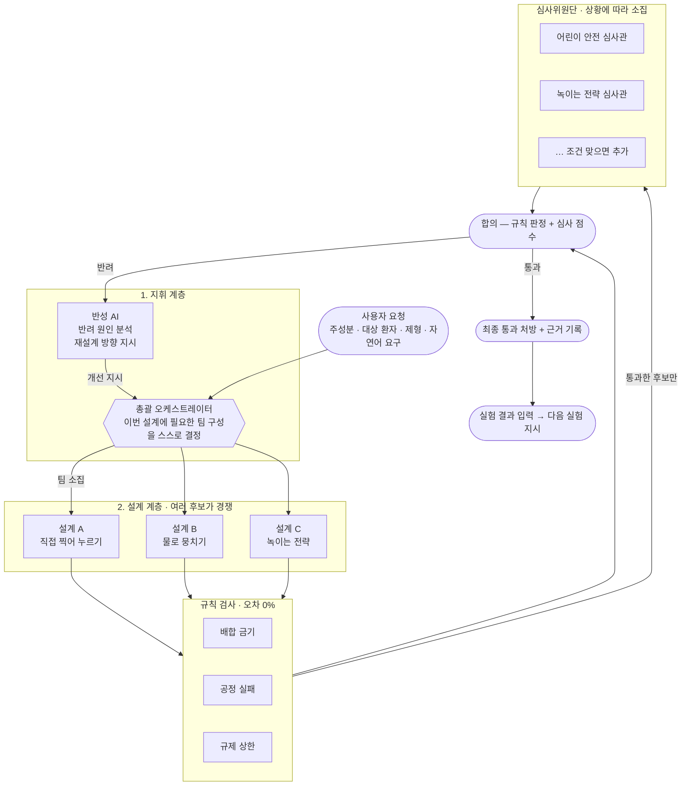

# Formula 1 — 실패를 미리 겪어보는 AI 제형 설계 시스템

> 약을 실제로 만들어 보기 전에, 여러 AI가 서로 견제하며 "이 처방은 왜 실패할지"를 미리 찾아내고 스스로 고쳐 나가는 시스템입니다.
>
> 제4회 인공지능 신약개발 경진대회 출품작 · 팀 **Formula 1**

**바로 써 보기 → <https://zihwan.com/formula1>**

---

## 한눈에 보기

분자식을 넣으면 컴퓨터가 그 분자의 작용기를 계산하고, 출처가 붙은 규칙표들이 정해진 순서대로 처방을 검사합니다. 검사를 통과한 처방만 상황에 맞게 불려 온 AI 심사관이 순위를 매기고, 반려되면 AI가 이유를 읽고 다시 설계합니다. 약을 만든 뒤에는 실험 결과를 문장으로 넣으면 AI가 해석하고 **다음에 할 실험까지 지시**합니다.

이 전 과정이 웹 화면에서 실시간으로 보이고, **API 키 없이도 전부 동작합니다.**

## 목차

1. [무엇이 문제인가](#1-무엇이-문제인가)
2. [챗봇에게 맡기면 안 되는 이유](#2-챗봇에게-맡기면-안-되는-이유)
3. [핵심 아이디어 — 창의는 AI가, 검증은 규칙이](#3-핵심-아이디어--창의는-ai가-검증은-규칙이)
4. [전체 흐름](#4-전체-흐름)
5. [입구 — 분자 구조부터 계산한다](#5-입구--분자-구조부터-계산한다)
6. [검사에는 순서가 있다](#6-검사에는-순서가-있다)
7. [실제로 이렇게 돕니다 (시연 시나리오 3개)](#7-실제로-이렇게-돕니다)
8. [만든 뒤의 절반 — 다음 실험을 지시한다](#8-만든-뒤의-절반--다음-실험을-지시한다)
9. [우리가 쓴 룰북](#9-우리가-쓴-룰북)
10. [이 시스템의 차별점](#10-이-시스템의-차별점)
11. [기술 구조](#11-기술-구조-개발자용)
12. [직접 실행해 보기](#12-직접-실행해-보기)
13. [현재 상태와 남은 일](#13-현재-상태와-남은-일)

---

## 1. 무엇이 문제인가

새로운 약 하나를 세상에 내놓기까지 보통 10년이 넘게, 수조 원이 듭니다. 그런데 이 과정이 "약효 성분을 찾는 일"로 끝나지 않습니다. 약효를 내는 주성분을 찾았더라도 사람이 삼킬 수 있는 형태 — 알약, 캡슐, 시럽 — 로 만들어야 비로소 약이 됩니다. 이 단계를 **제형 설계**라고 부릅니다.

문제는 주성분 하나로는 알약이 굳지 않는다는 점입니다. 그래서 여러 첨가제를 섞는데, 바로 그 조합에서 사고가 납니다.

| 사고 유형 | 무슨 일이 생기나 |
|---|---|
| 화학적 충돌 | 주성분과 첨가제가 반응해 약이 갈색으로 변하거나 분해된다 |
| 공정 실패 | 가루를 눌러 알약으로 찍을 때 부서지거나 기계에 들러붙는다 |
| 규제 초과 | 나라마다 정한 첨가제 상한을 넘긴다. 어린이용은 기준이 훨씬 엄격하다 |

지금까지 제약 현장은 이걸 **실험실에서 직접 만들어 보고, 실패하면 다시 설계하는** 방식으로 풀었습니다. 한 번 실험에 드는 시간과 비용이 크고, 그 시행착오를 수십 번 반복합니다. 이 값비싼 시행착오를 실험실이 아니라 **컴퓨터 안에서 미리 끝내자**는 것이 이 프로젝트의 출발점입니다.

## 2. 챗봇에게 맡기면 안 되는 이유

"AI가 똑똑하니 좋은 처방을 물어보면 되지 않나?" 여기에 함정이 있습니다.

거대언어모델은 말을 아주 그럴듯하게 합니다. 그런데 그럴듯한 것과 실제로 맞는 것은 다릅니다. 이런 AI는 **없는 사실을 자신 있게 지어내는 일(환각)** 이 있습니다. 일어나지 않는 화학 반응을 매끄럽게 설명하고, 만들 수 없는 처방을 태연히 제시하며, 심지어 규제 수치까지 지어냅니다. "이 첨가제는 15mg까지 괜찮다"고 단언하지만 실제 기준은 10mg일 수 있습니다.

제약에서 이런 실수는 곧 제품 폐기와 허가 반려입니다. 그래서 이 분야에는 "그럴듯함"이 아니라 **"확실히 맞음"** 이 필요합니다.

## 3. 핵심 아이디어 — 창의는 AI가, 검증은 규칙이

그래서 역할을 둘로 나눴습니다.

> **새로운 처방을 상상하고 만드는 일은 AI에게,
> 그것이 맞는지 검사하는 일은 절대 틀리지 않는 규칙에게 맡긴다.**

이렇게 나누는 이유가 분명합니다. 첨가제와 공정 조건의 조합은 사실상 천문학적입니다. 이 넓은 공간에서 쓸 만한 후보를 상상하고, 서로 부딪히는 목표(안정성·복용 편의·생산 단가·규제 통과) 사이에서 타협점을 찾고, 규칙집에 없는 새로운 상황까지 판단하는 일은 규칙만으로는 못 합니다. AI가 잘하는 일입니다.

반대로 "이 첨가제가 어린이 상한을 넘는가" 같은 판단은 계산기처럼 언제나 똑같이 내려야 합니다. 여기에 AI의 추측이 끼어들면 위험해집니다.

| 성격 | 예시 | 담당 |
|---|---|---|
| 숫자로 답이 떨어지는 것 | "이 첨가제가 10mg 이하인가" | 규칙 기반 검사기 (계산) |
| 맥락을 읽어야 하는 것 | "이 조합이 어린이가 먹기에 자연스러운가" | 심사 AI (판단) |

규칙은 "이건 틀렸어"까지만 말할 수 있고 새로운 답을 만들지는 못합니다. 둘은 경쟁이 아니라 서로의 빈틈을 메우는 **역할 분담**입니다.

## 4. 전체 흐름

가장 큰 특징은 **AI 구성이 고정돼 있지 않다**는 점입니다. 미리 정해 둔 AI를 매번 똑같이 돌리는 게 아니라, 요청이 들어올 때마다 그 상황에 필요한 전문가를 그때그때 불러 팀을 새로 꾸립니다. 어린이용 약이면 어린이 안전을 볼 심사관을, 잘 녹지 않는 약이면 녹이는 전략을 볼 심사관을 부르는 식입니다.



**지휘 계층**이 요청을 읽고 어떤 전문가 팀이 필요한지 정합니다. 검증이 실패로 끝나면 반성 AI가 원인을 짚어 다시 설계하도록 되돌립니다.

**설계 계층**은 초안을 하나만 만들지 않습니다. 서로 다른 전략으로 후보를 동시에 만들어 경쟁시키고, 검증을 가장 잘 통과한 후보가 살아남습니다.

**검증 계층**은 두 축입니다. 규칙 검사는 숫자로 판단하는 것을 계산기처럼 처리하고, AI 추측이 없어서 몇 번을 돌려도 같은 결과가 나옵니다. 심사위원단은 맥락을 읽어야 하는 부분을 담당하되 **반려 권한이 없습니다** — 점수는 통과한 후보들 사이의 순위 결정에만 씁니다.

### 심사관은 고정 명단이 없습니다

명단에 여섯 명이 등록돼 있고, 조건이 맞는 사람만 그 자리에서 만들어집니다.

| 심사관 | 소집 조건 |
|---|---|
| 어린이 안전 | 대상이 어린이일 때 |
| 녹이는 전략 | 잘 녹지 않는 약이거나 코팅이 필요할 때 |
| 공정 실현성 | 항상 |
| 규제 취지 | 숫자로 못 끊은 규제 판단이 남았을 때 |
| 문헌 조사 | 룰북이 모르는 성분이 처방에 있을 때 |
| 고령자 안전 | 대상이 고령자일 때 |

어린이용 요청에서는 어린이 안전 심사관이 들어오고 고령자 심사관은 **아예 만들어지지 않습니다.** 요청을 고령자용으로 바꾸면 반대가 됩니다.

## 5. 입구 — 분자 구조부터 계산한다

검사를 시작하려면 "이 약이 어떤 작용기를 가졌는가"를 먼저 알아야 합니다. 유당이 위험한지 아닌지는 약에 아민기가 있느냐에 달려 있기 때문입니다. 이걸 사람이 손으로 적으면 틀립니다. 실제로 이 프로젝트의 초기 데모가 그렇게 틀렸습니다.

입력 단계는 다섯 갈래로 나뉩니다.

```
분자식 (SMILES)
   │
   ├─ 1. 구조 품질 검사    파싱·염·전하·입체중심이 온전한가
   ├─ 2. 분자 특성값 계산   35종 (분자량 · 극성표면적 · 수소결합 밀도 …)
   ├─ 3. 구조 패턴 검출     82종 (아민 · 가수분해 · 산화 · 광분해 …)
   ├─ 4. 물성 예측         용해도·투과도 → BCS 등급 (교차검증)
   └─ 5. 문헌 조사         PubChem 식별정보 + 제형·안정성 논문
```

### 구조 패턴 82종 — 무엇이 있고 무엇이 위험한가를 나눕니다

기준서(v1.1)에 맞춰 구조 패턴을 82종으로 넓혔습니다. 핵심은 개수가 아니라 **판정을 세 등급으로 나눈 것**입니다.

| 등급 | 뜻 | 개수 | 허용되는 해석 |
|---|---|---|---|
| 구조 사실 | 이 작용기가 있다 | 18 | 존재 확인까지만 |
| 조건부 경고 | 조건이 맞으면 위험해질 수 있다 | 52 | 조건과 시험을 찾아본다 |
| 높은 경고 | 구조만으로도 주의가 큰 부위 | 12 | 그래도 단독으로 공정을 배제하지 않는다 |

**"조건"이 무엇인지도 함께 저장합니다.** 예를 들어 에스터가 검출되면 "가수분해 가능"이라고만 하지 않고, 그것이 위험이 되려면 무엇이 필요한지(수분·pH·온도·시간)와 무엇으로 확인할 수 있는지(pH·온도별 수계 스트레스 시험)를 같이 답니다. 구조 하나로 결론을 내지 않겠다는 원칙이 데이터 구조에 박혀 있는 셈입니다.

분야별로는 질소·아민 18종, 니트로사민 7종, 산과 염기 8종, 가수분해 14종, 산화 10종, 반응성 8종, 금속 결합 6종, 광분해 10종, 고체 특성 1종입니다.

### 세분화하면서도 기존 판정을 깨지 않았습니다

기준서는 아민을 `1차 지방족`·`2차 지방족`·`3차 지방족`·`방향족`으로 나누라고 요구합니다. 그런데 배합 금기 규칙표는 여전히 `primary_amine`·`secondary_amine`이라는 이름으로 연결돼 있습니다.

그래서 패턴 목록에 "이 패턴은 규칙표의 어느 이름과 연결되는가"를 적는 칸을 두었습니다. 화면에는 세분화된 이름이 나오고, 규칙표와는 기존 이름으로 연결됩니다. 테스트가 이걸 고정합니다.

### 고리 크기까지 봅니다

같은 패턴이라도 고리 크기에 따라 위험이 다릅니다. 4각 고리 β-lactam은 구조적 긴장 때문에 훨씬 불안정한데, 5각 γ-lactam은 평범한 고리 아미드입니다. 패턴만으로는 둘이 구분되지 않아서 **고리 정보를 후처리로 봅니다.**

```
2-azetidinone (4각)  → β-lactam · 높은 경고
2-pyrrolidone (5각)  → γ-lactam · 구조 사실
아목시실린           → β-lactam 검출 → 안정성 시험이 자동으로 필수 등급이 됨
```

### 구조 패턴을 화면에서 직접 검사할 수 있습니다

판정을 믿으려면 "그 패턴이 정말 이 분자에 있는가"를 사람이 확인할 수 있어야 합니다.

- 규칙표가 쓰는 패턴을 버튼으로 제공하고, 각 패턴이 **어떤 규칙을 발동시키는지** 함께 보여줍니다
- 직접 쓴 패턴도 대 볼 수 있고, 맞은 부분이 구조 그림에 강조됩니다
- 염은 판정 계층과 똑같이 **본체를 추출한 뒤** 매칭합니다

### 예측값은 두 모델로 교차검증하고, 불일치 자체를 신호로 씁니다

용해도 예측은 특히 불확실합니다. 그래서 단일 모델의 점 추정값을 믿는 대신 **두 모델의 예측이 얼마나 벌어지는지**를 봅니다.

```
두 모델의 용해도 예측 차이 ≥ 1 log  →  예측을 신뢰하지 않음
                                    →  실험 용해도 측정을 "필수" 시험으로 올림
```

예측 모델이 아직 연결되지 않은 상태에서는 **숫자를 지어내지 않습니다.** "미연결"이라고 표시하고, 그것도 자료 요청으로 이어집니다. 자료가 없다는 것은 안전하다는 뜻이 아니기 때문입니다.

용해도와 투과도가 모두 있으면 **BCS 등급**을 도출해 이후 전략 선택(녹이는 전략이 필요한가)이 참조합니다. 이것도 예측 기반 사전 분류이며 규제 판정을 대체하지 않는다고 화면에 명시합니다.

### 구조 경고가 시험 등급을 올립니다

지금까지 확인시험 목록은 모든 고형 경구 약에 대해 고정이었습니다. 그러면 에스터를 가진 약과 안 가진 약이 같은 시험을 받습니다 — 구조를 계산해 놓고 그 결과를 시험 선택에 쓰지 않는 셈입니다.

이제 구조 경고가 등급을 **자동으로 올립니다.**

| 검출된 구조 | 올라가는 시험 | 권장 → 필수 |
|---|---|---|
| 가수분해 가능 부위 | 소규모 stress stability | ✓ |
| 수분 반응성 부위 | 축약 수분 민감성 시험 | ✓ |
| 광분해 우선순위 신호 | 광안정성 (ICH Q1B) | ✓ |
| 아민 | 부형제 배합적합성 시험 | ✓ |
| 니트로사민 전구체 | NDSRI 위험평가 | 신규 추가 |
| 고반응성 부위 | ICH M7 변이원성 평가 | 신규 추가 |

무엇이 왜 올라갔는지도 함께 표시합니다. 투여경로가 고형 경구가 아니면 고체 특성화 시험(XRPD 등)의 비중을 낮춥니다.

### 문헌 조사

설계를 시작하기 전에 이 약물에 대해 이미 알려진 것을 모읍니다. **PubChem**에서 식별정보와 보고된 물성을, **Europe PMC**에서 제형·안정성 논문을 가져옵니다. 둘 다 공개 데이터베이스이고 인증 키가 필요 없습니다. 결과가 없으면 없다고 표시하고 넘어갑니다.

## 6. 검사에는 순서가 있다

규칙표를 아무 순서로나 돌릴 수 없습니다. "직접 찍어 누르기 규칙"은 그 공정이 선택된 뒤에야 의미가 있고, 그 선택은 가루가 잘 흐르는지 등급이 나온 뒤에야 가능합니다. 그래서 규칙표마다 순서가 붙어 있고, **앞 단계가 만든 값이 뒷 단계의 발동 조건으로 흘러갑니다.**

```
0  참조 자료         첨가제 목록 · 특성값 정의 · 구조 패턴 정의
5  주성분 특성 경고   경고 구간 판단
10 가루 흐름 등급     안식각 48도 ──→ 흐름 "나쁨"
11 공정 경로 결정              └─→ 직접 찍어 누르기 배제
20 배합 금기 (1대1)  ← 성분 자체를 바꿔야 하는 반려라 앞에 온다
21 어린이 안전 상한
22 색소 · 향료
30 여러 성분 상호작용
40 선택된 공정의 세부 규칙  ← 위에서 정한 공정을 참조
45 첨가제 배합비
50 코팅 · 잔류용매
60 녹는 정도 분류 → 전략
70 포장 · 안정성 · 분석법
```

폴더 번호만 보면 규제가 마지막 같지만, 실제로는 **어린이 안전이 21번으로 앞에서 돕니다.** 값 몇 개를 조정해서 해결되는 문제가 아니라 성분 자체를 바꿔야 하는 반려라, 무거운 공정 계산을 하기 전에 먼저 걸러내는 편이 낫기 때문입니다.

## 7. 실제로 이렇게 돕니다

화면 위쪽의 **시연 시나리오** 버튼을 누르면 바로 실행되고, 실행되는 동안 오른쪽에 "지금 어느 계층이 무엇을 왜 하는지" 해설이 단계별로 뜹니다. 세 가지 모두 실제로 돌려서 어떤 경로를 밟는지 확인한 것입니다.

### 시나리오 1 · 규칙이 AI를 막는 순간 (약 1분)

현장 사정 때문에 **유당을 반드시 써야 한다**고 못 박고 어린이용 플루옥세틴 정제를 요청합니다. 설계 AI는 그 제약을 지키고, 규칙표가 막습니다.

```
[구조]   플루옥세틴 → 2차 아민 검출
[설계]   제약대로 유당을 넣은 처방 생성
[규칙]   INC002 반려 — 2차 아민이 유당과 반응해 갈변
         규칙표가 제시한 대안: 만니톨
[판정]   이 제약을 유지하는 한 통과하는 처방이 없다
```

여기서 중요한 건 마지막 줄입니다. "유당을 빼라"는 재설계 지시와 "유당을 반드시 넣어라"는 제약이 서로 부딪히므로, 시스템은 헛되게 다시 설계하지 않고 **제약 자체가 불가능하다는 결론과 대체 첨가제를 냅니다.** 연구자가 들어야 할 답은 "다시 설계했다"가 아니라 "이건 안 되고 대신 이걸 쓰라"입니다.

### 시나리오 2 · 요청에 따라 팀이 바뀐다 (약 2분)

어린이용 바나나향 아세트아미노펜 정제를 요청합니다. 대상이 어린이라서 어린이 안전 심사관이 생성되고, 명단의 다른 심사관들은 조건에 맞지 않아 만들어지지 않습니다. 아세트아미노펜이 아미드라서 유당 금기에 걸리지 않는 것도 왼쪽 구조 플래그에서 함께 확인됩니다.

### 시나리오 3 · 만든 뒤 다음 실험까지 (약 2분)

설계를 한 바퀴 돌린 뒤 실험 결과를 자연어로 자동 입력해 다음 절반으로 이어집니다. 아래 8장이 그 내용입니다.

## 8. 만든 뒤의 절반 — 다음 실험을 지시한다

여기까지가 **만들기 전**의 절반입니다. 나머지 절반은 실제로 만든 뒤에 옵니다.

AI가 결과 데이터를 직접 해석하고 **다음 실험을 지시**하며, 사람은 벤치에서 그 실험을 수행합니다. 사람이 판단의 병목이 아니라 실행 주체로 들어오는 구조입니다. FutureHouse와 옥스퍼드대, 포덤대 연구진이 다중 에이전트 시스템 로빈(Robin)에서 제시한 **lab-in-the-loop** 패러다임을 적용했습니다.

연구자는 실험 노트를 **문장으로** 적어 넣습니다.

> "30분 용출 62%로 목표에 못 미쳤다. 정제 경도는 38N, 마손도 1.2%. 6개월 가속 조건에서 총 불순물이 0.9%까지 올랐고 정제 표면이 약간 갈변했다."

그러면 세 단계가 돌고, **각 단계의 담당이 다릅니다.** 설계 루프와 똑같은 역할 분담입니다.

| 단계 | 담당 | 하는 일 | 지켜야 하는 제약 |
|---|---|---|---|
| 1. 판독 | AI | 문장에서 측정값을 뽑는다 | **문장에 적힌 수치만.** 없는 값은 지어내지 않고, 못 읽은 표현은 못 읽었다고 표시한다 |
| 2. 판정 | 규칙 | 규격 이탈을 계산한다 | 같은 데이터면 항상 같은 해석. AI가 개입하지 않는다 |
| 3. 지시 | AI + 참조 자료 | 다음에 할 실험을 고르고 가설을 세운다 | **후보는 실제 확인시험 66종뿐.** 목록 밖 시험은 화면에 나가기 전에 버려진다 |

위 예시를 넣으면 측정값 4개(용출 62 · 경도 38 · 마손도 1.2 · 불순물 0.9)와 관찰 1건(갈변)을 판독하고, 규칙이 4건 이탈을 판정한 뒤 다음 실험을 지시합니다.

```
가설  고분자 점도가 높아 주성분 방출이 억제되어 30분 용출이 미달하고,
      정제 강도 부족이 마손도 초과로 이어진 것으로 보인다.

1  M9 비교 용출 시험        근거 ICH M9 3.2
2  용출 프로파일 시험       근거 FDA dissolution guidance
3  강제 분해 시험           근거 ICH Q14/Q2
```

**모든 "다음 실험"에 출처가 붙습니다.** 시험 후보를 실제 확인시험 목록으로 묶어 둔 결과이고, 규칙표에 적용한 원칙("근거 없는 규칙은 실행되지 않는다")을 실험 지시에도 똑같이 적용한 것입니다. AI는 **고를 뿐 발명하지 못합니다.**

## 9. 우리가 쓴 룰북

약학 도메인 데이터는 두 명이 서로 다른 방식으로 설계해 왔습니다. 표 42개를 받아 **33개를 쓰고 있습니다.** 무엇을 쓰고 무엇을 안 썼는지, 그리고 그 이유를 밝힙니다.

기준은 하나입니다.

> **행마다 출처와 검증 상태가 적힌 표만 처방을 반려할 수 있다.**

### 판정에 쓰는 표 — 이도영 담당 (27개, 규칙 363행)

행마다 조치 방법과 검증 상태가 붙어 있어서 이 기준을 만족합니다. 그래서 배합 금기·공정·규제·어린이 안전 판정은 전부 여기서 나옵니다.

| 폴더 | 표 수 | 내용 |
|---|---|---|
| `00_master` | 4 | 첨가제 목록 · 특성값 정의 · 구조 패턴 정의 · 물성 추정 |
| `01_route_decision` | 2 | 가루 흐름 등급 · 공정 경로 분기 |
| `02_incompatibility` | 2 | 1대1 배합 금기 · 여러 성분 상호작용 |
| `03_process` | 8 | 직접 찍어 누르기 · 뭉치기 · 코팅 · 캡슐 · 배합비 · 잔류용매 |
| `04_biopharmaceutics` | 6 | 녹는 정도 분류와 전략 · 용출 · 분석법 |
| `05_regulatory` | 5 | 어린이 안전 · 색소와 향료 · 안정성 · 포장 |

여기에 엔진 설정 표 2개(심사관 명단, 합의 가중치)와 **구조 패턴 목록(82종)** 을 런타임에 읽습니다. 구조 패턴 목록은 기준서 v1.1을 표로 옮긴 것으로, 패턴마다 어떤 규칙을 발동시키는지·위험이 되려면 무슨 조건이 필요한지·무슨 시험으로 확인하는지가 함께 적혀 있습니다.

가장 자주 발동하는 것은 어린이 안전(46행)과 1대1 배합 금기(15행)입니다.

### 참고 자료로 쓰는 표 — 조하준 담당 (3개)

출처는 붙어 있지만 "위반하면 어떻게 처리할지"가 행마다 적혀 있지 않습니다. 
그래서 반려를 만드는 자리에는 넣지 않고, 정보를 공급하는 자리에 넣었습니다.

| 표 | 행 수 | 어디에 쓰나 |
|---|---|---|
| 주성분 특성 임계값 | 62 | 물성 경고 구간 표시 |
| FDA 첨가제 목록 | 1,796 | 룰북이 모르는 성분인지 판별 |
| 확인시험 목록 | 66 | **다음 실험 지시의 후보 목록** |


## 10. 이 시스템의 차별점

### 규칙을 코드가 아니라 데이터로 관리한다

보통 이런 검사 시스템은 규칙을 프로그램 코드에 하나하나 적습니다. 그러면 규칙을 더할 때마다 개발자가 코드를 고쳐야 하고, 규칙을 가장 잘 아는 약학 전문가는 부탁만 할 수 있습니다.

우리는 뒤집었습니다. 규칙은 표로 관리하고, 그 표가 "숫자로 판단할 것"인지 "말로 판단할 것"인지만 설정 파일에 한 줄 적으면 시스템이 알맞은 검사에 자동으로 연결합니다. **규칙을 추가하는 일이 코딩이 아니라 데이터 입력**이 됩니다.

### 같은 입력이면 항상 같은 판정

숫자로 판단하는 검사에는 AI 추측이 전혀 들어가지 않습니다. 같은 처방을 백 번 검사하면 백 번 같은 결과가 나옵니다. 이 재현성은 나중에 규제 기관을 설득할 때 가장 확실한 근거가 됩니다.

### 근거가 없는 규칙은 실행되지 않는다

가장 특이한 지점입니다. 규칙표의 각 줄에는 그 수치를 **어디서 가져왔는지**가 적혀 있고, 추적에 실패한 것은 실패했다고 정직하게 기록돼 있습니다. 엔진은 그 기록을 읽고 스스로 판단합니다.

| 근거 상태 | 엔진 동작 |
|---|---|
| 검증됨 | 그대로 판정에 사용 — 반려를 만들 수 있다 |
| 잠정값 | 사용하되 결과에 "잠정" 표기 |
| 미검증 | **반려는 못 시킴** — 심사관에게 넘김 |
| 사람 판단 필요 | 사람에게 넘김 |
| 출처 못 찾음 · 규칙 아님 | **읽는 단계에서 아예 제외** |

이 정책은 만들어지자마자 **우리 자신의 데모를 반려했습니다.** 초기 데모의 두 번째 반려 사유였던 "어린이 계면활성제 상한 초과"는, 출처를 추적해 보니 그 기준이 피부에 바르는 경우에만 해당하고 먹는 약의 어린이 상한은 존재하지 않아 폐기된 행이었습니다. 근거 없는 판정은 하지 않는다는 원칙이 우리 편의보다 먼저 적용된 셈이고, 그것이 이 프로젝트가 팔려는 바로 그 가치입니다.

### 규칙표가 늘어나도 검사 함수는 여덟 개

규칙표 종류가 몇 개로 늘어나도 새 함수를 짜지 않습니다. 설정 파일에 "이 표는 이 함수에 이 칸을 이렇게 연결하라"고 적는 것으로 끝납니다.

| 검사 방식 | 하는 일 | 예시 |
|---|---|---|
| 두 성분 조합 금기 | 성분 쌍의 금기 탐지 | 유당 + 2차 아민 → 갈변 |
| 여러 성분 조합 금기 | 성분 묶음이 함께 있을 때의 금기 | 아민염 + 당 + 알칼리 활택제 |
| 임계값 | 수치 기준 검사 | 흐름 지수 20 이하 |
| 범위 | 허용 범위 이탈 | 붕해제 1~15% |
| 필수 성분 강제 | 특정 조건일 때 필수 성분 | 잘 안 녹는 약 → 녹이는 전략 필수 |
| 조건부 금지 | 특정 속성일 때 옵션 금지 | 습기 먹는 약 → 습기 통하는 포장 금지 |
| 구간 조회 | 구간으로 파생값 산출 | 안식각 48도 → 흐름 "나쁨" |
| 결정 트리 | 조건 분기로 공정 확정 | 흐름 나쁨 → 직접 찍어 누르기 배제 |

## 11. 기술 구조 (개발자용)

에이전트 오케스트레이션은 [LangGraph](https://github.com/langchain-ai/langgraph) 기반입니다. 총괄·설계·검사·심사 노드가 하나의 그래프를 이루고, 후보 설계와 심사관 평가는 `Send`로 병렬 팬아웃됩니다. 검증 실패 시 반성 단계를 거쳐 설계로 되돌아가는 루프가 있으며 최대 5회로 제한됩니다.

LLM은 프로바이더에 묶이지 않습니다. Anthropic Claude와 Groq 무료 티어를 같은 인터페이스로 감싸고, 라이브 배포는 무료 티어로 돕니다. 처방과 판정은 전부 **구조화 출력**으로 받아 파싱 실패라는 실패 모드를 없앴습니다.

무료 티어에서 실제로 겪은 제약이 하나 있습니다. Groq는 `max_tokens`도 분당 토큰 한도에 포함해 계산하고, 병렬 팬아웃이 동시에 한도를 때리면 호출이 거절됩니다. 그러면 호출부가 규칙 기반 대체값으로 내려가 **가짜 점수가 화면에 남습니다.** 그래서 클라이언트가 모델별 분당 토큰을 직접 회계하고, 예산이 있는 모델을 배정받을 때까지 순번을 기다립니다. 실측으로 대체값 4건 → 0건이 됐고 실행 시간도 240초 → 123초로 줄었습니다.

```
Formula1/
├─ config/
│  ├─ rulebook_manifest.yaml   규칙 카탈로그 — 어떤 표를 어떤 검사에 연결할지
│  ├─ packaging_categories.yaml 포장 식별자 사전
│  └─ prompts/                  심사관 평가 기준
├─ database/                    약학 팀이 공급하는 규칙표
│  ├─ 00_master ~ 06_config     정본 룰북 (판정 권한)
│  ├─ reference/                참조 자료 (조회 전용)
│  └─ legacy/                   초기 버전 (회귀 비교용)
├─ formula/
│  ├─ contracts.py              데이터 계약 · 근거 정책
│  ├─ chem/                     분자 계산 (특성값 · 구조 패턴 · 추정 · 2D 그림)
│  ├─ checkers/                 여덟 개 검사 함수 + 우선순위 실행
│  ├─ agents/                   LLM 노드 (해석 · 설계 · 심사 · 반성) + 합의
│  ├─ rag/                      근거 검색 (문서 2,083개)
│  ├─ orchestrator/             LangGraph 그래프 · 상태 · 이벤트 버스
│  └─ feedback/                 lab-in-the-loop (판독 · 판정 · 다음 실험 지시)
├─ web/
│  ├─ server.py                 FastAPI + 실시간 스트림
│  └─ static/                   빌드 단계 없는 대시보드
└─ tests/
   ├─ (pytest 54개)             구조 패턴 진리표 · 검사 방향 · 근거 정책 · 시나리오
   └─ browser/                  실제 브라우저 검증 (화면 동작 · 보안 · 반응형)
```

## 12. 직접 실행해 보기

**라이브: <https://zihwan.com/formula1>** — 설치 없이 바로 씁니다.

**API 키 없이도 전부 돌아갑니다.** `GROQ_API_KEY`(무료)나 `ANTHROPIC_API_KEY`가 없으면 LLM 단계가 규칙 기반 대체로 내려가고, 규칙 검사·분자 계산·합의는 원래대로 동작합니다. 시연 중 네트워크나 키 문제로 데모가 멈추지 않게 하려는 설계입니다. 대체값이 쓰인 경우에는 화면에 **표시가 붙습니다** — 실제 심사 소견과 구분되게 하려는 것입니다.

화면 구성은 이렇습니다. 왼쪽에 분자 구조와 특성값, 그리고 구조 패턴 검사. 가운데 위에 에이전트 그래프, 그 아래에 실행에 맞춰 흐르는 아키텍처 해설, 맨 아래에 실행 트레이스. 오른쪽에 후보 처방과 합의 결과, 그리고 lab-in-the-loop 패널. 트레이스의 규칙 이름을 클릭하면 **원본 표의 행과 출처 문헌**이 열립니다.

## 13. 현재 상태와 남은 일

**남은 일** — **물성 예측 모델 연결**이 가장 큽니다. 용해도·투과도·pKa 예측기(ADMET-AI, SolTranNet, QupKake)를 붙일 자리와 교차검증 로직은 완성돼 있지만, 모델 자체는 아직 연결하지 않았습니다. 무게가 큰 의존성이 따라오므로 배포 정책을 정한 뒤 붙일 예정입니다. 그때까지는 "미연결"로 표시하고 실측 자료를 요청합니다. 그 밖에 환자 체중 입력을 받아 체중 기반 어린이 규칙을 활성화하고, 규제 사용한도 9,071행의 연결 방식을 정하는 것이 남았습니다. 문헌 조사와 규제 취지 심사관의 소집 신호는 현재 게이트 결과에서 파생하는 1차 구현이라 정의를 다듬을 여지가 있습니다.
