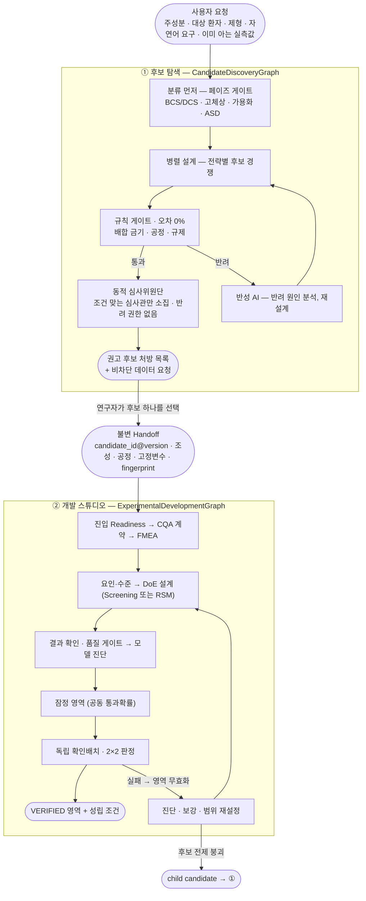

# Formula 1 — 실패를 미리 겪어보는 AI 제형 설계 시스템

> 약을 실제로 만들어 보기 전에, 여러 AI가 서로 견제하며 "이 처방은 왜 실패할지"를 미리 찾아내고, 연구자가 고른 처방을 실험계획부터 확인배치까지 이끌어 **검증된 운전 영역**으로 만드는 시스템입니다.
>
> 제4회 인공지능 신약개발 경진대회 출품작 · 팀 **Formula 1**

**바로 써 보기 → <https://zihwan.com/formula1>**

---

## 한눈에 보기

시스템은 두 단계로 나뉩니다.

**① 후보 탐색.** 분자식을 넣으면 컴퓨터가 작용기를 계산하고, 처방을 만들기 전에 이 약이 어떤 부류인지부터 정합니다(BCS/DCS 용해도·투과도, 고체상, 가용화 전략 필요 여부, ASD 공정). 그다음 여러 전략의 후보 처방을 동시에 만들고, 출처가 붙은 규칙표들이 정해진 순서대로 검사합니다. 통과한 처방만 상황에 맞게 불려 온 AI 심사관이 순위를 매기고, 반려되면 AI가 이유를 읽고 다시 설계합니다. **값을 모른다고 멈추지 않습니다** — 계산값 → 예측식 → 실측값 중 있는 것까지만 쓰고, 판정이 실제로 갈리는 지점에서만 구체적인 실측을 되묻습니다.

**② 개발 스튜디오.** 연구자가 후보 하나를 고르면 그 처방이 불변 Handoff로 고정되고, CQA 계약 → FMEA → 요인·수준 → 실험계획(DoE) → 결과 입력 → 모델 진단 → 불확실성을 반영한 잠정 영역 → 독립 확인배치까지 이어 가서 **VERIFIED 운전 영역(design space)과 그 성립 조건**을 냅니다. 숫자는 결정론 통계 엔진이, 판정은 규칙 171개가, 승인은 연구자가 합니다. 화면은 "시스템이 묻고 연구자가 답하는" 질문 카드로 진행됩니다.

모든 과정이 웹 화면에서 보입니다. **시스템은 데이터를 지어내지 않습니다** — LLM이 응답하지 않으면 처방이나 점수를 대신 채우지 않고 "응답 없음"으로 표시하며, 시연 데이터는 전부 공개 논문의 실측값입니다.

## 목차

1. [무엇이 문제인가](#1-무엇이-문제인가)
2. [챗봇에게 맡기면 안 되는 이유](#2-챗봇에게-맡기면-안-되는-이유)
3. [핵심 아이디어 — 창의는 AI가, 검증은 규칙이, 결정은 연구자가](#3-핵심-아이디어--창의는-ai가-검증은-규칙이-결정은-연구자가)
4. [전체 흐름 — 그래프 둘, 연결은 하나](#4-전체-흐름--그래프-둘-연결은-하나)
5. [입구 — 분자 구조부터 계산한다](#5-입구--분자-구조부터-계산한다)
6. [분류 먼저 — 값을 몰라도 후보부터](#6-분류-먼저--값을-몰라도-후보부터)
7. [검사에는 순서가 있다](#7-검사에는-순서가-있다)
8. [개발 스튜디오 — 고른 후보를 검증된 영역까지](#8-개발-스튜디오--고른-후보를-검증된-영역까지)
9. [시연 시나리오](#9-시연-시나리오)
10. [우리가 쓴 룰북](#10-우리가-쓴-룰북)
11. [이 시스템의 차별점](#11-이-시스템의-차별점)
12. [Robin(FutureHouse)에서 가져온 것](#12-robinfuturehouse에서-가져온-것)
13. [기술 구조 (개발자용)](#13-기술-구조-개발자용)
14. [직접 실행해 보기](#14-직접-실행해-보기)
15. [한계와 남은 일](#15-한계와-남은-일)

---

## 1. 무엇이 문제인가

새로운 약 하나를 세상에 내놓기까지 보통 10년이 넘게, 수조 원이 듭니다. 그런데 이 과정이 "약효 성분을 찾는 일"로 끝나지 않습니다. 약효를 내는 주성분을 찾았더라도 사람이 삼킬 수 있는 형태 — 알약, 캡슐, 시럽 — 로 만들어야 비로소 약이 됩니다. 이 단계를 **제형 설계**라고 부릅니다.

문제는 주성분 하나로는 알약이 굳지 않는다는 점입니다. 그래서 여러 첨가제를 섞는데, 바로 그 조합에서 사고가 납니다.

| 사고 유형 | 무슨 일이 생기나 |
|---|---|
| 화학적 충돌 | 주성분과 첨가제가 반응해 약이 갈색으로 변하거나 분해된다 |
| 공정 실패 | 가루를 눌러 알약으로 찍을 때 부서지거나 기계에 들러붙는다 |
| 규제 초과 | 나라마다 정한 첨가제 상한을 넘긴다. 어린이용은 기준이 훨씬 엄격하다 |

처방이 정해진 뒤에도 끝이 아닙니다. 혼합 시간, 붕해제 함량 같은 변수를 얼마나 흔들어도 규격을 지키는지 — **운전 영역** — 를 실험으로 증명해야 합니다. 제약 현장은 이 모든 것을 **실험실에서 직접 만들어 보고, 실패하면 다시 설계하는** 방식으로 풀어 왔고, 그 시행착오를 수십 번 반복합니다. 이 값비싼 시행착오를 가능한 한 **컴퓨터 안에서 먼저 끝내고**, 꼭 필요한 실험만 정확히 계획하자는 것이 이 프로젝트의 출발점입니다.

## 2. 챗봇에게 맡기면 안 되는 이유

"AI가 똑똑하니 좋은 처방을 물어보면 되지 않나?" 여기에 함정이 있습니다.

거대언어모델은 말을 아주 그럴듯하게 합니다. 그런데 그럴듯한 것과 실제로 맞는 것은 다릅니다. 이런 AI는 **없는 사실을 자신 있게 지어내는 일(환각)** 이 있습니다. 일어나지 않는 화학 반응을 매끄럽게 설명하고, 만들 수 없는 처방을 태연히 제시하며, 규제 수치나 회귀계수까지 지어냅니다. "이 첨가제는 15mg까지 괜찮다"고 단언하지만 실제 기준은 10mg일 수 있습니다.

제약에서 이런 실수는 곧 제품 폐기와 허가 반려입니다. 그래서 이 분야에는 "그럴듯함"이 아니라 **"확실히 맞음"** 이 필요합니다.

## 3. 핵심 아이디어 — 창의는 AI가, 검증은 규칙이, 결정은 연구자가

역할을 셋으로 나눴습니다.

> **새로운 처방과 가설을 상상하는 일은 AI에게,
> 그것이 맞는지 검사하고 숫자를 계산하는 일은 절대 틀리지 않는 규칙과 엔진에게,
> 무엇을 개발하고 어떤 판단을 받아들일지는 연구자에게 맡긴다.**

첨가제와 공정 조건의 조합은 사실상 천문학적입니다. 이 넓은 공간에서 쓸 만한 후보를 상상하고, 서로 부딪히는 목표(안정성·복용 편의·생산 단가·규제 통과) 사이에서 타협점을 찾는 일은 규칙만으로는 못 합니다. AI가 잘하는 일입니다.

반대로 "이 첨가제가 어린이 상한을 넘는가", "이 영역에서 미래 배치가 규격을 통과할 확률은 얼마인가" 같은 판단은 계산기처럼 언제나 똑같이 내려야 합니다. 여기에 AI의 추측이 끼어들면 위험해집니다.

| 성격 | 예시 | 담당 |
|---|---|---|
| 숫자로 답이 떨어지는 것 | "이 첨가제가 10mg 이하인가", 회귀계수·예측구간 | 규칙 기반 검사기 · 통계 엔진 |
| 맥락을 읽어야 하는 것 | "이 조합이 어린이가 먹기에 자연스러운가", 실패 원인 가설 | 심사·가설 AI |
| 받아들일지 정하는 것 | 어떤 후보를 개발할지, 과적합 모델을 축소할지 | 연구자 |

규칙은 "이건 틀렸어"까지만 말할 수 있고 새로운 답을 만들지는 못합니다. AI는 답을 만들지만 스스로 확정하지 못합니다. 셋은 경쟁이 아니라 서로의 빈틈을 메우는 **역할 분담**입니다.

## 4. 전체 흐름 — 그래프 둘, 연결은 하나



두 그래프는 내부 상태를 공유하지 않고, 연구자가 고른 후보를 얼려 둔 **불변 Handoff** 하나로만 이어집니다. 후보 1위가 자동으로 개발에 들어가지도 않습니다 — 후보 카드의 **이 후보로 개발 착수**를 눌러야 시작합니다.

**① 후보 탐색**은 "만들기 전에 실패를 걸러내는" 쪽입니다. 지휘 계층이 요청을 읽고 필요한 전문가 팀을 정하고, 설계 계층은 초안을 하나만 만들지 않고 서로 다른 전략으로 동시에 만들어 경쟁시킵니다. 규칙 게이트를 통과했다는 것은 "명시적 위반을 **발견하지 못했다**"는 뜻이지 "안전이 확정됐다"가 아닙니다 — 그래서 모르는 값은 모른다고 표시하고(잠정/provisional), 전략이 갈리는 지점의 값만 되묻습니다([6장](#6-분류-먼저--값을-몰라도-후보부터)). 심사위원단은 맥락을 읽어야 하는 부분을 담당하되 **반려 권한이 없습니다** — 점수는 통과한 후보들 사이의 순위에만 씁니다.

**② 개발 스튜디오**는 "만든 뒤 실제 데이터로 운전 영역을 증명하는" 쪽입니다. 모든 판단 지점에서 멈추고 연구자의 입력을 기다리며, 결과는 확인배치로만 확정됩니다([8장](#8-개발-스튜디오--고른-후보를-검증된-영역까지)).

### 심사관은 고정 명단이 없습니다

명단에 여섯 명이 등록돼 있고, 조건이 맞는 사람만 그 자리에서 만들어집니다.

| 심사관 | 소집 조건 |
|---|---|
| 어린이 안전 | 대상이 어린이일 때 |
| 녹이는 전략 | 잘 녹지 않는 약이거나 코팅이 필요할 때 |
| 공정 실현성 | 항상 |
| 규제 취지 | 숫자로 못 끊은 규제 판단이 남았을 때 |
| 문헌 조사 | 룰북이 모르는 성분이 처방에 있을 때 |
| 고령자 안전 | 대상이 고령자일 때 |

어린이용 요청에서는 어린이 안전 심사관이 들어오고 고령자 심사관은 **아예 만들어지지 않습니다.** 요청을 고령자용으로 바꾸면 반대가 됩니다.

## 5. 입구 — 분자 구조부터 계산한다

검사를 시작하려면 "이 약이 어떤 작용기를 가졌는가"를 먼저 알아야 합니다. 유당이 위험한지 아닌지는 약에 아민기가 있느냐에 달려 있기 때문입니다. 이걸 사람이 손으로 적으면 틀리기 쉽습니다 — 아세트아미노펜은 이름 때문에 아민처럼 보이지만 실제로는 아미드라서 유당과 반응할 아민이 없습니다. 그래서 구조는 반드시 계산합니다.

```
분자식 (SMILES)
   │
   ├─ 1. 구조 품질 검사    파싱·염·전하·입체중심이 온전한가
   ├─ 2. 분자 특성값 계산   35종 (분자량 · 극성표면적 · 수소결합 밀도 …)
   ├─ 3. 구조 패턴 검출     82종 (아민 · 가수분해 · 산화 · 광분해 …)
   ├─ 4. 물성 예측         용해도·투과도 → BCS 등급 (교차검증)
   └─ 5. 문헌 조사         PubChem 식별정보 + 제형·안정성 논문
```

### 구조 패턴 82종 — 무엇이 있고 무엇이 위험한가를 나눕니다

핵심은 개수가 아니라 **판정을 세 등급으로 나눈 것**입니다.

| 등급 | 뜻 | 개수 | 허용되는 해석 |
|---|---|---|---|
| 구조 사실 | 이 작용기가 있다 | 18 | 존재 확인까지만 |
| 조건부 경고 | 조건이 맞으면 위험해질 수 있다 | 52 | 조건과 시험을 찾아본다 |
| 높은 경고 | 구조만으로도 주의가 큰 부위 | 12 | 그래도 단독으로 공정을 배제하지 않는다 |

**"조건"이 무엇인지도 함께 저장합니다.** 예를 들어 에스터가 검출되면 "가수분해 가능"이라고만 하지 않고, 그것이 위험이 되려면 무엇이 필요한지(수분·pH·온도·시간)와 무엇으로 확인할 수 있는지(pH·온도별 수계 스트레스 시험)를 같이 답니다. 구조 하나로 결론을 내지 않겠다는 원칙이 데이터 구조에 박혀 있습니다.

분야별로는 질소·아민 18종, 니트로사민 7종, 산과 염기 8종, 가수분해 14종, 산화 10종, 반응성 8종, 금속 결합 6종, 광분해 10종, 고체 특성 1종입니다.

### 세분화된 이름과 규칙표 이름을 잇습니다

아민은 `1차 지방족`·`2차 지방족`·`3차 지방족`·`방향족`으로 나눠 검출하지만, 배합 금기 규칙표는 `primary_amine`·`secondary_amine`이라는 이름으로 연결돼 있습니다. 그래서 패턴 목록에 "이 패턴은 규칙표의 어느 이름과 연결되는가"를 적는 칸을 두었습니다. 화면에는 세분화된 이름이 나오고, 규칙표와는 그 연결 이름으로 이어집니다. 테스트가 이 연결을 고정합니다.

### 고리 크기까지 봅니다

같은 패턴이라도 고리 크기에 따라 위험이 다릅니다. 4각 고리 β-lactam은 구조적 긴장 때문에 훨씬 불안정한데, 5각 γ-lactam은 평범한 고리 아미드입니다. 패턴만으로는 둘이 구분되지 않아서 **고리 정보를 후처리로 봅니다.**

```
2-azetidinone (4각)  → β-lactam · 높은 경고
2-pyrrolidone (5각)  → γ-lactam · 구조 사실
아목시실린           → β-lactam 검출 → 안정성 시험이 자동으로 필수 등급이 됨
```

### 구조 패턴을 화면에서 직접 검사할 수 있습니다

판정을 믿으려면 "그 패턴이 정말 이 분자에 있는가"를 사람이 확인할 수 있어야 합니다.

- 규칙표가 쓰는 패턴을 버튼으로 제공하고, 각 패턴이 **어떤 규칙을 발동시키는지** 함께 보여줍니다
- 직접 쓴 패턴도 대 볼 수 있고, 맞은 부분이 구조 그림에 강조됩니다
- 염은 판정 계층과 똑같이 **본체를 추출한 뒤** 매칭합니다

### 예측값은 두 모델로 교차검증하고, 불일치 자체를 신호로 씁니다

용해도 예측은 특히 불확실합니다. 그래서 단일 모델의 점 추정값을 믿는 대신 **두 모델의 예측이 얼마나 벌어지는지**를 봅니다.

```
두 모델의 용해도 예측 차이 ≥ 1 log  →  예측을 신뢰하지 않음
                                    →  실험 용해도 측정을 "필수" 시험으로 올림
```

예측 모델이 연결되지 않은 경우에는 **숫자를 지어내지 않습니다.** "미연결"이라고 표시하고, 그것도 자료 요청으로 이어집니다. 자료가 없다는 것은 안전하다는 뜻이 아니기 때문입니다. 용해도와 투과도가 모두 있으면 **BCS 등급**을 도출해 전략 선택이 참조하되, 예측 기반 사전 분류이며 규제 판정을 대체하지 않는다고 화면에 명시합니다.

### 구조 경고가 시험 등급을 올립니다

구조를 계산해 놓고 그 결과를 시험 선택에 쓰지 않으면, 에스터를 가진 약과 안 가진 약이 같은 시험을 받게 됩니다. 그래서 구조 경고가 확인시험 등급을 **자동으로 올립니다.**

| 검출된 구조 | 올라가는 시험 | 권장 → 필수 |
|---|---|---|
| 가수분해 가능 부위 | 소규모 stress stability | ✓ |
| 수분 반응성 부위 | 축약 수분 민감성 시험 | ✓ |
| 광분해 우선순위 신호 | 광안정성 (ICH Q1B) | ✓ |
| 아민 | 부형제 배합적합성 시험 | ✓ |
| 니트로사민 전구체 | NDSRI 위험평가 | 신규 추가 |
| 고반응성 부위 | ICH M7 변이원성 평가 | 신규 추가 |

무엇이 왜 올라갔는지도 함께 표시합니다. 투여경로가 고형 경구가 아니면 고체 특성화 시험(XRPD 등)의 비중을 낮춥니다.

### 이미 아는 실측값은 처음부터 넣을 수 있습니다 (선택)

비워 두면 시스템은 그 값을 **모른다고 보고**, 전략이 실제로 갈리는 지점에서만 데이터 요청을 냅니다. 이미 측정한 값이 있다면 첫 화면의 **실험 데이터 입력**에 넣으면 그만큼 요청이 줄고, 판정이 실측 기반으로 바뀝니다.

| 넣는 값 | 무엇이 달라지나 |
|---|---|
| 1회 투여량 | 용량–용해도 비(D0 등)가 계산되어 DCS 분류가 가능해집니다 |
| 안식각 · 압축성 지수 · Hausner 비 | 유동성 등급이 실측으로 산출되어 **공정 경로 결정**이 바뀝니다 |
| 용량/용해도 부피 · 흡수율 | BCS 등급이 **실측 기반**으로 확정됩니다(예측 등급은 확정으로 쓰지 않습니다) |
| 흡습성 · 광분해 · 열/수분 민감 | 포장 규칙과 경로 규칙(RTE004·RTE005)이 발동합니다 |

두 가지 원칙이 여기에 걸려 있습니다. **실측값은 추정보다 우선**하므로 RDKit 계산값이 사용자 입력을 덮어쓰지 않고, 목록에 없는 이름은 **받지 않습니다** — 이 값들은 규칙 조건식이 평가되는 문맥에 그대로 합쳐지기 때문에, 임의 키를 허용하면 판정 문맥 자체를 바꿀 수 있습니다.

### 문헌 조사

설계를 시작하기 전에 이 약물에 대해 이미 알려진 것을 모읍니다. **PubChem**에서 식별정보와 보고된 물성을, **Europe PMC**에서 제형·안정성 논문을 가져옵니다. 둘 다 공개 데이터베이스이고 인증 키가 필요 없습니다. 결과가 없으면 없다고 표시하고 넘어갑니다.

## 6. 분류 먼저 — 값을 몰라도 후보부터

처방을 만들기 **전에** 이 약이 어떤 부류인지부터 정합니다. 이 판정이 어떤 전략을 후보로 올릴지를 정하기 때문입니다.

```
RDKit 계산값 + 사용자 실측값 → 파생값 계산 (derived_quantities.csv, 서로 의존하는 값은 수렴할 때까지 반복)
  → Gate 3A  BCS/DCS 용해도·투과도 분류
  → Gate 3B  고체상 — 결정형/무정형 (advisory)
  → Gate 4   가용화 전략이 필요한가
  → Gate 4B  필요하면 어떤 ASD 공정인가
  → 켜진 신호로 전략 채점 (strategy_families.csv) → 경쟁 전략 목록 (예: 미분화 MICRO · 분무건조 ASD_SDD)
```

순서가 곧 의존 관계입니다 — Gate 4는 3A의 DCS 하위분류를, 4B는 4의 가용화 필요 신호를 읽습니다.

이 판정은 **계산값 → 예측식(ESOL·GSE 등) → 실측값** 3단계 중 있는 것까지만 씁니다. 실측이 없으면 "잠정(provisional)"이라고 표시한 채 그대로 진행하고, 게이트에는 **반려 권한이 없습니다** — 전략 후보의 범위만 좁히거나 넓힙니다.

**데이터 요청은 그래프를 막지 않습니다.** 판정이 실제로 갈리는 지점(예: 녹는점·결정형을 모름)에서만 `data_request_triggers.csv`가 구체적 실측을 요청하고, 후보는 이미 나와 있는 채로 화면의 **데이터 요청** 패널에 뜹니다. 요청은 두 종류입니다.

| 종류 | 언제 | 무엇을 바꾸나 |
|---|---|---|
| 전략을 좁히는 요청 | 설계 전 한 번 | 어떤 전략 집합으로 후보를 만들지 |
| 신뢰도를 올리는 요청 | 통과한 후보마다 | 후보의 `confidence` (grounded / provisional) |

값이 들어오면 그래프를 처음부터 다시 돌리지 않습니다. 파생값·게이트·전략 채점을 다시 계산해 전략 집합(`plan_signature`)이 그대로면 **신뢰도 태그만** 다시 매기고(LLM 호출 0회), 전략 집합 자체가 바뀔 때만 새로 생성합니다. 각 후보는 `confidence`와 `pending_refinements`(아직 못 채운 요청 목록)를 달고 나옵니다 — `pending_refinements`가 비어 있을 때만 grounded입니다.

## 7. 검사에는 순서가 있다

규칙표를 아무 순서로나 돌릴 수 없습니다. "직접 찍어 누르기 규칙"은 그 공정이 선택된 뒤에야 의미가 있고, 그 선택은 가루가 잘 흐르는지 등급이 나온 뒤에야 가능합니다. 그래서 규칙표마다 순서가 붙어 있고, **앞 단계가 만든 값이 뒷 단계의 발동 조건으로 흘러갑니다.**

```
0  참조 자료         첨가제 목록 · 특성값 정의 · 구조 패턴 정의
5  주성분 특성 경고   경고 구간 판단
10 가루 흐름 등급     안식각 48도 ──→ 흐름 "나쁨"
11 공정 경로 결정              └─→ 직접 찍어 누르기 배제
20 배합 금기 (1대1)  ← 성분 자체를 바꿔야 하는 반려라 앞에 온다
21 어린이 안전 상한
22 색소 · 향료
30 여러 성분 상호작용
40 선택된 공정의 세부 규칙  ← 위에서 정한 공정을 참조
45 첨가제 배합비
50 코팅 · 잔류용매
60 녹는 정도 분류 → 전략
70 포장 · 안정성 · 분석법
```

폴더 번호만 보면 규제가 마지막 같지만, 실제로는 **어린이 안전이 21번으로 앞에서 돕니다.** 값 몇 개를 조정해서 해결되는 문제가 아니라 성분 자체를 바꿔야 하는 반려라, 무거운 공정 계산을 하기 전에 먼저 걸러내는 편이 낫기 때문입니다.

## 8. 개발 스튜디오 — 고른 후보를 검증된 영역까지

후보 처방은 "이렇게 만들면 될 것 같다"까지입니다. 실제 개발은 어떤 품질 특성(CQA)을 어떤 **절대 규격**으로 볼지 정하고, 실패 원인을 짚고(FMEA), 바꿀 변수와 범위를 정해 실험계획을 세우고, 결과로 모델을 만들어 **규격을 동시에 만족하는 영역**을 찾은 뒤, **새로 만든 독립 배치**가 그 예측대로 나오는지 확인해야 끝납니다. 개발 스튜디오는 이 과정을 상태기계로 옮긴 것입니다.

| 단계 | 시스템이 하는 일 | 연구자가 정하는 것 |
|---|---|---|
| 진입 Readiness | 조성 합계·원료 등급·공정 단계·설비·배치 규모 검사 | 빠진 값 입력. 모르는 고정 공정변수는 `UNKNOWN`으로 기록 가능 — 최종 영역의 한계로 따라간다 |
| CQA 계약 | 템플릿·매핑 규칙으로 CQA 후보와 역할 제안 | 역할(DoE 반응/모니터링/해당없음)과 **절대 규격**. 규격 없는 CQA는 DoE 반응이 될 수 없다 |
| FMEA | 공정 단계별 원인→실패모드→CQA seed + LLM 누락 가설 | 처리 방향(DoE 요인/고정/자료 요청/제외). 발생도 근거가 없으면 O = UNKNOWN, RPN 미계산 |
| 요인·수준 | center = 후보 현재값, 경계 = 근거 교집합, 조성 제약 검사 | 연구 범위와 출처. 근거 없는 경계는 만들지 않는다 |
| DoE 설계 | 설계 선택 규칙 → 행렬·run order·seed·alias 생성 → 검증 | 승인 또는 다른 설계(사유 필수) |
| 결과 | CSV를 읽어 run과 대조 → **연구자 확인** → 품질 게이트 | 읽은 값 확인 |
| 모델 | 사전 계획한 전체 이차모형 적합·진단 | 과적합 flag를 **계층성 유지 축소** 또는 **사유 달고 수용** (자동 stepwise 없음) |
| 잠정 영역 | 미래 배치 예측분포로 공동 통과확률 ≥ 0.90 영역 + 권장 setpoint | PROVISIONAL 승인 |
| 확인배치 | 필수 확인점 3개 제안, 예측구간을 **첫 결과 전에 잠금**, 2×2 판정 | 독립 배치 실측값 입력 → 최종 승인 |

### 세 가지 원칙

1. **숫자는 코드가, 설명은 LLM이.** 설계행렬·alias·회귀계수·진단·예측구간·영역·판정·상태 승격은 결정론 엔진(`formula/qbd/`)이 합니다. LLM은 FMEA 누락 가설과 확인 실패 시 경쟁 원인가설만 내고, 그 출력은 근거 등급 `LLM_HYPOTHESIS`로 고정됩니다.
2. **모든 판정은 룰북이.** `database/07_doe/`의 규칙 171개(CSV 22개) + 마스터 7종 + manifest가 판정 권한 전부입니다. 조건식은 Python `eval`이 아니라 **AST 화이트리스트 평가기**로 돌고(허용되지 않은 문법이 CSV에 들어오면 로드 자체가 실패), 값이 없으면 "미발화"가 아니라 규칙마다 정한 결측 처리(`RECORD_NOT_CHECKED`, `REQUEST_DATA` …)를 적용합니다. 여러 규칙이 동시에 발화하면 전부 기록하고 가장 강한 효과 하나로 전이하며, 다음 상태는 전이표(`backtrack_routing_rules.csv`)에서만 찾습니다 — 표에 없으면 사람 판단(human triage)으로 갑니다.
3. **연구자가 승인한다.** 모든 승인 대기 상태에 승인과 반려가 있습니다. 경고는 사유를 남기면 넘길 수 있고, 차단·무효화는 누구도 override할 수 없습니다. 연구자는 판단을 바꿀 수 있지만 **근거 등급은 바꿀 수 없습니다** — 데이터로만 올라갑니다.

### 누가 무엇을 바꿀 수 있나

| 규칙 판정 강도 | override | 예 |
|---|---|---|
| WARNING | 사유 기록 후 진행 | 권고와 다른 설계(AA007), 통상 사용범위 밖(FR003) |
| ROUTE · AUGMENT | 사유 + 승인권자 | 과적합 flag(MV006) → 수용 시 `ACCEPTED_WITH_FLAGS` |
| REQUEST_DATA | 대체 근거 제출 시만 | 원출처 근거 등급은 그대로 |
| BLOCK_STAGE · INVALIDATE | **불가** (AA017) | 규격 없는 DoE 반응, 계층성 깨는 축소, 확인 실패한 영역 |

| 근거 등급 | 모델 적합 | 확인 판정 |
|---|---|---|
| 자체 실측(확인됨) | ✓ | ✓ |
| 문헌 표 수치 | ✓ | ✗ |
| 연구자 가정 | 수준값 근거로만(표시됨) | ✗ |

집행 모드는 둘입니다. **production**은 약학 담당 검토를 거쳐 `APPROVED`된 규칙만 집행하는데, 171개 규칙은 전부 검토 대기(`DRAFT_PENDING_REVIEW`)라서 production에서는 집행 규칙이 0개입니다. 그래서 화면은 **demo(sandbox)** 모드로 돕니다 — 규칙은 전부 집행되지만 결과는 운영으로 승격되지 않고, 화면에 지금 몇 개 규칙이 집행 중인지 항상 표시됩니다.

### 영역은 평균이 아니라 미래 배치로

잠정 영역은 모델 평균의 신뢰구간이 아니라 **미래 배치의 예측분포**(반응별 t 분포, 척도 √(평균 SE² + 잔차분산))로 계산합니다. 반응별 통과확률을 곱한 공동확률이 0.90 이상인 격자점이 영역이고(반응 간 독립 가정 — 정책에 기록), 분모는 **설계점 convex hull 안의 격자점**입니다. 권장 setpoint는 domain 경계에서 0.1 coded 이상 떨어진 점 중 공동확률이 가장 높은 곳입니다.

확인점은 세 개가 필수입니다 — **SETPOINT**(권장 setpoint), **BOUNDARY**(영역 안에서 공동확률이 가장 낮은 점), **ROBUSTNESS**(setpoint ± 허용 변동 꼭짓점 중 가장 취약한 점). 예측구간은 필수 확인점 × DoE 반응 전체를 한 family로 묶은 Bonferroni 동시구간이고, **첫 결과가 들어오기 전에 잠깁니다.** 판정은 2×2입니다.

| | 예측구간 안 | 예측구간 밖 |
|---|---|---|
| 규격 통과 | 최종 승인 요청 → **VERIFIED** | 영역 무효화 → 모델 보강 |
| 규격 실패 | 영역 무효화 → 진단 | 영역 무효화 → 진단 |

**VERIFIED는 "내부 사전계획을 통과했다"는 뜻입니다.** 세 점에서 1배치씩 확인한 것은 세 위치의 확인이지 영역 전체의 증명이 아니며, 규제기관이 승인한 Design Space나 PPQ 완료를 의미하지 않습니다. 최종 영역에는 성립 조건(scope)이 함께 붙습니다 — 관리되지 않은 공정변수, 요인 효과를 평가하지 않은 CQA, 설비, 배치 규모, 외삽 구역, 기록된 한계.

### 화면

맨 위 **① 후보 탐색 → ② 개발 스튜디오** 탭이 곧 두 그래프입니다. 스튜디오의 주인공은 가운데 **질문 카드**입니다 — 지금 상태에서 시스템이 연구자에게 묻는 것과 입력 폼, 승인·반려 버튼이 있고, 규칙이 막으면 어느 규칙이 왜 막았는지가 카드 안에 바로 뜹니다(그게 곧 다음에 넣을 값입니다). 그 아래에 시스템 판정과 연구자 결정이 번갈아 쌓이는 대화 기록, 옆에 단계 레일, 오른쪽에 결과(모델 표·영역 단면 지도·확인점)·규칙 판정 전체·lineage가 대화를 따라 채워집니다. 휴대폰에서는 한 열로 쌓이고, 편집 표는 행마다 카드로 바뀝니다.

## 9. 시연 시나리오

### ① 후보 탐색 — 입력줄 아래 카드 (누르면 바로 실행)

실행되는 동안 오른쪽에 "지금 어느 계층이 무엇을 왜 하는지" 해설이 단계별로 뜹니다. 모두 실제로 돌려서 어떤 경로를 밟는지 확인한 것입니다.

**시나리오 1 · 규칙이 AI를 막는 순간 (약 1분).** 현장 사정 때문에 **유당을 반드시 써야 한다**고 못 박고 어린이용 플루옥세틴 정제를 요청합니다.

```
[구조]   플루옥세틴 → 2차 아민 검출
[설계]   제약대로 유당을 넣은 처방 생성
[규칙]   INC002 반려 — 2차 아민이 유당과 반응해 갈변
         규칙표가 제시한 대안: 만니톨
[판정]   이 제약을 유지하는 한 통과하는 처방이 없다
```

"유당을 빼라"는 재설계 지시와 "유당을 반드시 넣어라"는 제약이 서로 부딪히므로, 시스템은 헛되게 다시 설계하지 않고 **제약 자체가 불가능하다는 결론과 대체 첨가제를 냅니다.**

**시나리오 2 · 요청에 따라 팀이 바뀐다 (약 2분).** 어린이용 바나나향 아세트아미노펜 정제를 요청합니다. 어린이 안전 심사관이 생성되고, 다른 심사관들은 조건에 맞지 않아 만들어지지 않습니다. 아세트아미노펜이 아미드라서 유당 금기에 걸리지 않는 것도 구조 플래그에서 함께 확인됩니다.

**시나리오 3 · 값을 몰라도 후보부터, 갈리는 지점만 되묻는다 (약 1~2분).** 성인용 이부프로펜 정제를 요청합니다(1회 투여량 200mg — 이부프로펜의 통상 단위 용량 — 을 입력해 둡니다. 용량이 있어야 DCS 분류에 필요한 용량–용해도 비를 계산할 수 있습니다). 페이즈 게이트가 **후보를 먼저 내고**, 판정이 갈리는 지점에서만 **데이터 요청** 패널에 실측을 요청합니다. 시연은 그 입력칸을 짚어 주고, 연구자가 가진 측정값을 넣어 제출하면 그래프를 다시 돌리지 않고 그 자리에서 재계산돼 남은 요청이 줄고 신뢰도 태그가 갱신됩니다. 측정값은 시스템이 대신 채우지 않습니다.

**시나리오 4 · 후보 이후 — Lornoxicam 분산정 개발 (약 3분).** ② 개발 스튜디오로 넘어가 아래 가이드 시연을 시작합니다.

### ② 개발 스튜디오 — Lornoxicam 분산정 가이드 시연

스튜디오의 **가이드 시연**은 장면 9개를 순서대로 걷습니다. 장면마다 무엇을 보여 주는지가 질문 카드 위에 뜨고, **이 장면 입력 채우기**로 논문에 적힌 값을 폼에 채운 뒤 연구자 버튼을 누르거나, **자동 진행**으로 끝까지 흘려 볼 수 있습니다(언제든 멈춤 가능). 입력값은 폼에 채워진 그대로 보이고, 판정과 계산은 매번 서버가 새로 합니다.

데이터는 Almotairi et al., *Pharmaceuticals* 2022, 15, 1463 (CC BY)의 실측 15 run(Table 3)이며, 사전 적재하지 않고 **결과 제출 화면으로 CSV를 올리는 과정 자체가 시연 대상**입니다. 논문의 회귀식·ANOVA·최적점은 쓰지 않고 엔진이 처음부터 다시 계산합니다.

| 장면 | 보여 주는 것 |
|---|---|
| 1 진입 | 논문에 없는 값(원료 등급·배치 규모·압축력)을 규칙이 짚어 요청 → 연구자가 논문에 적힌 사실(공급처, 미보고)을 그대로 기록. 압축력·배치 규모는 `UNKNOWN`으로 최종 영역의 한계까지 따라감 |
| 2 CQA | 용출 요약값·규격이 비면 CR006·CR002가 승인을 막음 → DE30 ≥ 75 %(프로젝트 목표, 가정 표시) 입력. 함량은 논문이 인용한 85–115 %. 논문에 기준이나 측정이 없는 CQA(경도 기준, 유연물질, 중량 RSD, 분산 미세도)는 그 사실을 근거로 `해당없음` — 최종 scope에 남음 |
| 3 FMEA | 혼합시간·충진제 비·붕해제 → DoE 요인, SLS 활택(2 %·3분)·압축력 → 고정(압축력은 고심각도·검출 불가). 논문 DSC·FTIR(상호작용 없음)을 근거로 상호작용 O = 1 |
| 4 요인 | 논문 연구 범위(Table 9) 입력 → 크로스포비돈 2–10 %가 통상 범위 2–5 %를 벗어남(FR003 경고), 희석 교락 경고(FR007) |
| 5 설계 | 3요인 + 사전근거 → RSM 직행, Box–Behnken 15 run, 꼭짓점 외삽 구역 표시 |
| 6 결과·모델 | 논문 실측 15 run CSV 업로드 → 읽은 60개 값 확인. 마손도 예측 R² 0.25 → 선형 축소 0.82. 함량균일성 예측 R² 0.48도 과적합 flag → 사유 달고 수용. 영향점 run 3·12(동률) 표시, 삭제 없음 |
| 7 영역 | supported domain 7,501 격자 중 평균 기준 77.2 % → 공동확률 47.6 %. 경계 주도 CQA는 DE30. 권장 setpoint 2.7 / 12.5분 / 6.8 %, 공동확률 0.991 |
| 8 확인계획 | 필수 3점 잠금(12개 비교 → 개별 99.58 %, setpoint DE30 82.3 (71.9–92.8)). 논문 최적처방 배치는 결과가 이미 공개돼 참고점으로만 |
| 9 확인배치 | 논문 최적처방 배치(3:1 · 11분 · 6.23 %)의 공개 관측값(분산 4.4 s · 마손도 0.19 % · DE 80.64 % · AV 4.65 · 함량 99.62 %)을 참고점으로 넣어 잠근 예측구간과 비교 — 전부 구간 안. 승격은 필수 확인점 3개의 새 독립 배치 실측으로만 이어진다 |

시연의 모든 값은 논문(조성 Table 10 · 요인 범위 Table 9 · 실측 Table 3 · 최적처방 Table 5·6 · 공정 §3.2.4 · DSC/FTIR §2.2–2.3)에서 왔고, 논문에 없는 값은 비워 두거나 "미보고"로 기록합니다. 예외는 DE30 ≥ 75 % 하나로, 논문 기준이 아니라 프로젝트 목표값이며 화면에 가정으로 표시됩니다. 잔차 자유도 5인 모델이라 예측구간이 약 ±10 %p로 넓은 것도 한계로 표시합니다.

## 10. 우리가 쓴 룰북

기준은 하나입니다.

> **행마다 출처와 검증 상태가 적힌 표만 처방을 반려할 수 있다.**

### ① 후보 탐색 — 판정에 쓰는 표 (이도영 담당, 규칙 363행)

행마다 조치 방법과 검증 상태가 붙어 있어서 이 기준을 만족합니다. 배합 금기·공정·규제·어린이 안전 판정은 전부 여기서 나옵니다.

| 폴더 | 내용 |
|---|---|
| `00_master` | 첨가제 목록 · 특성값 정의 · 구조 패턴 정의 · 물성 추정 · 파생값 정의 |
| `01_route_decision` | 가루 흐름 등급 · 공정 경로 분기 |
| `02_incompatibility` | 1대1 배합 금기 · 여러 성분 상호작용 |
| `03_process` | 직접 찍어 누르기 · 뭉치기 · 코팅 · 캡슐 · 배합비 · 잔류용매 |
| `04_biopharmaceutics` | 녹는 정도 분류와 전략 · 용출 · 분석법 · 페이즈 게이트 4종(3A·3B·4·4B) |
| `05_regulatory` | 어린이 안전 · 색소와 향료 · 안정성 · 포장 |
| `06_config` | 심사관 명단 · 합의 가중치 · 전략군(strategy_families) |

여기에 **구조 패턴 목록(82종)** 을 런타임에 읽습니다. 패턴마다 어떤 규칙을 발동시키는지·위험이 되려면 무슨 조건이 필요한지·무슨 시험으로 확인하는지가 함께 적혀 있습니다. 가장 자주 발동하는 것은 어린이 안전(46행)과 1대1 배합 금기(15행)입니다.

### ① 후보 탐색 — 참고 자료로 쓰는 표 (조하준 담당)

출처는 붙어 있지만 "위반하면 어떻게 처리할지"가 행마다 적혀 있지 않아서 반려를 만드는 자리에는 넣지 않고, 정보를 공급하는 자리에 넣었습니다.

| 표 | 어디에 쓰나 |
|---|---|
| 주성분 특성 임계값 (62행) | 물성 경고 구간 표시 |
| FDA 첨가제 목록 (1,796행) | 룰북이 모르는 성분인지 판별 |
| 확인시험 목록 (66행) | 구조 경고에 따른 시험 계획의 후보 목록 |
| 측정 카탈로그 · 데이터 요청 트리거 | 무엇을 재면 무엇이 풀리는지, 언제 되묻는지 |

### ② 개발 스튜디오 — `database/07_doe` (룰북 23종 + 마스터 7종, 규칙 171개)

| 묶음 | 파일 | 판정하는 것 |
|---|---|---|
| governance | manifest · 근거 등급 · 승인·override · 이력 | 조건식 문법·함수·context schema, 근거 등급별 사용 권한, override 매트릭스, lineage |
| readiness | 진입 준비 | 조성·등급·공정·설비·배치 규모 |
| qbd_risk | QTPP→CQA · CQA 정의 · FMEA seed · 척도 · 요인 적격성 · 범위 제약 | 역할·절대 규격, 처리 방향, 경계 근거, balance ≥ 0 |
| planning | 통계 상수 · 설계 선택 · 무작위화 · 설계 검증 · 증강 | 설계군, rank·잔차 자유도·alias·백엔드 지원 여부 |
| execution | run sheet · 결과 품질 | 질량수지·설비 용량, 배치 ID·시험법 버전·반복 독립성 |
| analysis | screening · 모델 검증 · 영역 | 효과구간 분류, 과적합·LOF·영향점, domain·불확실성·scope |
| verification | 확인 판정 · 전이표 | 2×2, 잠금·독립성·근거 등급, `(reason_code, from_state) → next_state` |
| masters | CQA 템플릿 · 공정 단계 · 시험법 · 부형제 사용범위 · 설비 · 확인시험 · 통계 출처 | 조회 전용 사실 |

모든 행이 `DRAFT_PENDING_REVIEW` 상태이고, 과학 수치(부형제 범위·약전 기준·서지)는 원문 대조 전(`TO_VERIFY`)입니다. 룰북 수정은 `scripts/generators/`에서 재생성하고 `scripts/validate_07_doe.py`로 정적 검사(조건식 문법·필드·함수·전이 정합)와 실패 재현 fixture 48건을 통과시킵니다.

## 11. 이 시스템의 차별점

### 규칙을 코드가 아니라 데이터로 관리한다

보통 이런 검사 시스템은 규칙을 프로그램 코드에 하나하나 적습니다. 그러면 규칙을 더할 때마다 개발자가 코드를 고쳐야 하고, 규칙을 가장 잘 아는 약학 전문가는 부탁만 할 수 있습니다. 여기서는 규칙을 표로 관리하고, 그 표가 어떤 검사에 연결되는지만 설정 파일에 한 줄 적습니다. **규칙을 추가하는 일이 코딩이 아니라 데이터 입력**이 됩니다. 개발 스튜디오의 판정도 같습니다 — 코드는 사실을 규칙 문맥으로 옮길 뿐, 판정 조건은 CSV 한 줄입니다.

### 같은 입력이면 항상 같은 판정

숫자로 판단하는 검사와 통계 계산에는 AI 추측이 전혀 들어가지 않습니다. 같은 처방을 백 번 검사하면 백 번 같은 결과가 나오고, 같은 seed면 같은 run order가 나옵니다. 이 재현성은 규제 기관을 설득할 때 가장 확실한 근거가 됩니다.

### 근거가 없는 규칙은 실행되지 않는다

규칙표의 각 줄에는 그 수치를 **어디서 가져왔는지**가 적혀 있고, 추적에 실패한 것은 실패했다고 기록돼 있습니다. 엔진은 그 기록을 읽고 스스로 판단합니다.

| 근거 상태 | 엔진 동작 |
|---|---|
| 검증됨 | 그대로 판정에 사용 — 반려를 만들 수 있다 |
| 잠정값 | 사용하되 결과에 "잠정" 표기 |
| 미검증 | **반려는 못 시킴** — 심사관에게 넘김 |
| 사람 판단 필요 | 사람에게 넘김 |
| 출처 못 찾음 · 규칙 아님 | **읽는 단계에서 아예 제외** |

이 정책은 그럴듯해 보이는 규칙에도 예외 없이 적용됩니다. 예를 들어 "어린이 계면활성제(SLS) 상한 초과" 같은 규칙은 출처를 추적해 보면 그 기준이 피부에 바르는 경우에만 해당하고 먹는 약의 어린이 상한은 존재하지 않아, 읽는 단계에서 빠집니다.

### 모르는 것을 통과로 읽지 않는다

규칙이 아무것도 못 잡는 이유는 둘입니다 — **문제가 없거나, 판단할 자료가 없거나.** 이 둘을 같은 칸에 넣으면 자료가 없는 쪽이 통과로 읽힙니다. 그래서 모르는 값은 "잠정"으로 표시하고 되묻고(①), 결측 값이 걸린 규칙은 미발화가 아니라 `NOT_CHECKED`나 자료 요청으로 기록하며(②), 개발 결과는 확인배치 전까지 PROVISIONAL을 넘지 못합니다.

엔진 자신이 못 찾은 것도 같습니다. 조용한 통과가 생길 수 있는 경로를 막아 두었습니다.

| 경로 | 조용히 통과되는 모양 | 이 시스템의 처리 |
|---|---|---|
| 성분 이름 대조 | 룰북은 `Lactose monohydrate`, 처방은 `유당` — 글자 비교로는 둘이 만나지 않는다 | 두 부형제 마스터(영문·국문·이명)를 사전으로 삼아 대조. 계열명(`유당`)이면 발동시키되 "등급 미지정"을 판정문에 적는다 |
| 구조 해석 실패 | SMILES 오타 → 구조를 못 읽음 → 작용기 0개 → 구조 기반 금기가 하나도 발동 안 함 | 입력 즉시 사유와 함께 되돌려 준다. 구조를 못 얻은 채 실행되면 게이트가 **통과가 아니라 사람 이관**을 낸다 |
| 사전 조회 | 사전이 비어 있으면 "룰북 밖 조합" 신호가 늘 거짓 | 같은 사전을 쓰고, 주성분은 부형제가 아니므로 신호 계산에서 제외한다 |
| Handoff 변조 | 조성을 바꾸고 fingerprint를 그대로 두면 다른 처방으로 개발이 진행된다 | fingerprint를 재계산해 대조(PV001) — 어긋나면 lineage 검토로 멈춘다 |

회귀 시험은 미탐과 오탐을 같이 고정합니다 — `유당`·`Lactose, NF`·`유당수화물`이 전부 반려로 걸리는지와 함께, 만니톨(이 규칙이 권하는 대체품)과 전분글리콜산나트륨이 **걸리지 않는지**도 못 박습니다. 미탐을 막겠다고 오탐을 만들면 그건 반대 방향의 같은 사고이기 때문입니다.

### 규칙표가 늘어나도 검사 함수는 여덟 개

| 검사 방식 | 하는 일 | 예시 |
|---|---|---|
| 두 성분 조합 금기 | 성분 쌍의 금기 탐지 | 유당 + 2차 아민 → 갈변 |
| 여러 성분 조합 금기 | 성분 묶음이 함께 있을 때의 금기 | 아민염 + 당 + 알칼리 활택제 |
| 임계값 | 수치 기준 검사 | 흐름 지수 20 이하 |
| 범위 | 허용 범위 이탈 | 붕해제 1~15% |
| 필수 성분 강제 | 특정 조건일 때 필수 성분 | 잘 안 녹는 약 → 녹이는 전략 필수 |
| 조건부 금지 | 특정 속성일 때 옵션 금지 | 습기 먹는 약 → 습기 통하는 포장 금지 |
| 구간 조회 | 구간으로 파생값 산출 | 안식각 48도 → 흐름 "나쁨" |
| 결정 트리 | 조건 분기로 공정 확정 | 흐름 나쁨 → 직접 찍어 누르기 배제 |

## 12. Robin(FutureHouse)에서 가져온 것

"AI에게 어떻게 시키느냐"도 설계의 일부입니다. 실험이 실패했을 때 진짜 원인 후보는 보통 여러 개인데, "왜 실패했을까?"라고만 물으면 AI는 그럴듯한 답 하나를 만듭니다. 그래서 **서로 다른 이유를 진짜로 여러 개 생각하게 만드는 지시문 작성법**을, 그 방법을 공개한 실제 신약개발 AI 연구에서 가져왔습니다.

**Robin**은 비영리 연구소 FutureHouse가 만들고 2026년 국제 학술지 **Nature**([논문](https://www.nature.com/articles/s41586-026-10652-y) · [arXiv](https://arxiv.org/abs/2505.13400))에 실린 AI 시스템으로, 사람 개입 없이 가설을 세우고 실험을 제안해 황반변성 치료 후보 약물(ripasudil)을 실제로 찾아낸 사례입니다. FutureHouse는 AI에게 내리는 지시문 원문을 공개했고(GitHub `Future-House/robin`, `robin/prompts.py`), 그 원문을 문장 단위로 대조해 가져왔습니다.

| Robin의 프롬프트 패턴 | 원문 근거 | 이 시스템에 적용한 곳 |
|---|---|---|
| **구별되는 아이디어를 배열로 강제** | `CANDIDATE_GENERATION_SYSTEM_MESSAGE` — "Generate exactly {num_candidates} distinct ideas" | 개발 스튜디오 진단 에이전트 — 확인배치 실패 시 **서로 다른** 원인가설 최대 3개, 가설마다 그것만 가르는 판별시험 |
| **필요 없으면 만들지 않는다** | `FOLLOWUP_SYSTEM_MESSAGE` — "It is not necessary to propose a follow-up experiment if there is nothing significant to follow up on" | 경쟁할 원인이 하나뿐이면 가설도 하나. FMEA 누락 가설도 근거가 없으면 빈 배열 |
| **우선순위를 매긴 평가 기준** | `CANDIDATE_RANKING_SYSTEM_PROMPT` — 근거 강도(최우선) → … → 참신성(마지막) | 심사관 공통 rubric: 근거 강도 → 잔여 위험 → 실현 가능성 → 참신성(참신함만으로 점수를 올리지 않는다) |
| **표현이 아니라 근거로 판단** | 같은 프롬프트 — "not on the persuasive quality or wording" | 같은 rubric에 그대로 |
| **검색된 근거에 뿌리내린 생성** | 후보 생성 전에 문헌 검색 질의를 먼저 만드는 2단계 구조 | 설계 에이전트는 RAG 근거를 먼저 받고, rationale에 그 근거를 반영해야 한다 |

**가져오지 않은 것도 있습니다.**

- **자유 텍스트 시험 제안.** Robin은 어세이 이름을 모델이 자유롭게 적게 합니다. 여기서는 판별시험을 **확인시험 마스터의 실제 행 안에서만** 고르게 하고, 목록 밖 시험은 버립니다. 자유 텍스트는 재현 가능한 근거(ICH/USP 출처, 판정 기준)를 남기지 못하기 때문입니다.
- **쌍대비교 + Bradley–Terry 순위 집계.** 쌍마다 별도 LLM 호출이 필요해 후보 수가 늘수록 호출 수가 제곱으로 늘고, 무료 티어의 분당 토큰 한도가 이미 빠듯합니다. 심사관 점수는 결정론적 가중평균(`formula/agents/consensus.py`)으로 합치고, 반려 권한이 없다는 원칙은 그대로입니다.

## 13. 기술 구조 (개발자용)

### ① 후보 탐색

에이전트 오케스트레이션은 [LangGraph](https://github.com/langchain-ai/langgraph) 기반입니다. 후보 설계와 심사관 평가는 `Send`로 병렬 팬아웃되고, 검증 실패 시 반성 단계를 거쳐 설계로 되돌아가는 루프는 최대 5회로 제한됩니다.

```
intake → phase_gates → generate ─(N개 병렬)→ gate ─┬─ 통과 → drq_refine → summon ─(M명 병렬)→ consensus
                          ↑                        │
                          └──────── reflect ←──────┘  (반려 · 최대 5회)
```

`phase_gates`·`gate`·`drq_refine`는 순수 파이썬입니다. 데이터 요청에 대한 회신(`POST /api/runs/{id}/measurements`)은 그래프를 다시 돌리지 않고 이 결정론 판정 위에서 계산됩니다.

LLM은 프로바이더에 묶이지 않습니다. Anthropic Claude와 Groq 무료 티어를 같은 인터페이스로 감싸고, 라이브 배포는 무료 티어로 돕니다. 처방과 판정은 전부 **구조화 출력**으로 받습니다. Groq는 `max_tokens`도 분당 토큰 한도에 포함해 계산하고, 병렬 팬아웃이 동시에 한도를 때리면 호출이 거절됩니다. 그래서 클라이언트가 모델별 분당 토큰을 직접 회계하고, 예산이 있는 모델을 배정받을 때까지 순번을 기다립니다. 그래도 응답을 받지 못하면 **결과를 지어내지 않습니다** — 그 전략의 후보는 만들지 않고, 그 심사관은 "점수 없음"으로 표시하며, 순위는 실제로 매겨진 점수만으로 정합니다.

### ② 개발 스튜디오

```
formula/development/  rules.py (manifest 로더 · AST 평가기 · 집행기) · states.py (상태기계 전이표)
                      service.py (오케스트레이터 · artifact → 규칙 문맥 매핑) · store.py (SQLite 이벤트 · 결정 원장)
                      handoff.py (Handoff · fingerprint · 데모 후보) · contracts.py (데이터 계약)
formula/qbd/          doe.py (BBD · CCD · FCCD · 2^(4-1) · PB12 생성 · alias · 검증 문맥)
                      analysis.py (OLS · PRESS · Cook's D · pure error · 적합결여 · screening 효과구간)
                      design_space.py (convex hull domain · 공동확률 · setpoint · 확인점 · family 예측구간)
                      cqa.py · fmea.py · factors.py (CQA mapper · FMEA engine · RangeProposer)
formula/agents/development.py   FMEA 누락 가설 · 진단 에이전트 (LLM — 응답이 없으면 가설을 만들지 않음)
```

통계 엔진은 numpy + scipy만 씁니다. 설계는 교과서 표 그대로 직접 생성하고 도구 버전·seed·데이터 해시를 모델마다 저장합니다. 골든 값은 statsmodels 참조 구현(`tests/golden/compute_lornoxicam_golden.py`)과 대조해 고정했습니다.

### API

| Method | Endpoint | 책임 |
|---|---|---|
| POST | `/api/runs` · GET `/api/runs/{id}/stream` | 후보 탐색 실행 · 이벤트 스트림 |
| POST | `/api/runs/{id}/measurements` | 데이터 요청 회신 → 재계산 |
| POST | `/api/candidates/{id}/development-studies` | `{run_id, candidate_version}` → 불변 Handoff + study |
| POST | `/api/development-studies/demo/lornoxicam` | 가이드 시연 study |
| GET | `/api/development-studies/{id}` | state + 지금 연구자에게 묻는 것(`prompt`) |
| POST | `/api/development-studies/{id}/actions/{action}` | 연구자 행동 — `required_data`, `cqa_edit`/`cqa_approve`, `fmea_edit`/`fmea_approve`, `factor_data`/`factor_approve`, `plan_approve`, `results_submit`/`results_confirm`, `model_reduce`/`model_accept`/`model_approve`, `region_approve`, `vplan_lock`, `verification_submit`/`verification_confirm`, `finalize`, `directive_approve`, `override`, 각 반려 |
| GET | `/api/development-studies/{id}/trace` | 역추적 식별자 + 이벤트·결정 원장 |
| GET | `/api/development-studies/{id}/region-slice` | 공동확률 영역 단면 |
| GET | `/api/rules/{rule_id}` | 규칙 원본 CSV 행 + 출처 |

개발 스튜디오의 모든 변경 요청은 `Idempotency-Key`(같은 키는 한 번만 반영), `Expected-State-Version`(오래된 버전이면 409), `Actor-ID` 헤더를 받습니다.

```
formula1/
├─ config/                      규칙 카탈로그 · 포장 사전 · 실측 입력 허용목록 · 심사관 기준
├─ database/                    약학 팀이 공급하는 규칙표
│  ├─ 00_master ~ 06_config     후보 탐색 룰북 (판정 권한)
│  ├─ 07_doe/                   개발 스튜디오 룰북 · 마스터
│  └─ reference/                참조 자료 (조회 전용)
├─ docs/doe_v6.1/               개발 스튜디오 아키텍처 명세 · 인계 문서
├─ formula/
│  ├─ chem/                     분자 계산 (특성값 · 구조 패턴 · 예측 · 2D 그림)
│  ├─ biopharm/ · planner/      페이즈 게이트 · 파생값 · 데이터 요청 · 전략 채점
│  ├─ checkers/                 여덟 개 검사 함수 + 우선순위 실행
│  ├─ agents/                   LLM 노드 (해석 · 설계 · 심사 · 반성 · FMEA 가설 · 진단) + 합의
│  ├─ orchestrator/             LangGraph 그래프 · 상태 · 이벤트 버스
│  ├─ rag/                      근거 검색
│  ├─ development/ · qbd/       개발 스튜디오 상태기계 · 통계 엔진
├─ web/                         FastAPI + 빌드 단계 없는 화면 (app.js · studio.js · explainer.js)
└─ tests/
   ├─ (pytest 172개)            구조 패턴 진리표 · 검사 방향 · 페이즈 게이트 · 07_doe 룰 fixture · 골든 값 · study 흐름
   └─ browser/                  실제 브라우저 검증 (화면 동작 · 보안 · 반응형 · 시나리오 · 스튜디오 시연)
```

## 14. 직접 실행해 보기

**라이브: <https://zihwan.com/formula1>** — 설치 없이 바로 씁니다.

```bash
python3.12 -m venv .venv && .venv/bin/pip install -r requirements.txt
.venv/bin/pytest                                   # 전체 테스트
.venv/bin/python scripts/validate_07_doe.py database/07_doe tests/fixtures/rule_fixtures.json
.venv/bin/uvicorn web.server:app --port 8000       # http://localhost:8000
```

AI 단계(후보 설계·심사·가설)에는 `GROQ_API_KEY`(무료) 또는 `ANTHROPIC_API_KEY`가 필요합니다. 키가 없거나 응답이 없으면 그 단계는 **결과를 만들지 않고 "응답 없음"으로 표시**합니다 — 틀에 박힌 처방이나 점수로 채우지 않습니다. 요청 해석과 재설계 지시는 규칙 기반으로도 처리되고, 규칙 검사·분자 계산·개발 스튜디오의 통계 엔진과 판정은 키 없이 그대로 동작합니다.

화면은 **입력·행동이 가운데, 관측은 바깥**입니다. ① 후보 탐색에서는 가운데 넓은 칸에 후보 처방·합의·데이터 요청이, 왼쪽에 분자 구조·특성값, 오른쪽에 에이전트 그래프·해설·실행 트레이스가 있습니다. ② 개발 스튜디오에서는 가운데 질문 카드가 중심입니다. 규칙 이름을 누르면 **원본 표의 행과 출처 문헌**이 열립니다. 처음 방문하면 **시스템 설명**이 열리고, 상단 버튼으로 언제든 다시 볼 수 있습니다.

## 15. 한계와 남은 일

- **물성 예측 모델 연결.** 용해도·투과도·pKa 예측기(ADMET-AI, SolTranNet, QupKake)를 붙일 자리와 교차검증 로직은 있지만 모델 자체는 연결하지 않았습니다(무거운 의존성). 그때까지는 "미연결"로 표시하고 실측을 요청합니다.
- **룰북 검토.** 개발 스튜디오 규칙 171개는 약학 담당 검토 전이라 production 집행이 0개입니다. 부형제 사용범위·약전 기준·서지는 원문 대조가 필요하고, 시험법 반복정밀도·설비 능력이 비어 있어 반복 오차 검사(SA008)·범위 폭 검사(FR008)는 `NOT_CHECKED`, run sheet 설비 용량 검사(RS003)는 발행 보류로 동작합니다.
- **study 저장소.** 개발 스튜디오 기록은 서버의 임시 저장소(SQLite)에 있어 서버가 재시작되면 진행 중인 study가 사라집니다. 운영에는 영구 저장소가 필요합니다.
- **개발 스튜디오 범위.** Control strategy·NOR·스케일업, mixture·split-plot·D-optimal·DSD 설계, 다변량 공동확률은 범위 밖이며 해당 설계는 실행이 차단됩니다. screening 뒤 RSM은 새 설계(face-centered CCD)로 계획하고, 증강은 블록 중심점 + 실패 확인점 표적 run의 단순 형태입니다. 판별시험 결과 입력 화면은 아직 없습니다.
- **그 밖에.** 환자 체중 기반 어린이 규칙, 규제 사용한도 9,071행의 연결, 문헌 조사·규제 취지 심사관 소집 신호의 정의를 다듬는 일이 남았습니다. 1대1 배합 금기 표는 2차 아민 × 유당을 유당수화물 등급에만 두고 있어, 무수유당 등급 행 추가 여부를 약학 팀과 확인해야 합니다.
