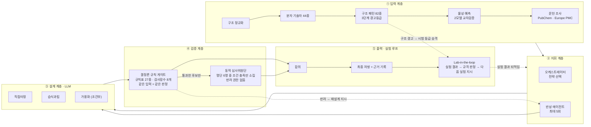

# 논문 삽입용 아키텍처 도해 — LLM 생성 프롬프트

전체 흐름을 한 장에 담는 **논문 그림(Figure)** 스타일 도해를 만들기 위한 한글 프롬프트다.
아래 블록을 그대로 복사해 이미지 생성 모델이나 도해 생성 도구에 넣으면 된다.

> 글자가 많은 도해는 **Ideogram · GPT-Image · Recraft** 처럼 텍스트 렌더링이 정확한 모델에서
> 잘 나온다. Midjourney는 글자가 깨지므로 라벨을 나중에 얹어야 한다.
> 화면비는 **16:9**, 논문 2단 조판이면 **4:3**을 권한다.
> Mermaid·draw.io 같은 도구를 쓸 경우 아래 "구조 명세"만 넘겨도 된다.

---

## 프롬프트 (복사해서 사용)

```
학술 논문에 삽입할 시스템 아키텍처 다이어그램을 그려줘.

[전체 스타일]
- 흑백 계열의 절제된 학술 도해. 배경 흰색, 선과 글자는 검정~진회색.
- 색은 딱 두 곳에만 최소한으로 쓴다: 결정론 규칙 계층의 테두리(짙은 남색),
  반려·경고 표시(붉은색). 나머지는 회색조.
- 장식·그림자·3D·아이콘 남용 금지. 사각형 박스, 얇은 실선, 화살표만 사용.
- 글꼴은 산세리프. 논문 그림 캡션 크기로 축소해도 읽히도록 라벨은 짧게.
- 좌에서 우로 흐르는 가로 방향 배치. 전체가 한 장에 들어와야 한다.

[제목]
Formula 1: 결정론적 규칙 검증을 갖춘 자기조직형 멀티 에이전트 제형 설계 시스템

[구조: 왼쪽에서 오른쪽으로 5개 구역]

구역 1 — 입력 계층 (Input Layer)
  상자 제목: "분자 입력 및 사전 조사"
  안에 세로로 5개 작은 상자:
    · 구조 정규화        염 제거 · 전하 · 입체중심
    · 분자 기술자 44종    분자량 · 극성표면적 · 수소결합밀도
    · 구조 패턴 82종      SMARTS · 9개 분류 · 3단계 경고등급
    · 물성 예측          용해도 · 투과도 (두 모델 교차검증)
    · 문헌 조사          PubChem · Europe PMC
  구역 아래 작은 글씨: "예측 편차 ≥ 1 log → 고불확실성 → 확인시험 요청"

구역 2 — 지휘 계층 (Control Plane)
  상자 제목: "오케스트레이터"
  안에 2개 상자: "전략 선택" 과 "반성 에이전트 (최대 5회)"
  작은 글씨: "요청마다 팀 구성을 다시 결정"

구역 3 — 설계 계층 (Generation)
  상자 제목: "병렬 후보 설계 (LLM)"
  안에 나란히 2~3개 상자: "직접타정", "습식과립", "가용화(조건부)"
  세 상자가 모두 오른쪽 검증 계층으로 화살표

구역 4 — 검증 계층 (Verification) ★ 이 구역을 시각적으로 가장 강조
  상하 2단으로 나눈다.
  위: "결정론 규칙 게이트" — 짙은 남색 테두리, 두꺼운 선
      안에 가로로: 배합금기 → 소아안전 → 공정 → 배합비 → 규제
      아래 작은 글씨: "규칙표 27종 · 검사 함수 8개 · 우선순위 순서 실행"
      그 아래 작은 글씨: "같은 입력 = 같은 판정 (오차 0%)"
  아래: "동적 심사위원단 (LLM)" — 점선 테두리
      안에 상자 3개: "소아 안전", "가용화 전략", "… 조건 충족 시 소집"
      아래 작은 글씨: "명단 6명 중 조건이 맞는 심사관만 생성 · 반려 권한 없음"
  두 단 사이에 세로 화살표: 위에서 아래로 "통과한 후보만"

구역 5 — 출력 및 실험 루프 (Output & Lab-in-the-loop)
  위: "합의" 상자 → "최종 처방 + 근거 기록" 상자
  아래: "Lab-in-the-loop" 상자, 안에 3단계 가로 배치:
    "실험 결과 (자연어)" → "규격 판정 (규칙)" → "다음 실험 지시 (확인시험 66종에서 선택)"
  작은 글씨: "AI가 해석하고 지시 · 사람은 벤치에서 수행"

[화살표 / 되먹임]
- 구역 1 → 2 → 3 → 4 → 5 로 굵은 실선 화살표.
- 검증 계층에서 지휘 계층으로 되돌아가는 **붉은 점선 화살표**,
  라벨: "반려 → 재설계 지시".
- 출력 계층의 Lab-in-the-loop에서 지휘 계층으로 되돌아가는 **회색 점선 화살표**,
  라벨: "실험 결과 되먹임".
- 구역 1의 "구조 패턴"에서 구역 5의 "다음 실험 지시"로 얇은 점선,
  라벨: "구조 경고 → 시험 등급 승격".

[범례 — 오른쪽 아래 작게]
  실선 테두리   = 결정론 (규칙 기반, 재현 가능)
  점선 테두리   = LLM 판단
  붉은 점선     = 반려 되먹임

[꼭 지킬 것]
- 모든 라벨은 위에 적힌 한글 그대로. 임의로 영어로 바꾸거나 문구를 만들어내지 말 것.
- 상자 안에 문장을 넣지 말고 명사구로 짧게.
- 전체 상자 개수는 위에 적은 것만. 보기 좋게 하려고 요소를 추가하지 말 것.
```

---

## 구조 명세 (Mermaid·draw.io 용)

이미지 모델 대신 도해 도구로 그릴 때는 아래 관계만 넘기면 된다.



---

## 그림 캡션 (논문용 초안)

> **그림 1.** Formula 1 시스템 구조. 분자식에서 출발해 구조 패턴 82종과 분자 기술자 44종을
> 산출하고(①), 오케스트레이터가 요청별로 전략과 심사관 구성을 결정한다(②).
> 서로 다른 공정 전략의 후보가 병렬로 생성되어(③) 결정론적 규칙 게이트를 통과해야 하며,
> 통과한 후보만 조건에 따라 소집된 심사 에이전트가 상대 평가한다(④).
> 규칙 게이트는 출처가 검증된 규칙 행만 반려를 생성하고 동일 입력에 동일 판정을 보장한다.
> 반려 시 반성 에이전트를 거쳐 재설계로 되먹임되며(붉은 점선), 실제 제조 후에는 실험 결과가
> 자연어로 입력되어 다음 실험 지시로 이어진다(⑤).

---

## 사용 시 주의

- **숫자를 바꾸면 이 문서도 같이 고칠 것.** 규칙표 27종·검사함수 8개·구조 패턴 82종·
  기술자 44종·심사관 6명·확인시험 66종은 현재 구현의 실측값이다.
- 설계 전략은 기본 2개(직접타정·습식과립)가 돌고, 난용성으로 판정될 때 가용화가 더해져
  최대 3개가 된다. 그림에서 세 번째 상자에 "조건부"를 적는 이유다.
- 물성 예측 모델은 현재 **미연결** 상태다. 도해에는 계층으로 표시하되, 논문 본문에서는
  "예측기 연결 시 동작하는 교차검증 구조"로 기술해야 사실과 어긋나지 않는다.
