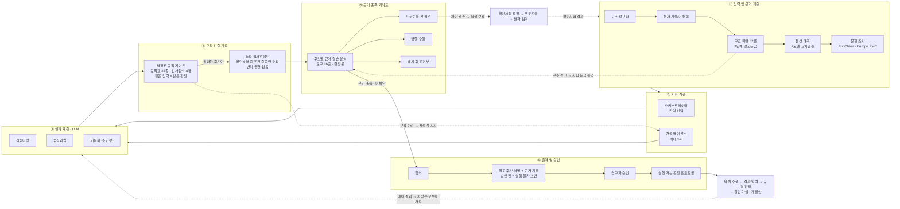

# 논문 삽입용 아키텍처 도해 — LLM 생성 프롬프트

전체 흐름을 한 장에 담는 **논문 그림(Figure)** 스타일 도해를 만들기 위한 한글 프롬프트다.
아래 블록을 그대로 복사해 이미지 생성 모델이나 도해 생성 도구에 넣으면 된다.

> 글자가 많은 도해는 **Ideogram · GPT-Image · Recraft** 처럼 텍스트 렌더링이 정확한 모델에서
> 잘 나온다. Midjourney는 글자가 깨지므로 라벨을 나중에 얹어야 한다.
> 화면비는 **16:9**, 논문 2단 조판이면 **4:3**을 권한다.
> Mermaid·draw.io 같은 도구를 쓸 경우 아래 "구조 명세"만 넘겨도 된다.

**2026-08-03 개정** — 검증이 게이트 두 개(규칙 · 근거)로, 되먹임이 두 개(실험 전 확인시험 ·
실험 후 배치 결과)로 나뉜 구조를 반영했다. 이전 판은 실행 *후* 루프만 그려서, 자료가 없는
신약 주성분에 실행 가능한 공정 프로토콜이 바로 나가는 것처럼 읽혔다.

---

## 프롬프트 (복사해서 사용)

```
학술 논문에 삽입할 시스템 아키텍처 다이어그램을 그려줘.

[전체 스타일]
- 흑백 계열의 절제된 학술 도해. 배경 흰색, 선과 글자는 검정~진회색.
- 색은 딱 두 곳에만 최소한으로: 결정론 게이트 테두리(짙은 남색), 되먹임·경고 표시(붉은색).
  나머지는 회색조.
- 장식·그림자·3D·아이콘 남용 금지. 사각형 박스, 얇은 실선, 화살표만.
- 산세리프 글꼴. 논문 그림 크기로 축소해도 읽히도록 라벨은 짧게.
- 배치: 그림 상단 2/3는 좌에서 우로 흐르는 6개 구역, 하단 1/3은 오른쪽에서 왼쪽으로
  돌아오는 되먹임 밴드. 전체가 한 장에 들어와야 함.

[제목]
Formula 1: 이중 검증 게이트를 갖춘 자기조직형 멀티 에이전트 제형 설계 시스템 구조

[구조: 왼쪽에서 오른쪽으로 6개 구역]

① 입력 및 근거 계층 — 제목 "분자 입력 및 사전 조사". 세로로 5개 상자:
· 구조 정규화 (염 제거·전하·입체중심)
· 분자 기술자 44종 (분자량·극성표면적·수소결합밀도)
· 구조 패턴 82종 (SMARTS·9개 분류·3단계 경고등급)
· 물성 예측 (용해도·투과도, 두 모델 교차검증)
· 문헌 조사 (PubChem·Europe PMC)
구역 아래 작은 글씨: "예측 편차 ≥ 1 log → 고불확실성 → 근거 결손으로 표시"

② 지휘 계층 — 제목 "오케스트레이터". 안에 2개 상자: "전략 선택", "반성 에이전트 (최대 5회)".
작은 글씨: "요청마다 팀 구성을 다시 결정"

③ 설계 계층 — 제목 "병렬 후보 설계 (LLM)". 나란히 3개 상자: "직접타정", "습식과립",
"가용화 (조건부)". 세 상자 모두 오른쪽 검증 계층으로 화살표.

④ 규칙 검증 계층 — 상하 2단.
위: "결정론 규칙 게이트" — 짙은 남색 테두리, 두꺼운 선.
    안에 가로로 "배합금기 → 소아안전 → 공정 → 배합비 → 규제".
    아래 작은 글씨 두 줄: "규칙표 27종 · 검사 함수 8개 · 우선순위 순서 실행",
    "같은 입력 = 같은 판정 (오차 0%)".
    그 아래 회색 작은 글씨 한 줄: "위반 없음 = 안전 확정 아님. 정보 부재는 별도 판정"
아래: "동적 심사위원단 (LLM)" — 점선 테두리.
    안에 3개 상자 "소아 안전", "가용화 전략", "… 조건 충족 시 소집".
    아래 작은 글씨: "명단 6명 중 조건이 맞는 심사관만 생성 · 반려 권한 없음"
두 단 사이 세로 화살표에 라벨 "통과한 후보만"

⑤ 근거 충족 게이트 — 이 구역과 ④를 시각적으로 가장 강조.
제목 상자 "후보별 근거 결손 분석" — 짙은 남색 테두리, 두꺼운 선.
안에 세로로 3개 상자:
· 프로토콜 전 필수 (수분·열 안정성, 배합적합성, 실험 용해도, 결정형)
· 병행 수행 (세부 조건 최적화)
· 배치 후 조건부 (실패 원인 조사)
아래 작은 글씨 두 줄: "확인시험 66종을 전략별로 분류",
"선택된 전략에 영향을 주는 시험만 선행 요구"
게이트 오른쪽으로 나가는 화살표에 라벨 "근거 충족 · 비차단"

⑥ 출력 및 승인 — 세로로 5개 상자를 위에서 아래로 화살표 연결:
· 합의
· 권고 후보 처방 + 근거 기록
· 공정 프로토콜 근거 검증
· 연구자 승인
· 실행 가능 공정 프로토콜
"권고 후보 처방 + 근거 기록" 상자 옆 작은 글씨: "승인 전 상태 = 실행 불가 초안"

[하단 되먹임 밴드 — 오른쪽에서 왼쪽으로]
- 실험 전 루프: ⑤에서 아래로 내려오는 상자 3개 가로 배치 —
  "확인시험 요청" → "확인시험 프로토콜" → "확인시험 결과 입력".
  마지막 상자에서 왼쪽 ①로 붉은 점선 화살표, 라벨 "근거 부족 → 확인시험 선행".
- 실험 후 루프: ⑥에서 아래로 내려오는 상자 4개 가로 배치 —
  "제형 배치 수행" → "배치 결과 입력 (용출·경도·마손도·불순물)" → "규격 판정 (규칙)" →
  "원인 가설 · 후속 확인시험 · 개정안".
  마지막 상자에서 왼쪽 ③으로 회색 점선 화살표, 라벨 "배치 결과 → 처방·프로토콜 개정".
- 두 루프 사이 작은 글씨: "확인시험 결과와 배치 결과는 입력을 분리",
  "AI가 해석하고 지시 · 사람은 벤치에서 수행"

[화살표 / 되먹임]
- ①→②→③→④→⑤→⑥ 굵은 실선 화살표
- ④ → ②: 붉은 점선, 라벨 "규칙 반려 → 재설계 지시"
- ⑤ → 실험 전 루프 → ①: 붉은 점선, 라벨 "차단 결손 → 실행 보류"
- 실험 후 루프 → ③: 회색 점선, 라벨 "실험 결과 되먹임"
- ①의 "구조 패턴" → ⑤의 "후보별 근거 결손 분석": 얇은 점선,
  라벨 "구조 경고 → 시험 등급 승격"

[범례 — 오른쪽 아래 작게]
  실선 테두리 = 결정론 (규칙 기반, 재현 가능)
  점선 테두리 = LLM 판단
  짙은 남색   = 판정 게이트
  붉은 점선   = 반려·보류 되먹임
  회색 점선   = 사후 되먹임

[꼭 지킬 것]
- 모든 라벨은 위에 적힌 한글 그대로. 임의로 영어로 바꾸거나 문구를 만들어내지 말 것.
- 상자 안에 문장 대신 명사구로 짧게.
- 위에 적은 상자만. 보기 좋게 하려고 요소를 추가하지 말 것.
- 게이트가 두 개(규칙, 근거)라는 점과 되먹임이 두 개(실험 전, 실험 후)라는 점이
  한눈에 구분되어야 함.
```

> 6구역이라 이미지 모델이 좁게 뽑을 수 있다. 결과가 뭉치면 ④와 ⑤를 한 구역
> (상=규칙 게이트, 중=심사위원단, 하=근거 게이트) 3단으로 합쳐 5구역으로 줄인다.

---

## 구조 명세 (Mermaid·draw.io 용)

이미지 모델 대신 도해 도구로 그릴 때는 아래 관계만 넘기면 된다.



---

## 그림 캡션 (논문용 초안)

> **그림 1.** Formula 1 시스템 구조. 분자식에서 출발해 구조 패턴 82종과 분자 기술자 44종을
> 산출하고(①), 오케스트레이터가 요청별로 전략과 심사관 구성을 결정한다(②).
> 서로 다른 공정 전략의 후보가 병렬로 생성되어(③) 결정론적 규칙 게이트를 통과해야 하며,
> 통과한 후보만 조건에 따라 소집된 심사 에이전트가 상대 평가한다(④).
> 규칙 게이트는 출처가 검증된 규칙 행만 반려를 생성하고 동일 입력에 동일 판정을 보장하지만,
> 위반이 없다는 것이 정보가 충분하다는 뜻은 아니다. 따라서 후보별 근거 결손을 별도로 판정하고
> 확인시험을 선행·병행·배치 후로 분류한다(⑤). 선행 근거가 충족되지 않으면 실행 가능한 공정
> 프로토콜 대신 확인시험 프로토콜을 출력하며, 근거가 충족되고 연구자가 승인한 경우에만
> 실행 가능 상태로 전환된다(⑥). 되먹임은 두 개다 — 확인시험 결과는 입력·근거 계층으로,
> 배치 결과는 설계·프로토콜 개정 단계로 돌아간다.

---

## 사용 시 주의

- **숫자를 바꾸면 이 문서도 같이 고칠 것.** 규칙표 27종·검사함수 8개·구조 패턴 82종·
  기술자 44종·심사관 6명·확인시험 66종·근거 요구 16종은 현재 구현의 실측값이다.
- 설계 전략은 기본 2개(직접타정·습식과립)가 돌고, 난용성으로 판정될 때 가용화가 더해져
  최대 3개가 된다. 그림에서 세 번째 상자에 "조건부"를 적는 이유다.
- 물성 예측 모델은 현재 **미연결** 상태다. 도해에는 계층으로 표시하되, 논문 본문에서는
  "예측기 연결 시 동작하는 교차검증 구조"로 기술해야 사실과 어긋나지 않는다.
  미연결이라는 사실 자체가 근거 게이트에서 "실험 용해도 선행 요구"로 이어진다.
- 근거 게이트는 후보를 **반려하지 않는다.** 도해에서 ⑤가 붉은 실선으로 후보를 끊는 것처럼
  그리면 안 된다 — 보류(실행 불가 초안)와 반려(재설계)는 다른 결과다.
