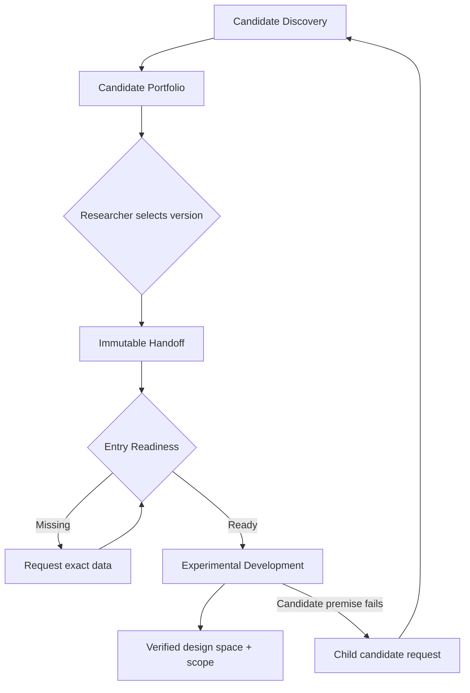
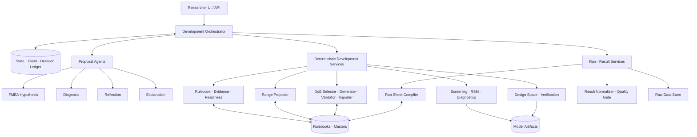
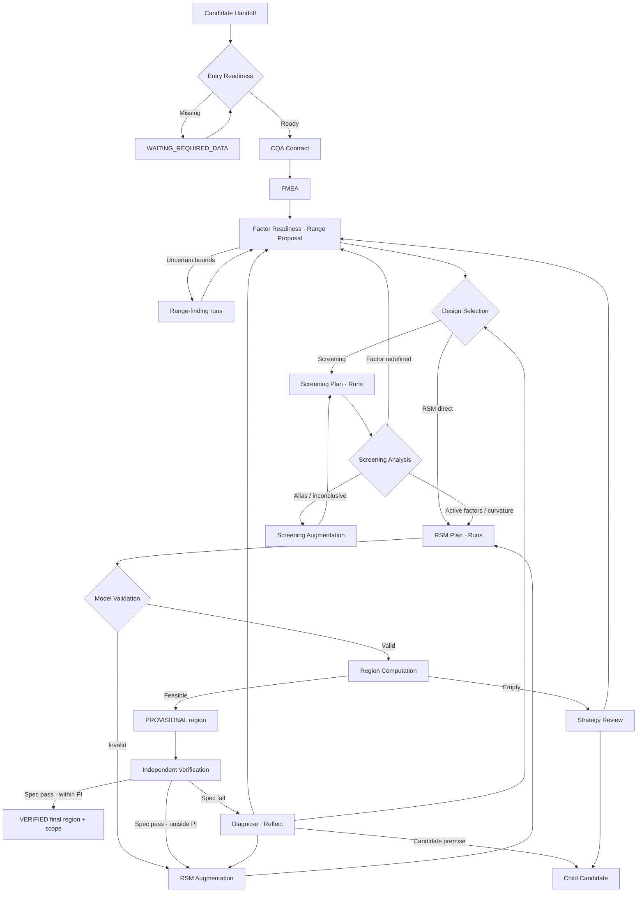
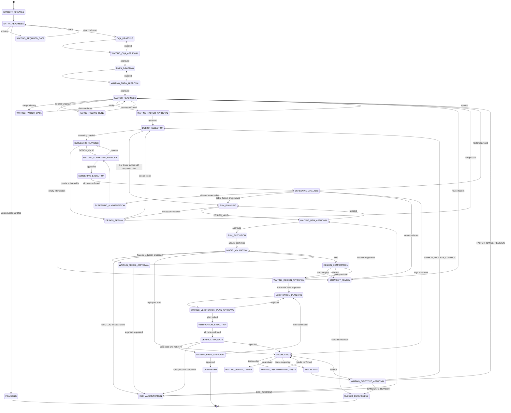
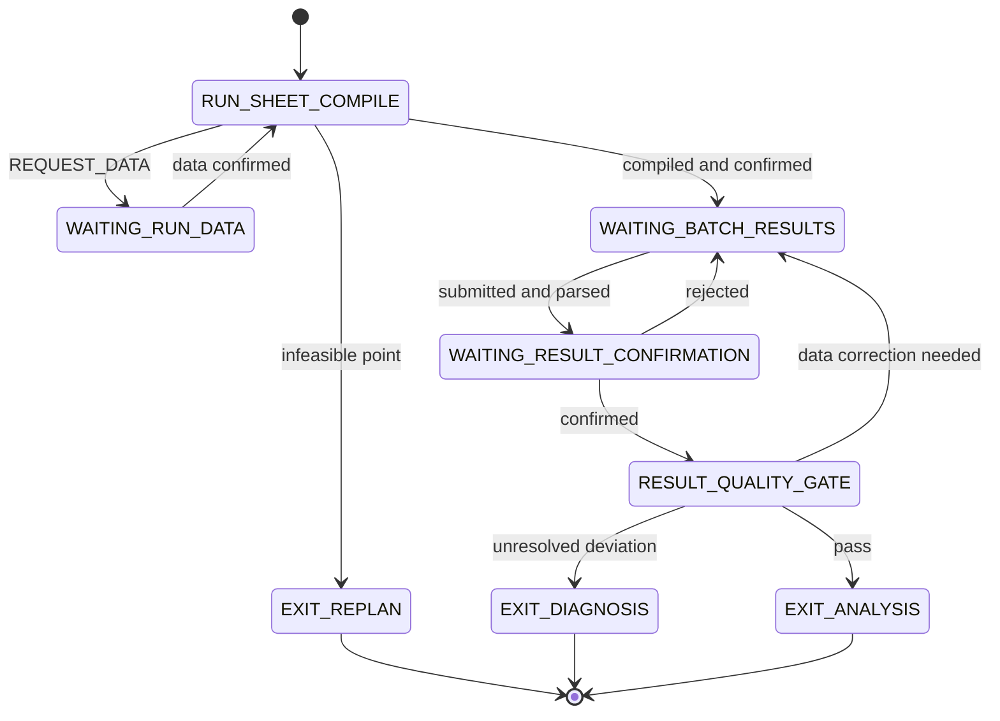

# Formula 1 — DoE Agent Architecture v6.1

> 개발자 구현 명세 · 2026-09-23  
> 상류 시스템: Formula 1 `CandidateDiscoveryGraph`  
> 신규 시스템: `ExperimentalDevelopmentGraph`  
> 시작점: 연구자가 선택한 불변 후보처방 `candidate_id@version`  
> 종료점: 독립 확인배치로 검증된 **최종 design space**와 그 **성립 조건(scope)**

---

## v6 → v6.1 변경 요약 (룰북 DB 검토 반영)

| 검토 항목 | 반영 |
|---|---|
| A1 조건식 계약 | AST 화이트리스트 DSL, generator 바인딩, 함수 registry(인자·반환), `rank` → `matrix_rank`, `nonempty_all` 신설 (§7.3) |
| A2 필드·enum 불일치 | typed RuleContext를 manifest에 정의하고 검증기가 모든 필드 경로를 검사. `ResponseModel.validation_status`에 `ACCEPTED_WITH_FLAGS` 추가, stage는 상태기계 상태명만 |
| A3 참고 배치 | 판정 대상을 SETPOINT·BOUNDARY·ROBUSTNESS로 한정. REFERENCE_EXISTING은 검토 요청만 |
| A4 확인계획 | 첫 결과 제출 전 잠금, 배치·블렌드 ID 기준 독립성, 역할 간 배치 재사용 금지, 빈 집합 차단, 공개된 결과는 사전 확인배치 불가 |
| A5 고심각도 | 고심각도 제외 차단을 독립 invariant(FE012)로 분리. 권고(PASS)와 판정 강도를 다른 축으로 |
| A6 무영향 판정 | 효과구간 전체가 [−δ, +δ] 안일 때만 FIXED. ACTIVE·FIXED·INCONCLUSIVE 상호배타 |
| A7 범위 폭 | `|예상 범위 효과|` 기준, 값 없으면 NOT_CHECKED |
| A8 규격 | `acceptance_operator`(LE, GE, BETWEEN, TARGET_TOL, PASS_FAIL) 필수, 하한>상한 차단, MONITOR_ONLY도 판정 기준 필요 |
| A9 DRAFT 집행 | `load_enabled`/`enforcement_enabled` 분리, production은 APPROVED 규칙만 집행, demo는 sandbox. 근거 등급 권한표를 규칙이 `evidence_permits`로 호출 |
| A10 미지원 설계 | backend capability matrix. mixture, D-optimal, split-plot, DSD, 2요인 BBD, 범주형 RSM은 실행 차단 |
| B1 반복 SD | 시험법 master에는 METHOD_REPEATABILITY만. 배치 간 SD는 master에서 제거 |
| B2 domain | supported domain = 설계점 convex hull, 분모 = domain 내 격자점. 골든 값 재계산 |
| B5 다중 비교 | 확인 예측구간은 family(필수점 × DOE_RESPONSE) Bonferroni 동시구간 |
| B6 challenge | FAIL 예상에는 예측 실패확률 ≥ 0.5 근거 필요 |
| D1 전이 | 전이표를 (reason_code, from_state) → next_state 단일 registry로. 검증기 예외 목록 제거 |
| 검증 | 검증기가 필드·함수·전이를 정적 검사하고, 실패 재현 fixture 48건을 실제 평가 |

## v5 → v6 변경 요약

| 영역 | 변경 |
|---|---|
| 종료점 | NOR·실행 프로토콜·Pilot 승인 단계를 MVP에서 제외. 최종 영역 + 성립 조건으로 종료. 권장 운전범위는 선택 필드 |
| 범위 제외 | Control strategy(PAT, 측정불확실성 기반 관리한계, 원료규격 체계)는 MVP 범위 밖 |
| 상태기계 | 전면 재작성. study 상태와 artifact 상태 분리, 모든 승인 단계에 반려 전이, reason code 전이표를 단일 진실원으로 지정 |
| Readiness | 진입 Readiness와 Factor Readiness로 분리(순환 의존 제거) |
| 신규 전이 | `FACTOR_REDEFINED`(screening 후 요인 재정의), RSM 직행, 범위 확인 run, 빈 영역·무효 요인 → 전략 검토 |
| 확인배치 | 규격 × 예측구간 2×2 판정, 확인점 역할(setpoint·경계·robustness·challenge), 기존 외부 배치는 참고 기록 |
| 수준값 | `RangeProposer` 신설: center는 후보 현재값, 경계는 근거 교집합, 폭 적정성·조성 제약 검사 |
| 설계 입력 | 연구자 제공 설계 import 경로 신설(동일 Validator 통과 필수) |
| Override | CQA·FMEA·설계·모델 단계별 허용/차단 매트릭스 정의. 근거 등급은 사람이 올릴 수 없음 |
| CQA | 절대 규격 필수(상대 기준만으로 영역 생성 금지), `MONITOR_ONLY` 정의, 요인 판정의 `not_evaluated` 범위 기록 |
| 근거 등급 | `LITERATURE_DIGITIZED`, `SYNTHETIC_DEMO` 추가 |
| 모델 | 사전 분석계획의 전체 모형으로 적합, 항 축소는 연구자 승인으로만(자동 stepwise 금지) |
| 데이터 계약 | `DesignSpaceVersion.scope`, `OverrideDecision`, `FactorScreeningDecision`, `VerificationPoint.role` 추가 |
| 데모 | Lornoxicam 분산정 실측 데이터 기반 골든 테스트 추가 |
| 적재 대상 | 룰북·설정 23종 + 참조 마스터 7종 = 30종 (`reason_code_catalog`를 룰북 #23에 통합). 데모 필수 22종 |
| 데모 데이터 | 적재 대상이 아닌 테스트 fixture·업로드 파일로 분류 |
| 확인 필요 | `formula1_statistical_rulebook_v0.1.xlsx`(105개 통계 규칙)는 v5 문서에 언급만 있고 내용 미확인 |

---

## 0. 한 문장 정의

Formula 1의 DoE 에이전트는 **LLM이 실험표와 통계 결과를 자유 생성하는 에이전트가 아니라**, 연구자의 승인 아래 CQA·FMEA·실험계획·실험결과를 연결하고, 검증된 결정론 엔진을 호출하여 다음 실험을 선택하고, 독립 확인배치로 검증된 design space를 산출하는 이벤트 기반 Experimental Development 시스템이다.

핵심 흐름:

```text
선택 후보 고정
→ 진입 Readiness
→ CQA Contract
→ FMEA
→ Factor Readiness (수준값 제안·범위 확인)
→ Design Selection
   ├─ Screening → (요인 재정의 시 Factor Readiness 복귀) → RSM
   └─ RSM 직행 (3요인 이하 + 승인된 사전근거)
→ PROVISIONAL design space
→ 독립 확인배치 (2×2 판정)
→ (필요 시 보정 후 재확인)
→ VERIFIED 최종 design space + 성립 조건
```

### 반드시 지킬 경계

1. 후보 순위 1위가 자동으로 DoE에 진입하지 않는다.
2. 연구자가 정확한 후보 버전을 선택해야 한다.
3. LLM은 가설·설명·진단·제한적 개정안만 제시한다.
4. 설계행렬, alias, 회귀계수, 통계진단, 규격판정, 설계공간, 상태승격은 코드가 수행한다.
5. Screening 결과만으로 design space를 선언하지 않는다.
6. 독립 확인배치 전에는 `VERIFIED`라는 표현을 사용하지 않는다.
7. 확인배치 실패 시 해당 영역 버전은 즉시 `INVALIDATED`가 된다.
8. 동일 배치 안의 정제·분취·주입 반복을 독립 제조배치로 세지 않는다.
9. 배치 수 예산은 조건부이며 보장된 고정 숫자가 아니다.
10. 이 결과는 규제기관이 승인한 Design Space나 PPQ 완료를 의미하지 않는다.
11. 모든 `DOE_RESPONSE`는 절대 규격을 가져야 한다. "최선 대비" 같은 상대 기준만으로 영역을 만들지 않는다.
12. 연구자는 판단을 바꿀 수 있지만 근거 등급은 바꿀 수 없다. 근거 등급은 데이터로만 올라간다.

---

## 1. 시스템 경계

### 1.1 두 개의 bounded context

| Context | 책임 | 입력 | 최종 출력 |
|---|---|---|---|
| `CandidateDiscoveryGraph` | 제형전략 탐색, 후보 생성, 기존 Rulebook/Evidence Gate, 후보 순위화 | QTPP, API 정보, 실측값 | `CandidatePortfolio` |
| `ExperimentalDevelopmentGraph` | 선택 후보의 CQA·FMEA·DoE·모델·확인배치 | `CandidateDevelopmentHandoff` | VERIFIED `DesignSpaceVersion` + scope |

두 그래프는 내부 state를 공유하지 않는다. 오직 불변 Handoff와 표준 이벤트로 연결한다. 상류 후보의 새 버전은 기존 study를 차단하지 않고 알림 이벤트(`CANDIDATE_VERSION_AVAILABLE`)로만 전달된다.



### 1.2 MVP 범위

포함:

- 저분자 경구 속방성·분산 정제, 직접타정 우선
- 한 연구실, 등록 설비 1세트, 고정 배치 규모
- Screening 요인 최대 4개(범주형 1개 허용), RSM 요인 최대 3개
- 지원 반응: 용출(단일 요약값), 분산·붕해시간, 인장강도 또는 경도, 마손도, 함량균일성(AV)
- 모든 계획, 결과, 모델, 영역, 판단은 versioned artifact로 보존

"지원 반응"은 시스템이 다룰 수 있는 범위다. 모든 study에서 필수인 반응 목록이 아니다. 어떤 CQA를 `DOE_RESPONSE`로 둘지는 연구자가 CQA Contract에서 정한다(§6 D2).

제외(MVP 범위 밖):

- Control strategy: PAT 기반 요인 측정, 측정불확실성을 반영한 관리한계, 원료규격 체계
- NOR 승인·실행 프로토콜 확정·Pilot/스케일업 루프
- 조성 혼합물 설계, split-plot, 불규칙 영역 D-optimal의 전체 지원(메타데이터와 경고만 제공)

---

## 2. 전체 논리 아키텍처



### 2.1 계층별 권한

| 계층 | 할 수 있는 일 | 할 수 없는 일 |
|---|---|---|
| Orchestrator | 상태 전이, WAIT/RESUME, retry, 승인 대기, failure routing | 과학적 숫자 생성, 모델 통과 판정 변경 |
| LLM agents | FMEA 누락 가설, 결과 설명, 경쟁 원인가설, 판별시험 초안, 제한적 revision directive, 문헌 근거를 단 수준값 후보 | 실험행렬 생성, S/O/D·수준값 확정, 회귀 계산, 규격 생성, 근거 등급 변경, DB 직접 수정 |
| Deterministic services | 조건식 판정, 수준값 제안, 행렬 생성·검증, 분석, 불확실성 계산, 영역 생성, 상태승격 조건 검사 | 근거 없는 범위·규격·시험법 생성 |
| Researcher | 후보 선택, CQA/FMEA/요인·수준/계획/결과/모델/영역 승인, 허용 범위 안의 override | `BLOCK_STAGE`·`INVALIDATE` 규칙 우회, 근거 등급 상향, 과거 artifact 덮어쓰기 |
| Stores | raw data, 버전, seed, 도구 버전, 승인·override·무효화 이력 보존 | 최신 결과만 남기고 과거 삭제 |

### 2.2 Override 원칙

Override는 **시스템이 규칙에 따라 내린 판정을 연구자가 사유를 남기고 뒤집는 것**이다.

| 규칙 판정 강도 | override | 요구사항 |
|---|---|---|
| `WARNING` | 가능 | 사유 기록 |
| `ROUTE`, `AUGMENT` | 가능 | 사유 + 승인권자 확인 |
| `REQUEST_DATA` | 대체 근거 제출 시 가능 | 대체 근거는 용도·방법·독립성·적용성으로 평가하며, 원출처 등급은 바꾸지 않음 |
| `BLOCK_STAGE`, `INVALIDATE` | 불가 | — |

각 규칙의 override 가능 여부는 룰 스키마의 `human_override` 필드가 결정한다(§7.2). 단계별 상세 매트릭스는 §6의 D2(CQA), D3(FMEA), D5(설계), D8(모델)에 있다. 모든 override는 `OverrideDecision`(§10)으로 기록되고, 이후 산출물의 lineage에 따라다닌다. 진단 에이전트는 확인배치 실패 시 override 이력을 경쟁 가설 후보로 사용한다.

---

## 3. 에이전트와 결정론 서비스

### 3.1 Development Orchestrator

- `DevelopmentStudy` 상태기계 소유(§5)
- 다음에 실행 가능한 노드 계산
- 외부 실험을 기다릴 때 checkpoint 저장 후 요청 종료
- 동일 이벤트의 중복 적용 방지
- 승인·결과 제출 시 정확한 지점에서 재개
- 실패 reason code를 전이표(§5.3)에 따라 라우팅
- 전역 예외 상태 진입 시 복귀 지점 저장

Orchestrator는 과학적 결론을 직접 작성하지 않는다.

### 3.2 CQA Mapper

구현은 `template + rule engine + researcher approval`이다.

```text
QTPP + dosage form + release profile + process route
→ mandatory/conditional CQA candidates
→ DOE_RESPONSE / MONITOR_ONLY / NOT_APPLICABLE 제안
→ method·unit·absolute criterion 연결
→ researcher approval
```

역할 정의:

| 역할 | 측정 | 모델 적합 | 영역 계산 | 규격 확인 |
|---|---|---|---|---|
| `DOE_RESPONSE` | ✅ | ✅ | ✅ | ✅ |
| `MONITOR_ONLY` | ✅ | ❌ | ❌ | ✅ 배치별 통과 여부만 |
| `NOT_APPLICABLE` | ❌ | ❌ | ❌ | ❌ |

`MONITOR_ONLY` CQA에 대해서는 요인 효과를 평가하지 않은 것이다. 이 사실은 이후 모든 요인 판정에 `not_evaluated`로 자동 기록된다(§6 D7).

전체 규격 범위에서 멀리 떨어진 반응(예: 모든 run이 규격의 10% 이하)은 `NON_BINDING` 정보 표시를 받는다. 역할은 바뀌지 않는다.

### 3.3 FMEA Hypothesis Agent

입력: 승인된 CQA, 구조화된 unit operation map, 후보 조성·원료 등급, 기존 공정·배합 Rulebook, 선행실험 및 문헌 근거.

출력:

- `cause → failure mode → local effect → CQA effect`
- 근거가 있는 항목과 `LLM_HYPOTHESIS` 분리
- 후보 CMA/CPP 제안
- 누락된 확인자료 제안

금지:

- 관찰자료 없이 Occurrence를 숫자로 생성
- 검출방법 없이 Detectability를 확정
- RPN 순서만으로 고심각도 항목 제외

Occurrence가 대부분 `UNKNOWN`인 초기 단계에서는 RPN 순위를 계산하지 않는다. 처리 방향은 **심각도 + 조절 가능성 + 근거**로 결정한다. DoE 결과가 나오면 FMEA는 새 버전으로 갱신되고, `LLM_HYPOTHESIS`는 데이터에 따라 `DATA_CONSISTENT` 또는 `DATA_CONTRADICTED`로 상태가 바뀐다. 원인 확정에는 별도 판별시험이 필요하다.

### 3.4 Range Proposer (신규, 결정론)

요인별 low/center/high를 근거와 함께 제안한다.

```text
입력: Handoff 현재값, 부형제 사용범위 master, 설비 master,
      시험법 정밀도, 연구 목적(연구자 입력)
출력: 요인별 low/center/high
      + 경계별 출처·근거 등급
      + 폭 적정성 검사
      + 설계점 전체의 조성 제약 검사
      + 필요 시 범위 확인 run 제안
```

규칙:

1. **center = 후보처방의 현재값**이 기본이다.
2. **low/high = 근거 교집합:** 과학적 범위 ∩ 설비 능력 ∩ 조성 제약 ∩ 연구 목적.
3. **폭 적정성:** 예상 효과가 시험법 반복오차의 2–3배 이상이 되도록 폭을 검사한다. 너무 좁으면 "범위 내 무영향" 결론의 위험을 경고한다. design space는 시험 범위 밖으로 나갈 수 없으므로, 원하는 운전 폭 + 여유를 포함하는지도 확인한다.
4. **조성 제약:** ±1 수준만이 아니라 설계의 모든 점(축점 포함)에서 balance 성분이 음수가 되지 않는지, 합계가 맞는지 검사한다. balance 구조가 있으면 "요인 효과와 희석 효과 교락" 경고를 붙인다.
5. **범위 확인 run:** 끝점 제조 가능성이 불확실하면 극단 조합 2–4개를 먼저 제안한다. 이 run은 fitting set에 넣지 않고 범위 근거로만 기록한다.
6. 근거 없는 경계값은 `EXPERT_ASSUMPTION`으로 표시하거나 `REQUEST_DATA`로 차단한다.

LLM은 문헌 근거를 달아 후보 값을 제안할 수 있지만 확정하지 못한다. 최종 값은 연구자가 `WAITING_FACTOR_APPROVAL`에서 승인한다.

### 3.5 DoE Planning Agent

이름은 Agent지만 실제 역할은 도구 조정자다.

1. 승인된 factor contract를 읽는다.
2. `DoEDesignSelector`를 호출한다.
3. `DesignBackend`로 행렬을 생성한다.
4. `DesignValidator`로 rank, alias, bounds, constraint를 검사한다.
5. 사람이 이해할 수 있는 선택 사유와 경고를 작성한다.

행렬 자체와 run 수 계산은 LLM이 작성하지 않는다.

**연구자 제공 설계(import):** 연구자가 외부 도구로 만든 행렬이나 문헌 설계를 가져올 수 있다.

```text
외부 행렬 업로드 (source = RESEARCHER_PROVIDED)
→ 동일 DesignValidator 통과 필수
→ selector 권고와 다르면 차이점 표시 + OverrideDecision 요구
→ 이후 흐름 동일
```

### 3.6 Statistical Analysis Agent

결정론 분석 서비스를 호출하고 결과를 설명한다. `MODEL_VALID` 판정은 `ModelValidationGate`가 반환하며 Agent는 변경할 수 없다.

### 3.7 Run Sheet Compiler

승인된 run 설정을 run별 칭량표와 설정값 목록으로 변환한다. 근거 없는 설정값은 만들지 않고 `REQUEST_DATA`를 반환한다. MVP에서는 실행 프로토콜 승인 단계 없이 run sheet 확인만 거친다.

### 3.8 Result Interpreter

```text
raw input → parsed candidate values → unit/method validation
→ researcher confirmation → canonical TestResult → Result Quality Gate
```

### 3.9 Diagnosis Agent

- 서로 경쟁하는 원인가설 최대 3개
- 각 가설을 구별하는 시험
- 예상되는 판별 패턴
- 현재 증거로 제외할 수 없는 가설
- override 이력과 `EXPERT_ASSUMPTION` 근거를 우선 점검 대상으로 포함

### 3.10 Reflection Agent

허용되는 출력은 네 가지다.

```text
DOE_AUGMENT              모델 보강 실험
FACTOR_RANGE_REVISION    요인·범위 재설정
METHOD_PROCESS_CONTROL   시험법·공정 편차 개선 후 재계획 (신규)
CANDIDATE_REVISION       후보 전제 붕괴 → child candidate
```

`METHOD_PROCESS_CONTROL`은 high pure error의 원인이 시험법·공정 편차로 밝혀진 경우다. 시험법 version이 바뀌면 scope가 바뀌므로 설계 선택부터 다시 시작하고, 이전 결과는 fitting set에서 제외한다.

Reflection Agent는 DB를 수정하지 않는다. 구조화된 `RevisionDirective`를 생성하고 연구자 승인으로 넘긴다.

---
## 4. End-to-end Development Graph



---

## 5. 상태기계

### 5.1 메인 상태기계



### 5.2 실행 서브사이클

`RANGE_FINDING_RUNS`, `SCREENING_EXECUTION`, `RSM_EXECUTION`, `VERIFICATION_EXECUTION`, `WAITING_DISCRIMINATING_TESTS`는 모두 이 서브사이클을 run별로 실행한다. 단계 전체는 모든 run이 `EXIT_ANALYSIS`에 도달해야 다음으로 넘어간다.



`EXIT_REPLAN`은 `DESIGN_REPLAN`으로, `EXIT_DIAGNOSIS`는 `DIAGNOSING`으로 연결된다.

### 5.3 Reason code 전이표 (단일 진실원)

이 표가 `backtrack_routing_rules.csv`(룰북 #23)이다. 키는 `(reason_code, from_state)`이며, 같은 코드라도 발생 상태가 다르면 별도 행이다. 검증기는 next_state를 가진 모든 규칙이 이 표에 `(result_code, stage ⊆ from_states, next_state)` 행을 갖는지 예외 없이 검사한다. 규칙의 `result_code`(판정 결과)와 라우팅 사유는 이 표를 통해서만 연결된다.

| reason_code | 발생 상태 | next_state | artifact 부수효과 |
|---|---|---|---|
| `MISSING_INPUT` | ENTRY_READINESS | WAITING_REQUIRED_DATA | — |
| `UNRESOLVED_HARD_FAIL` | ENTRY_READINESS | INELIGIBLE | — |
| `RANGE_MISSING` | FACTOR_READINESS | WAITING_FACTOR_DATA | — |
| `CATEGORY_PROTOCOL_MISSING` | FACTOR_READINESS | WAITING_FACTOR_DATA | — |
| `BOUNDS_UNCERTAIN` | FACTOR_READINESS | RANGE_FINDING_RUNS | range-finding run은 fitting 제외 |
| `EMPTY_FACTOR_INTERSECTION` | FACTOR_READINESS | STRATEGY_REVIEW | — |
| `DESIGN_RSM_DIRECT` | DESIGN_SELECTION | RSM_PLANNING | — |
| `UNSAFE_OR_INFEASIBLE_POINT` | SCREENING_PLANNING, RSM_PLANNING, RUN_SHEET_COMPILE | DESIGN_REPLAN | plan → REJECTED |
| `DESIGN_RANK_DEFICIENT` | SCREENING_PLANNING, RSM_PLANNING | DESIGN_REPLAN | plan → REJECTED |
| `DESIGN_NO_RESIDUAL_DF` | SCREENING_PLANNING, RSM_PLANNING | DESIGN_REPLAN | plan → REJECTED |
| `DESIGN_MIXTURE_SUM_VIOLATED` | SCREENING_PLANNING, RSM_PLANNING | DESIGN_REPLAN | plan → REJECTED |
| `UNRESOLVED_ALIAS` | SCREENING_ANALYSIS | SCREENING_AUGMENTATION | — |
| `INCONCLUSIVE` | SCREENING_ANALYSIS | SCREENING_AUGMENTATION | — |
| `FACTOR_REDEFINED` | SCREENING_ANALYSIS | FACTOR_READINESS | FactorDefinition 새 버전 |
| `CURVATURE_DETECTED` | SCREENING_ANALYSIS | RSM_PLANNING | — |
| `NO_ACTIVE_FACTOR` | SCREENING_ANALYSIS | STRATEGY_REVIEW | — |
| `HIGH_PURE_ERROR` | SCREENING_ANALYSIS, MODEL_VALIDATION | DIAGNOSING | model → HOLD |
| `MODEL_FLAGGED` | MODEL_VALIDATION | WAITING_MODEL_APPROVAL | — |
| `MODEL_INVALID` | MODEL_VALIDATION | RSM_AUGMENTATION | model → REJECTED |
| `EMPTY_COMMON_REGION` | REGION_COMPUTATION | STRATEGY_REVIEW | — |
| `VERIF_OUTSIDE_PI` | VERIFICATION_GATE | RSM_AUGMENTATION | region → INVALIDATED |
| `VERIF_SPEC_FAIL` | VERIFICATION_GATE | DIAGNOSING | region → INVALIDATED |
| `VERIF_ALL_PASS` | VERIFICATION_GATE | WAITING_FINAL_APPROVAL | — |
| `RUN_DATA_MISSING` | RUN_SHEET_COMPILE | WAITING_RUN_DATA | — |
| `RESULT_NO_BATCH` | RESULT_QUALITY_GATE | WAITING_BATCH_RESULTS | — |
| `RESULT_SETTING_DEVIATION` | RESULT_QUALITY_GATE | WAITING_BATCH_RESULTS | deviation 기록 |
| `RESULT_NO_METHOD_VERSION` | RESULT_QUALITY_GATE | WAITING_BATCH_RESULTS | — |
| `RESULT_UNIT_UNCLEAR` | RESULT_QUALITY_GATE | WAITING_BATCH_RESULTS | — |
| `RESULT_REPLICATE_UNKNOWN` | RESULT_QUALITY_GATE | WAITING_BATCH_RESULTS | — |
| `RESULT_UNCONFIRMED` | RESULT_QUALITY_GATE | WAITING_RESULT_CONFIRMATION | — |
| `UNRESOLVED_DEVIATION` | RESULT_QUALITY_GATE | DIAGNOSING | result → EXCLUDED |
| `CANDIDATE_PREMISE_FAILURE` | WAITING_DIRECTIVE_APPROVAL, STRATEGY_REVIEW | CLOSED_SUPERSEDED | child candidate 이벤트 |
| `LINEAGE_MISMATCH` | * | WAITING_AUDIT_REVIEW | 복귀 지점 저장 |
| `UNKNOWN` | * | WAITING_HUMAN_TRIAGE | 복귀 지점 저장 |

### 5.4 상태 구분 원칙

- **Study 상태**는 5.1의 상태다. 종료 상태는 `COMPLETED`, `CLOSED_SUPERSEDED`, `INELIGIBLE`이다.
- **Artifact 상태**는 각 artifact의 `status` 필드다. `INVALIDATED`는 artifact(주로 `DesignSpaceVersion`)에만 쓴다.
- **전역 예외**(`WAITING_AUDIT_REVIEW`, `WAITING_HUMAN_TRIAGE`)는 어느 상태에서든 진입하며, 해소 시 저장된 복귀 지점에서 재개한다.
- 상류 후보의 새 버전은 상태가 아니라 알림 이벤트다.

---

## 6. 단계별 처리 계약

### D0. Candidate Handoff

Handoff는 다음을 고정한다.

```text
candidate_id@version
composition and material grades
ordered process route
fixed process parameters (값 또는 UNKNOWN 명시)
batch-scale basis
QTPP snapshot
rule verdict IDs
evidence snapshot
rulebook and policy versions
formulation fingerprint
```

후보가 바뀌면 기존 Handoff를 수정하지 않고 새 Handoff와 새 study를 만든다.

### D1. Entry Readiness

차단 항목(요인 범위는 여기서 검사하지 않는다):

- 조성 또는 단위 불완전, 합계·질량수지 불일치
- 중요한 원료 등급 미정
- 구조화된 공정단계 없음
- 설비·배치규모 미정
- CQA 후보의 시험법 가용성 없음
- Hard Fail 미해결

고정 공정변수가 기록되지 않은 경우(예: 압축력)는 `REQUEST_DATA`를 발행한다. 연구자는 값을 입력하거나 `UNKNOWN`으로 기록할 수 있다. `UNKNOWN`으로 진행하면 최종 영역의 `scope.unmanaged`에 자동 기록된다.

출력: `READY`, `WAITING_REQUIRED_DATA`, `INELIGIBLE`.

### D2. CQA Contract

각 CQA는 다음을 가져야 한다.

```text
cqa_id
criticality
analysis_role            DOE_RESPONSE | MONITOR_ONLY | NOT_APPLICABLE
summary_definition       (용출은 단일 요약값: 특정 시점, DE, 또는 profile model 중 하나)
lower/upper/target       절대 규격
unit
test_method_id@version
criterion_source         PHARMACOPEIA | PROJECT_TARGET | ...
rationale_refs
approval_status
```

차단 규칙:

- 시험법·단위·절대 규격이 없는 CQA는 `DOE_RESPONSE`가 될 수 없다.
- 상대 기준(예: "최선 처방 대비 f2 ≥ 85")만 있는 경우 `DOE_RESPONSE`로 쓸 수 없다. 상대 기준은 보조 지표로만 저장한다.
- MVP에서 용출 시점별 독립 적합은 금지한다.

CQA override 매트릭스:

| 연구자 결정 | 처리 |
|---|---|
| `DOE_RESPONSE` → `MONITOR_ONLY` | 허용, 사유 기록 (`WARNING`) |
| 템플릿 mandatory CQA → `NOT_APPLICABLE` | 근거 첨부 시 허용 |
| 물리적 완전성 CQA를 모두 제외(DoE 반응도 모니터링도 아님) | 차단 |
| 시험법·단위·절대 규격 없는 CQA를 `DOE_RESPONSE`로 | 차단 |
| 상대 기준만으로 `DOE_RESPONSE` 지정 | 차단 |
| 용출 시점별 독립 적합 | MVP에서 차단 |

### D3. FMEA

공정을 unit operation으로 분해하고 CQA별 위험을 연결한다. 처리 방향:

- 조절 가능하고 수치범위가 있음 → DoE 후보
- 고정 관리가 적절함 → fixed condition (최종 scope에 기록)
- 확인시험이 먼저 필요함 → Request Data
- 근거로 위험이 낮음이 확인됨 → 제외 (근거 기록)
- 안전·규제상 금지 → Reject

FMEA 연구자 권한 매트릭스:

| 연구자 결정 | 처리 |
|---|---|
| 행 승인·삭제 | 삭제 시 사유 기록 |
| 행 추가 | 출처 `EXPERT_ASSUMPTION` |
| 원인·실패모드·CQA 연결 수정 | 새 버전 |
| S, D 입력·수정 | S는 CQA 정의, D는 실제 시험·관리 수단과 연결 필수 |
| 처리 방향 변경 | 사유 기록 |
| LLM 가설 채택·기각 | 채택해도 `LLM_HYPOTHESIS` 태그 유지 |
| 근거 없이 O에 숫자 입력 | 허용, `EXPERT_ASSUMPTION` 표시 |
| 고심각도 행 삭제 | 사유 + 대체 관리수단 필수 |
| LLM 가설을 확인된 사실로 변경 | 차단 (데이터로만 상태 변경) |
| 범위·측정법 없는 항목을 DoE 요인으로 | 차단 (Factor Readiness) |
| 승인된 FMEA 덮어쓰기 | 차단, 새 버전만 |

### D4. Factor Readiness

요인 종류: `CMA`, `CPP`, `CATEGORICAL`, `MIXTURE_COMPONENT`, `HARD_TO_CHANGE`, `NOISE_FACTOR`.

`RangeProposer`(§3.4)가 수준값을 제안한다. 실행 가능 범위:

```text
approved factor range
= scientific range
∩ equipment capability
∩ material/formulation constraints
∩ study purpose (researcher)
```

교집합이 비어 있으면 요인을 clip하지 않고 `STRATEGY_REVIEW`로 보낸다. 경계가 불확실하면 `RANGE_FINDING_RUNS`로 보낸다.

Screening 후 요인 종류나 척도가 바뀌면(예: 범주형 다형체 → 연속형 다형체 함량) `FACTOR_REDEFINED`로 이 단계에 돌아와 새 `FactorDefinition` 버전을 승인받는다.

### D5. DoE Selection and Planning

설계 선택 우선순위:

| 조건 | 기본 설계군 |
|---|---|
| 조성비 합계 제약 + 공정요인 | mixture–process design (MVP: 경고 후 연구자 판단) |
| 불규칙 영역·금지조합·범주형 조합 | D-optimal/custom design |
| hard-to-change factor | split-plot 검토 (MVP: 메타데이터만) |
| 4개 이상 연속요인 screening | Resolution IV 이상 fractional factorial + 중심점 |
| 범주형 포함 screening | DSD 또는 Res IV (Plackett–Burman 12-run은 `WARNING`) |
| 3개 이하 요인·강한 사전근거 | 승인 후 RSM 직행 |
| RSM, 극단 corner 위험 | Box–Behnken (꼭짓점 영역 외삽 flag) |
| RSM, 축점을 기존 범위 안에 유지 | face-centered CCD |
| RSM, 안전한 축점·연속요인 | CCD |

모든 plan에 저장: standard/randomized run order, coded/actual matrix, intended model terms, alias structure, matrix rank, block 구조, center points, random seed, package/version, candidate set hash, prohibited point validation, `source`(`SYSTEM_GENERATED`/`RESEARCHER_PROVIDED`), 관련 `override_decision_ids`.

설계 override: selector 권고와 다른 설계는 `WARNING` 수준에서 사유 기록 후 허용한다. Validator의 차단(rank 부족, 금지조합, 설비범위 밖)은 override할 수 없다.

### D6. Runs and Results

```text
DoERun → RunSheet → Batch → TestResult[]
```

각 run은 하나의 독립 제조단위다. 동일 batch의 정제 10개는 독립 run 10개가 아니다. 문헌 데이터에서 반복(예: 1, 1′)의 독립성이 불명확하면 `REQUEST_DATA`로 차단한다.

### D7. Screening Analysis

요인 분류: `ACTIVE`, `FIXED`, `ALIASED`, `CURVATURE`, `RETAIN_FOR_SAFETY`, `INCONCLUSIVE`, `INVALID`.

효과구간(CI)과 실질 효과 기준 δ(`practical_effect_threshold`)로 판정하며 세 분류는 상호배타다.

| 분류 | 조건 (alias 해소 상태에서) |
|---|---|
| `ACTIVE` | CI 하한 ≥ δ 또는 CI 상한 ≤ −δ |
| `FIXED` | −δ < CI 하한 이고 CI 상한 < δ (구간 전체가 [−δ, +δ] 안) |
| `INCONCLUSIVE` | 그 밖 (구간이 ±δ에 걸침) 또는 δ 미정 → screening 증강 |

`p < 0.05`만으로 ACTIVE를 정하거나 `p ≥ 0.05`만으로 제외하지 않는다. `HIGH_PURE_ERROR` 판정은 시험법 반복정밀도(METHOD_REPEATABILITY) 값이 있을 때만 수행한다. 배치 간 SD를 시험법 SD 자리에 쓰지 않는다.

모든 요인 판정은 평가 범위를 함께 저장한다. `factor_effect_not_evaluated`(요인 효과 미평가)와 `spec_checked`(규격 확인됨)는 다른 의미이므로 별도 필드로 기록한다.

```text
factor: compression_force → FIXED
responses_evaluated: [dissolution]
factor_effect_not_evaluated: [friability, tensile_strength]   ← MONITOR_ONLY에서 자동 연결
spec_checked: [friability, tensile_strength]
range_tested: 12–16 kN
```

### D8. RSM and Model Validation

사전 `AnalysisPlan`의 intended terms(기본: 전체 이차모형, 블록 항 포함)로 적합한다. p값 기반 자동 stepwise 항 삭제는 금지한다.

검사 항목: 행렬 rank(상대 tolerance 상수화), 잔차 자유도, 계층성, pure error와 lack-of-fit, 예측 R²(PRESS), 잔차 패턴·등분산성, leverage·Cook's distance, 예측 불확실성, domain·scope 일관성. LOF를 계산할 수 없는 경우는 "비유의"가 아니라 `MODEL_LOF_NOT_COMPUTABLE`로 따로 기록한다.

`ResponseModel.validation_status`:

| 값 | 의미 | 영역 입력 |
|---|---|---|
| `VALID` | 진단 통과 (축소 모형은 새 버전으로 VALID) | 가능 |
| `FLAGGED` | 연구자 판단 대기 | 불가 |
| `ACCEPTED_WITH_FLAGS` | 연구자가 flag를 알고 수용 (사유 기록) | 가능 |
| `HOLD` | 진단 중 (예: high pure error) | 불가 |
| `REJECTED` | 무효 | 불가 |

모델 override 매트릭스:

| 상황 | 처리 |
|---|---|
| 예측 R²가 조정 R²보다 0.2 넘게 낮음 | `MODEL_FLAGGED` → 계층성 유지 축소(새 버전) 또는 수용(`ACCEPTED_WITH_FLAGS`) |
| 영향점 flag | 조사 신호. 자동 삭제 금지. 제외 시 사유·승인·원자료 보존 |
| pure error 자유도 ≤ 2 | `WARNING` |
| rank 부족, 잔차 자유도 0, 결과 미확정, 허용되지 않은 근거 등급 | 차단 |

축소 후 같은 자료로 계산한 PRESS는 선택 과정을 반영한 독립 성능 추정이 아니다. `selection_history`를 보존한다.

### D9. Provisional Design Space

모델 평균의 신뢰구간이 아니라 **미래 배치의 예측불확실성**을 사용한다.

```text
validated CQA models (VALID 또는 ACCEPTED_WITH_FLAGS)
+ approved CQA acceptance criteria
+ supported domain (정책 고정)
+ joint uncertainty policy
→ point-wise joint pass probability
→ provisional feasible region
→ recommended setpoint
```

**Supported domain 정책 (v6.1):**

| 항목 | 값 |
|---|---|
| `domain_policy` | `CONVEX_HULL_OF_DESIGN_POINTS` (BBD: coded \|xᵢ\| ≤ 1 이고 Σ\|xᵢ\| ≤ 2) |
| 분모 | domain 안의 격자점 |
| 격자 | 축당 21점. 단일 격자 결과를 연속 영역 보장으로 표현하지 않음 |
| 금지조합·조성 제약 | 같은 membership 판정에 포함 |

기본 규칙:

- supported domain 밖 예측 금지
- 모든 `DOE_RESPONSE` CQA 동시 만족. 개별 95% 구간 중첩을 공동 95% 보장으로 해석 금지
- 반응 간 독립 가정 곱은 MVP 근사이며 `joint_probability_policy`에 기록. marginal 확률과 잔차 상관 추정을 함께 저장
- MC 사용 시 seed, draw 수, MC 표준오차 저장
- 빈 feasible region이면 규격을 자동 완화하지 않음
- 권장 setpoint는 공동확률과 domain 경계 거리를 함께 고려 (경계 최소 거리 0.1 coded)

영역은 반드시 성립 조건(`scope`, §10.5)과 함께 저장한다. 관리되지 않은 중요 공정변수(`critical_unmanaged_count > 0`)가 있으면 검증 주장의 한계를 기록해야 최종 승인할 수 있다.

### D10. Independent Verification

확인점 역할:

| role | 목적 | 판정 대상 |
|---|---|---|
| `SETPOINT` | 권장 setpoint 확인 | 필수, 승격·무효화 근거 |
| `BOUNDARY` | 가장 취약한 CQA 경계 근처 | 필수, 승격·무효화 근거 |
| `ROBUSTNESS` | 허용 변동을 반영한 점 | 필수, 승격·무효화 근거 |
| `CHALLENGE` | 영역 밖 음성대조 | 선택. 예상 실패 CQA와 예측 실패확률(≥ 0.5)을 사전 잠금. 결과는 제한적 추가 근거 |
| `REFERENCE_EXISTING` | 계획 전부터 존재하던 배치 | 참고 평가만. 승격·무효화 근거 아님, 불일치 시 검토 요청 |

**계획 잠금과 독립성:**

- 확인점, 예측구간, 모델·규격·PI 정책 버전을 **첫 결과 제출 전에** 잠근다(`locked_at < first_result_submitted_at`, `locked_hash`).
- 결과가 이미 공개된 배치(문헌 등)는 사전 확인배치가 될 수 없다.
- 독립성은 result_id가 아니라 **독립 제조단위(batch_id)와 parent_blend_id**로 판정한다. 같은 블렌드 재타정, 재시험, 재주입은 독립 배치가 아니다.
- 한 배치를 여러 확인점에 쓰지 않는다.
- 필수 확인점 × 적용 CQA 결과가 모두 확정되어야 한다. 확인점이 0개면 승격할 수 없다.

**판정 범위와 다중성 (B5):**

| 항목 | 정책 |
|---|---|
| 규격 판정 | `DOE_RESPONSE`와 `MONITOR_ONLY` 포함 모든 적용 CQA |
| 예측구간 판정 | `DOE_RESPONSE`만 |
| 예측구간 수준 | family = 필수 확인점 × DOE_RESPONSE. Bonferroni 동시구간, family α = 0.05 (예: 3점 × 4반응 → 개별 99.58%) |

개별 95% 구간 12개를 모두 요구하면 모델이 맞아도 하나 이상 벗어날 가능성이 커진다. 이 정책은 보편 통계 법칙이 아니라 프로젝트의 보수적 결정이다.

2×2 판정 (필수 확인점만):

| | family PI 안 | family PI 밖 |
|---|---|---|
| 규격 통과 | 승격 후보 | `VERIF_OUTSIDE_PI` → 영역 무효화, `RSM_AUGMENTATION` |
| 규격 실패 | `VERIF_SPEC_FAIL` → 영역 무효화, `DIAGNOSING` | `VERIF_SPEC_FAIL` → 영역 무효화, `DIAGNOSING` |

**커버리지의 의미:** 세 점 각 1배치는 세 위치의 확인이지 영역 전체의 증명이 아니다. `verification_batches_per_point = 1`은 데모 최소 커버리지 정책이며, 운영 값은 허용 예측오차·변동·영역 복잡도로 정한다. `VERIFIED`는 "내부 사전계획 통과"를 뜻한다.

승격 조건: 필수 확인점 모두 2×2 좌상단, 승격 근거에 필수점 외 역할 없음, scope 동일, 연구자 승인. 확인배치를 이후 fitting에 포함하면 새 확인계획이 필요하다.

### D11. Final Region

`COMPLETED` 시점의 산출물:

```text
DesignSpaceVersion (status = VERIFIED)
  feasible geometry + 공동확률 지도
  recommended_setpoint
  recommended_operating_range   (선택, 영역의 부분집합이어야 함)
  scope                         (성립 조건)
  verification evidence
  전체 lineage와 override 이력
```

NOR 승인, 실행 프로토콜 확정, Pilot/스케일업은 MVP 범위 밖이다. 스케일업이 필요하면 새 Handoff와 새 study로 시작한다.

---
## 7. 룰북 구조의 원칙

### 7.1 세 종류를 구분한다

| 종류 | 의미 | 예시 |
|---|---|---|
| Deterministic Rulebook | 조건을 평가해 action/result code를 반환 | DoE 선택, matrix validation |
| Reference Master | 조회용 사실·템플릿 | 설비 범위, 시험법, CQA template, 부형제 사용범위 |
| Project Contract | 연구자가 프로젝트별로 승인한 값 | 후보별 CQA 기준, factor range |

설비 범위나 제품별 규격은 전역 Rulebook에 하드코딩하지 않는다.

### 7.2 공통 룰 스키마

```text
rule_id
rulebook_id
version
priority
scope
stage
when_expression
required_inputs
missing_value_action
gate_effect
result_code
next_state
message_ko
implementation_hint
human_override           NONE | REASON_ONLY | REASON_AND_APPROVER | ALTERNATIVE_EVIDENCE
override_approver_role   (REASON_AND_APPROVER일 때)
rationale
source_ids
governance_class
validation_status
owner
effective_from
```

허용 `gate_effect`: `PASS`, `WARNING`, `REQUEST_DATA`, `ROUTE`, `EXCLUDE_POINT`, `AUGMENT`, `BLOCK_STAGE`, `INVALIDATE`.

우선순위:

```text
INVALIDATE/BLOCK_STAGE
> REQUEST_DATA
> EXCLUDE_POINT/AUGMENT
> ROUTE
> WARNING
> PASS
```

`BLOCK_STAGE`, `INVALIDATE` 규칙은 `human_override = NONE`이어야 한다(스키마 검증). 모든 fired rule을 보존하며 가장 강한 action만 실행한다. 조건식은 restricted evaluator로 실행하고 Python `eval`을 사용하지 않는다.

---

### 7.3 조건식 DSL과 집행 모드 (v6.1)

`when_expression`은 파이썬 문법의 부분집합을 **AST 화이트리스트 평가기**로 실행한다. Python `eval`은 쓰지 않는다.

- 루트 이름과 필드는 manifest의 `context_schema`(typed RuleContext)에 정의된 것만 쓸 수 있다. 서비스는 artifact → context 매핑을 버전 관리한다.
- 컬렉션 판정은 generator expression으로 쓴다: `any(m.validation_status == 'FLAGGED' for m in models)`. 변수 바인딩은 `for` 절에서만 한다.
- 빈 컬렉션: `any` → False, `all` → True, `nonempty_all` → False. 승격 판정에는 `nonempty_all`을 쓴다.
- 함수는 registry(인자 수, 반환 타입)에 등록된 것만 쓴다. `matrix_rank`(행렬 rank)와 `evidence_permits`(근거 등급 사용 권한)는 별개 함수다.
- `None`과의 크기 비교·산술은 규칙 미발화가 아니라 `missing_value_action`을 적용한다.
- `stage`는 상태기계 상태명(또는 `ANY`)만 쓰며, 여러 상태는 `A|B`로 적는다.

집행 모드:

| 모드 | 집행되는 규칙 | `SYNTHETIC_DEMO` 근거 | 결과 저장 |
|---|---|---|---|
| production | `validation_status = APPROVED` | 거부 | prod |
| demo | `DRAFT_PENDING_REVIEW` 이상 | 적합·pure error만 허용 (확인 판정은 거부) | sandbox, 운영 승격 불가 |

manifest의 각 항목은 `load_enabled`(로드)와 `enforcement_enabled`(판정 권한)를 따로 가진다.

설계 백엔드 capability (MVP):

| 설계 | 지원 | 조건 |
|---|---|---|
| 부분요인, Plackett–Burman | ✅ | 3–4요인, 연속 또는 2수준 범주형 |
| Box–Behnken | ✅ | 연속요인 3개 |
| CCD, face-centered CCD | ✅ | 연속요인 2–3개 |
| DSD, D-optimal, mixture, mixture-process, split-plot | ❌ | 설계 검토 단계에서는 경고, 실행은 차단 |

## 8. 룰북 카탈로그

> **확인 필요:** v5는 `formula1_statistical_rulebook_v0.1.xlsx`의 105개 통계 규칙을 12·13·15·19–23번의 기반으로 재사용한다고 기술했다. 이 파일의 존재와 내용은 이 명세 작성 시점에 확인되지 않았다. 파일이 확인되기 전까지 모든 룰북은 "작성 필요"로 취급한다.

상태 표기: 🔴 데모 필수 · ⚪ 이후 확장 · 📎 xlsx 확인 시 재사용 후보

### A. 거버넌스·경계

| # | 파일 | 목적 | 대표 차단조건 | 상태 |
|---:|---|---|---|---|
| 1 | `rulebook_manifest.yaml` | 로드순서, polarity, evaluator, version | 미등록 rulebook·비활성 version | 🔴 |
| 2 | `evidence_governance_rules.csv` | 근거 등급과 숫자 사용 권한 | 출처 없음, inferred를 measured로 사용 | 🔴 |
| 3 | `approval_authority_rules.csv` | 단계별 승인 주체와 override 매트릭스 | 승인 없이 승격, 차단 규칙 override | 🔴 |
| 4 | `provenance_versioning_rules.csv` | fingerprint, scope hash, immutability | 후보·설비·방법 version 불일치 | ⚪ (MVP는 코드) |
| 5 | `development_readiness_rules.csv` | 진입 전 필수정보 완결성 | 조성·설비·시험법 누락 | 🔴 |

**#2 근거 등급:**

```text
MEASURED_CONFIRMED
MEASURED_UNCONFIRMED
LITERATURE_DIRECT
LITERATURE_DIGITIZED     (신규) 그림에서 추출한 값
MODEL_PREDICTED
EXPERT_ASSUMPTION
LLM_HYPOTHESIS
SYNTHETIC_DEMO           (신규) 시연용 합성값
UNKNOWN
```

| 등급 | 모델 적합 | pure error | 확인배치 판정 | 수준값 근거 |
|---|---|---|---|---|
| MEASURED_CONFIRMED | ✅ | ✅ | ✅ | ✅ |
| LITERATURE_DIRECT | ✅ | 반복 독립성 확인 시 | ❌ | ✅ |
| LITERATURE_DIGITIZED | ✅ (flag) | ❌ | ❌ | ✅ |
| MODEL_PREDICTED | ❌ | ❌ | ❌ | 참고 |
| EXPERT_ASSUMPTION | ❌ | ❌ | ❌ | ✅ (flag) |
| SYNTHETIC_DEMO | 시연 전용, 결과 화면에 "과학적 결론 아님" 표시 | | | |

근거 등급은 데이터로만 올라간다. 연구자 override로 등급을 올릴 수 없다.

**#3 승인·override 매트릭스:** §2.2, §6 D2·D3·D5·D8의 표를 이 파일로 구현한다.

### B. CQA·FMEA·요인

| # | 파일 | 목적 | 핵심 출력 | 상태 |
|---:|---|---|---|---|
| 6 | `qtpp_cqa_mapping_rules.csv` | 제형·방출에서 CQA 후보 도출 | mandatory/conditional CQA | 🔴 |
| 7 | `cqa_response_definition_rules.csv` | 역할·요약값·절대 규격 요건 | response role, 차단 사유 | 🔴 |
| 8 | `fmea_failure_mode_rules.csv` | unit operation별 원인–실패–CQA | FMEA seed rows | 🔴 |
| 9 | `fmea_scoring_scale.csv` | S/O/D 의미와 UNKNOWN 처리, 고심각도 보존 | scores 또는 unknown | 🔴 |
| 10 | `factor_eligibility_rules.csv` | FMEA 항목 → 요인/고정/요청/제외 | factor candidates | 🔴 |
| 11 | `factor_range_constraint_rules.csv` | 수준값 제안·폭 적정성·조성 제약·범위 확인 run | executable domain | 🔴 |

**#7 필수 규칙 예:**

```text
IF role == DOE_RESPONSE AND absolute_criterion IS NULL → BLOCK_STAGE
IF role == DOE_RESPONSE AND criterion_type == RELATIVE_ONLY → BLOCK_STAGE
IF response == dissolution AND summary_definition == PER_TIMEPOINT → BLOCK_STAGE (MVP)
IF all observed values within 10% of limit-distance → NON_BINDING (info)
```

**#11 필수 규칙 예:**

```text
center 미지정 → center = handoff 현재값
경계 출처 없음 → REQUEST_DATA 또는 EXPERT_ASSUMPTION
(high − low) × 예상 기울기 < 2 × method_repeatability_sd → WARNING (폭 부족)
어느 설계점에서든 balance 성분 < 0 → BLOCK_STAGE
balance 구조 존재 → WARNING (희석 효과 교락)
끝점 제조 가능성 근거 없음 → ROUTE: RANGE_FINDING_RUNS
```

### C. 통계 계획

| # | 파일 | 목적 | 상태 |
|---:|---|---|---|
| 12 | `statistical_policy_constants.csv` | alpha, 공동확률 기준, 폭 적정성 배수, Cook's D flag 기준 | 🔴 📎 |
| 13 | `doe_design_selection_rules.csv` | 설계군 선택 (§6 D5 표) | 🔴 📎 |
| 14 | `doe_randomization_blocking_rules.csv` | randomization, block, split-plot | ⚪ |
| 15 | `doe_design_validation_rules.csv` | 행렬·alias·rank·범위 검증, import 설계 동일 검증 | 🔴 📎 |
| 16 | `doe_augmentation_rules.csv` | foldover, axial, targeted run | ⚪ |

### D. 실행·결과 품질

| # | 파일 | 목적 | 상태 |
|---:|---|---|---|
| 17 | `run_sheet_compilation_rules.csv` | run sheet 질량수지·설비범위 검사 | ⚪ |
| 18 | `result_data_quality_rules.csv` | 결과의 단위·계층·방법·완결성·반복 독립성 | 🔴 |

**#18 차단 예:** `batch_id` 없음, run 설정 불일치, 시험법 version 없음, 단위 불명확, 자연어 추출값 미확인, deviation 미처리, 반복 독립성 불명확, 확인배치를 fitting set에 포함, range-finding run을 fitting set에 포함.

### E. 분석·영역·검증

| # | 파일 | 목적 | 상태 |
|---:|---|---|---|
| 19 | `screening_analysis_rules.csv` | 요인 분류 + 평가 범위 기록 | ⚪ (데모는 RSM 직행) 📎 |
| 20 | `model_validation_rules.csv` | 모델 검증, 과적합 flag, 축소 승인 요건 | 🔴 📎 |
| 21 | `design_space_rules.csv` | 공동확률 영역, 외삽 구역, setpoint 선정, scope 필수 | 🔴 📎 |
| 22 | `verification_rules.csv` | 확인점 역할, 2×2 판정, 승격 조건 | 🔴 📎 |
| 23 | `backtrack_routing_rules.csv` | §5.3 전이표 + reason code 설명·분류 (catalog 통합) | 🔴 📎 |

---

## 9. Reference Master와 Project Contract

### 9.1 Reference Master

| 파일 | 역할 | 상태 |
|---|---|---|
| `cqa_templates.csv` | 제형·방출유형별 기본 CQA 후보 | 🔴 |
| `process_unit_operation_master.csv` | 공정경로와 단계, 후보 CMA/CPP | 🔴 |
| `test_method_registry.csv` | 시험법·단위·표본 규칙·요약함수·**시험법 반복정밀도(METHOD_REPEATABILITY)만**·version. 배치 간 SD는 저장하지 않음 | 🔴 |
| `excipient_use_range_master.csv` | 부형제별 기능·통상 사용범위·출처 (신규) | 🔴 |
| `equipment_capability_master.csv` | 설비별 용량·속도·압력·분해능 | ⚪ (데모는 수동 입력) |
| `confirmation_test_master.csv` | 실패원인 구별용 시험 후보 | ⚪ |
| `statistical_sources.csv` | 통계·규제 근거와 확인상태 | ⚪ |

기존 Formula 1의 excipient, incompatibility, process, dissolution Rulebook은 FMEA seed와 금지조건으로 재사용한다.

### 9.3 적재 대상 요약

| 구분 | 전체 | 데모 필수 (🔴) |
|---|---:|---:|
| 룰북·설정 (§8) | 23 | 18 (#1·2·3·5·6·7·8·9·10·11·12·13·15·18·20·21·22·23) |
| 참조 마스터 (§9.1) | 7 | 4 (CQA 템플릿, 공정단계, 시험법, 부형제 사용범위) |
| **합계** | **30** | **22** |

적재 대상이 아닌 것:

- Project Contract(§9.2): study 진행 중 DB에 생성되는 객체
- 실험 결과: 연구자가 결과 제출 API로 입력하는 데이터
- 데모 데이터셋: 테스트 fixture와 데모 업로드 파일(§15, §19)

마스터 조회 원칙: 엔진은 실행 중 인터넷을 조회하지 않고 로컬 마스터만 읽는다. 마스터에 없는 항목은 `REQUEST_DATA`를 반환하거나, LLM이 근거 달린 후보를 제안하고 연구자 확인 후 마스터에 새 버전으로 추가한다. 설비 능력과 시험법 정밀도는 실험실 고유 정보이므로 연구자가 입력한다.

### 9.2 Project Contract

| 객체 | 연구자가 확정하는 내용 |
|---|---|
| `CandidateDevelopmentHandoff` | 정확한 후보 버전과 조성·공정, 고정 공정변수(값 또는 UNKNOWN) |
| `CQASpec` | 역할, 요약값 정의, 절대 규격, 단위, 방법 |
| `FMEAVersion` | 승인된 실패모드와 처리 방향 |
| `FactorDefinition` | 실제 범위, 경계 근거, 제약, controllability |
| `AnalysisPlan` | intended terms, alpha, transformation, 공동확률 정책 |
| `DoEPlan` | 행렬, seed, block, budget, source |
| `VerificationPlan` | 확인점 역할, 사전 예측구간, pass/fail criterion |

---

## 10. 핵심 데이터 계약

### 10.1 CandidateDevelopmentHandoff

```python
class FixedParameter(BaseModel):
    name: str
    value: float | str | None
    unit: str | None
    status: Literal["SET", "UNKNOWN"]
    evidence_ref: str | None

class CandidateDevelopmentHandoff(BaseModel):
    handoff_id: str
    project_id: str
    candidate_id: str
    candidate_version: int
    formulation_fingerprint: str
    qtpp_snapshot_id: str
    ingredients: list[IngredientAmount]
    process_route_id: str
    process_steps: list[ProcessStepRef]
    fixed_parameters: list[FixedParameter]
    batch_scale: str | None
    evidence_snapshot_id: str
    rule_verdict_ids: list[str]
    rulebook_version: str
    created_by: str
    created_at: str
```

### 10.2 CQASpec

```python
class CQASpec(BaseModel):
    cqa_id: str
    version: int
    name: str
    criticality: Literal["HIGH", "MEDIUM", "LOW"]
    analysis_role: Literal["DOE_RESPONSE", "MONITOR_ONLY", "NOT_APPLICABLE"]
    summary_definition: str | None
    quantity_kind: str
    acceptance_operator: Literal["LE", "GE", "BETWEEN", "TARGET_TOL", "PASS_FAIL"]
    lower: float | None
    upper: float | None
    lower_inclusive: bool = True
    upper_inclusive: bool = True
    target: float | None
    target_tolerance: float | None
    compendial_procedure_ref: str | None   # 약전 판정 절차(단계·개별값)는 요약 기준과 분리
    unit: str
    test_method_id: str
    test_method_version: str
    criterion_source: Literal["PHARMACOPEIA", "PROJECT_TARGET", "REGULATORY", "OTHER"]
    binding_status: Literal["BINDING", "NON_BINDING", "NOT_YET_KNOWN"]
    approval_status: str
    override_decision_ids: list[str]
```

### 10.3 FactorDefinition

```python
class RangeBound(BaseModel):
    value: float | str
    source_ref: str | None
    evidence_status: EvidenceStatus

class FactorDefinition(BaseModel):
    factor_id: str
    version: int
    name: str
    kind: Literal["CMA", "CPP", "CATEGORICAL", "MIXTURE_COMPONENT",
                  "HARD_TO_CHANGE", "NOISE_FACTOR"]
    unit: str | None
    low: RangeBound
    center: RangeBound
    high: RangeBound
    width_check: Literal["OK", "TOO_NARROW", "NOT_CHECKED"]
    composition_group_id: str | None
    balance_component: str | None
    range_finding_run_ids: list[str]
    fmea_refs: list[str]
    supersedes: str | None          # FACTOR_REDEFINED 시 이전 버전
    status: Literal["READY", "REQUEST_DATA", "FIXED", "EXCLUDED"]
```

### 10.4 DoEPlan, FactorScreeningDecision

```python
class DoEPlan(BaseModel):
    doe_plan_id: str
    version: int
    study_id: str
    handoff_id: str
    stage: Literal["RANGE_FINDING", "SCREENING", "RSM", "VERIFICATION"]
    source: Literal["SYSTEM_GENERATED", "RESEARCHER_PROVIDED"]
    design_type: str
    factor_ids: list[str]
    response_ids: list[str]
    intended_model_terms: list[str]
    standard_matrix_ref: str
    actual_matrix_ref: str
    alias_structure: dict
    block_definition: dict | None
    random_seed: int
    generator: dict
    diagnostics: dict
    override_decision_ids: list[str]
    status: str
    approved_by: str | None

class FactorScreeningDecision(BaseModel):
    factor_id: str
    classification: Literal["ACTIVE", "FIXED", "ALIASED", "CURVATURE",
                            "RETAIN_FOR_SAFETY", "INCONCLUSIVE", "INVALID"]
    responses_evaluated: list[str]
    not_evaluated: list[str]
    range_tested: dict
    rationale_codes: list[str]
```

### 10.5 TestResult, ResponseModel, DesignSpaceVersion

```python
class TestResult(BaseModel):
    test_result_id: str
    study_id: str
    doe_run_id: str
    batch_id: str
    test_method_id: str
    test_method_version: str
    response_id: str
    individual_values: list[float]
    summary_statistic: dict
    unit: str
    raw_data_refs: list[str]
    evidence_status: EvidenceStatus
    replicate_independence: Literal["INDEPENDENT_BATCH", "WITHIN_BATCH", "UNKNOWN"]
    deviation: str | None
    human_verification_status: Literal["PENDING", "CONFIRMED", "REJECTED"]

class ResponseModel(BaseModel):
    response_model_id: str
    version: int
    cqa_id: str
    formula: str
    intended_terms: list[str]
    reduced_from: str | None        # 연구자 승인 축소 시 원 모델
    coefficients: dict[str, float]
    covariance_ref: str
    fit_stats: dict                  # R2, adj R2, pred R2, PRESS
    pure_error: dict | None
    lack_of_fit: dict | None
    influence_flags: list[dict]
    domain_bounds: dict
    input_result_ids: list[str]
    tool_versions: dict
    validation_status: Literal["VALID", "FLAGGED", "ACCEPTED_WITH_FLAGS", "HOLD", "REJECTED"]
    selection_history: list[dict]
    override_decision_ids: list[str]

class RegionScope(BaseModel):
    fixed_conditions: list[FixedParameter]
    unmanaged: list[str]             # 예: 압축력 UNKNOWN
    not_evaluated: list[str]         # MONITOR_ONLY CQA
    material_lots: list[dict]
    equipment: str | None
    batch_scale: str | None
    extrapolation_zones: list[dict]  # 예: BBD 꼭짓점 영역

class DesignSpaceVersion(BaseModel):
    design_space_id: str
    version: int
    source_model_ids: list[str]
    domain_bounds: dict
    constraints: list[dict]
    uncertainty_method: str
    joint_probability_policy: dict   # 기준 확률, 독립 가정 여부
    feasible_region_ref: str
    recommended_setpoint: dict | None
    recommended_operating_range: dict | None
    scope: RegionScope
    verification_plan_id: str | None
    status: Literal["PROVISIONAL", "VERIFIED", "INVALIDATED"]
    invalidation_reason: str | None
```

### 10.6 VerificationPlan, OverrideDecision

```python
class VerificationPoint(BaseModel):
    point_id: str
    role: Literal["SETPOINT", "BOUNDARY", "ROBUSTNESS", "CHALLENGE", "REFERENCE_EXISTING"]
    settings: dict
    predicted: dict                  # CQA별 평균·family 예측구간 (잠금)
    expected_outcome: Literal["PASS", "FAIL"]
    expected_fail_cqa: str | None     # CHALLENGE 전용
    expected_fail_probability: float | None
    batch_id: str | None
    parent_blend_id: str | None

class VerificationPlan(BaseModel):
    verification_plan_id: str
    design_space_id: str
    design_space_version: int
    points: list[VerificationPoint]
    locked_at: str
    approved_by: str
    pi_policy: dict                  # family 구성, family_alpha, 보정 방법, 비교 수
    locked_hash: str
    batches_per_point: int

class OverrideDecision(BaseModel):
    decision_id: str
    rule_id: str
    rule_version: str
    original_effect: str
    researcher_decision: str
    reason: str
    approver: str | None
    actor_id: str
    affected_artifacts: list[str]
    created_at: str
```

---
## 11. 조건부 배치 예산 예시

속방성 직접타정, 4개 독립 연속요인, 실패 없는 경로 기준:

| 단계 | 설계 | 신규 독립 배치 | 누적 |
|---|---|---:|---:|
| Screening | 4-factor Resolution IV half fraction | 8 | 8 |
| Curvature/pure error | 중심점 배치 | 3 | 11 |
| RSM augmentation | 3-factor face-centered 축점 | 6 | 17 |
| 블록 중심점 | 두 번째 블록의 중심점 | 2 | 19 |
| Verification | setpoint, boundary, robustness | 3 | 22 |

- Screening과 RSM 증강은 시점이 달라 블록으로 처리한다. 두 번째 블록의 중심점 2개는 블록 효과 추정용이다(v5의 20배치 경로에서 누락).
- 3요인 full quadratic + 블록 항은 11개 모수이므로 19 run에서 잔차 자유도 8, pure error 자유도 3이다. 다중 CQA 공동확률에서는 예측구간이 넓어 영역이 좁게 나올 수 있다.
- 제외된 4번째 요인은 core 8 run에서 ±1로 변동했으므로 그 변동이 잔차에 포함된다. RSM과 확인배치에서의 고정 수준을 FactorDefinition에 기록한다.
- 확인 실패가 한 번 발생하면 증강 2점 + 재확인 3점으로 약 27배치가 된다.

Screening core 재사용 조건은 v5와 동일하다(제외요인 효과 < practical threshold, 관련 interaction 무시 가능, 3요인 projection이 factorial core 형성, scope 동일, lineage 보존). 혼합물, 범주형, split-plot에는 이 경로를 적용하지 않는다.

---

## 12. 구현 모듈 구조

```text
formula/
├── orchestrator/                  # 기존 Candidate Discovery 유지
├── development/
│   ├── contracts.py
│   ├── handoff.py
│   ├── readiness.py               # entry readiness
│   ├── graph.py
│   ├── state_machine.py           # §5.1, §5.2
│   ├── transitions.py             # §5.3 전이표 로더 + CI 검사
│   ├── events.py
│   ├── overrides.py               # OverrideDecision, 권한 매트릭스
│   ├── promotion.py
│   ├── version_guard.py
│   └── backtrack.py
├── qbd/
│   ├── cqa/{mapper.py, validator.py}
│   ├── fmea/{engine.py, scoring.py, factor_mapper.py, versioning.py}
│   ├── factors/{range_proposer.py, range_compiler.py, validator.py}
│   ├── doe/{selector.py, generator.py, backends.py, importer.py,
│   │        coding.py, alias.py, blocking.py, validator.py, augmentation.py}
│   ├── analysis/{screening.py, fitter.py, pure_error.py,
│   │             diagnostics.py, reduction.py, prediction.py}
│   ├── design_space/{engine.py, uncertainty.py, setpoint.py,
│   │                 scope.py, visualization.py}
│   └── verification/{planner.py, gate.py}
├── experiments/{contracts.py, run_sheet.py, ingestion.py,
│                result_quality.py, repository.py}
└── agents/{fmea_hypothesis.py, explainer.py, diagnosis.py, reflect.py}

database/07_doe/
├── governance/     # #1–3
├── readiness/      # #5
├── qbd_risk/       # #6–11
├── planning/       # #12–16
├── execution/      # #17–18
├── analysis/       # #19–21
├── verification/   # #22–23
└── masters/        # §9.1
```

### 12.1 배포

MVP는 모듈형 단일 배포: FastAPI + 명시적 상태기계(또는 LangGraph) + PostgreSQL/SQLite checkpointer + raw 파일 object storage + versioned rulebook registry.

### 12.2 통계 도구 adapter

```text
DesignBackend        classical matrix generation (pyDOE3 뒤에 adapter)
DesignImporter       외부 행렬 파싱 → 동일 Validator
RegressionBackend    OLS/ANOVA/diagnostics (statsmodels)
RegionBackend        grid + t 기반 예측분포 / Monte Carlo
VisualizationBackend contour/slice (Plotly)
```

특정 패키지가 설계 타당성을 보장한다고 가정하지 않는다. 모든 도구 version, seed, formula, candidate-set hash를 저장한다.

---

## 13. API

| Method | Endpoint | 책임 |
|---|---|---|
| POST | `/api/candidates/{id}/development-studies` | 정확한 후보 버전으로 Handoff 생성 |
| GET | `/api/development-studies/{id}/readiness` | blockers와 요청자료 조회 |
| POST | `/api/development-studies/{id}/required-data` | 실측·설비·방법정보 제출 (UNKNOWN 명시 가능) |
| POST | `/api/development-studies/{id}/cqa/approve` | CQA contract 승인 |
| POST | `/api/development-studies/{id}/fmea/draft` | FMEA 초안 생성 |
| PATCH | `/api/fmea/{id}/rows/{row_id}` | 행 수정·추가·삭제 (권한 매트릭스 적용) |
| POST | `/api/development-studies/{id}/fmea/approve` | FMEA 승인 |
| POST | `/api/development-studies/{id}/factors/propose-ranges` | RangeProposer 실행 |
| POST | `/api/development-studies/{id}/factors/approve` | 요인과 수준값 승인 |
| POST | `/api/development-studies/{id}/doe-plans` | 정책 기반 plan 생성 |
| POST | `/api/development-studies/{id}/doe-plans/import` | 연구자 제공 설계 import |
| GET | `/api/doe-plans/{id}` | matrix, alias, diagnostics 조회 |
| POST | `/api/doe-plans/{id}/approve` | plan 승인 |
| POST | `/api/doe-runs/{id}/run-sheet/compile` | run sheet 생성 |
| POST | `/api/doe-runs/{id}/results` | 원자료·결과 제출 |
| POST | `/api/doe-runs/{id}/results/confirm` | 파싱값 확인 |
| POST | `/api/doe-plans/{id}/analyze` | screening/RSM 분석 |
| GET | `/api/response-models/{id}/diagnostics` | 모델 진단 조회 |
| POST | `/api/response-models/{id}/reduce` | 축소 모형 승인 |
| POST | `/api/design-spaces` | provisional region 생성 |
| POST | `/api/design-spaces/{id}/verification-plans` | 확인계획 생성·잠금 |
| POST | `/api/verification-plans/{id}/evaluate` | 2×2 판정 |
| POST | `/api/design-spaces/{id}/finalize` | 최종 영역 승인 |
| POST | `/api/overrides` | override 기록 (규칙 권한 검사) |
| GET | `/api/development-studies/{id}/trace` | 전체 lineage 조회 |

모든 mutation에는 `Idempotency-Key`, `Expected-State-Version`, `Actor-ID`, `Reason or Approval-Note`가 필요하다.

---

## 14. 시스템 불변조건

1. 하나의 study는 하나의 Handoff만 참조한다.
2. 승인된 artifact는 수정하지 않고 새 버전을 만든다.
3. 범위·단위·시험법이 없는 요인은 실행계획에 들어갈 수 없다.
4. 금지조합과 설비범위 밖 점은 run sheet로 컴파일할 수 없다.
5. mixture component를 독립 factorial factor처럼 처리하지 않는다.
6. hard-to-change factor를 완전 randomization 가능한 요인처럼 처리하지 않는다.
7. human-confirmed result만 분석한다.
8. 독립 제조배치와 배치 내 반복을 구분한다. 독립성이 불명확하면 분석하지 않는다.
9. alias를 해소하지 않고 원인을 단정하지 않는다.
10. p값 기반 자동 항 삭제를 금지한다. 축소는 계층성을 지키고 연구자 승인으로만 한다.
11. outlier를 자동 삭제하지 않는다.
12. invalid model은 design-space 입력이 될 수 없다.
13. 실험 domain 밖을 feasible region에 포함하지 않는다.
14. verification 전 상태는 `PROVISIONAL`을 넘지 못한다.
15. verification 실패 시 해당 region 버전은 `INVALIDATED`다.
16. verification run을 fitting data로 재사용하면 새 독립 확인계획이 필요하다.
17. 권장 운전범위는 verified region의 부분집합이다.
18. 모든 `DesignSpaceVersion`은 `scope`를 가진다.
19. 상류 복귀는 기존 후보 수정이 아니라 child candidate 생성이다.
20. LLM은 행렬·계수·p-value·경계·수준값·승격결정을 생성하지 않는다.
21. 모든 `DOE_RESPONSE`는 절대 규격을 가진다.
22. `BLOCK_STAGE`·`INVALIDATE` 규칙은 override할 수 없다.
23. 근거 등급은 데이터로만 상향된다.
24. `MONITOR_ONLY` CQA는 요인 판정의 `not_evaluated`에 자동 기록된다.
25. range-finding run과 `REFERENCE_EXISTING` 배치는 승격 근거가 아니며, 영역 무효화의 직접 근거도 아니다.
26. 고심각도(S ≥ 4) 항목은 발생도와 무관하게 대체관리·승인 없이 제외하지 않는다.
27. 무영향(FIXED) 판정은 효과구간 전체가 [−δ, +δ] 안일 때만 한다.
28. 확인계획은 첫 결과 제출 전에 잠기고, 독립성은 배치·블렌드 ID로 판정한다.
29. production 모드에서는 APPROVED 규칙만 집행한다.
30. MVP 백엔드가 지원하지 않는 설계는 실행하지 않는다.

---

## 15. 인수 테스트

### Handoff·Readiness

- 동일 후보 version과 입력은 동일 fingerprint를 만든다.
- 필수 조성·설비·시험법이 없으면 `WAITING_REQUIRED_DATA`다.
- 요인 범위 누락은 진입 Readiness를 막지 않는다(Factor Readiness에서 처리).
- 고정 공정변수 `UNKNOWN`은 최종 scope의 `unmanaged`에 나타난다.

### CQA·FMEA·Factor

- 절대 규격 없는 `DOE_RESPONSE`는 차단된다.
- 상대 기준만 있는 반응은 차단된다.
- `MONITOR_ONLY` 전환 후 요인 판정에 `not_evaluated`가 자동 기록된다.
- LLM 가설의 근거 등급은 연구자 조작으로 바뀌지 않는다.
- 고심각도 FMEA 행은 사유·대체관리 없이 삭제되지 않는다.
- RangeProposer의 center는 Handoff 현재값과 같다.
- 어느 설계점에서든 balance 성분이 음수이면 차단된다.
- 범주형 → 연속형 재정의 시 `FACTOR_REDEFINED`로 Factor Readiness에 복귀한다.

### DoE Planning

- 4요인 Resolution IV 설계의 alias가 기대값과 일치한다.
- coded↔actual 왕복 변환이 일치한다.
- 동일 seed가 동일 run order를 만든다.
- import 설계는 생성 설계와 동일 Validator를 통과해야 한다.
- 권고와 다른 import 설계는 OverrideDecision 없이 승인되지 않는다.

### Result·Analysis

- 같은 batch의 개별 정제를 독립 run으로 세지 않는다.
- 반복 독립성 `UNKNOWN`은 분석에서 제외된다.
- 자동 stepwise 항 삭제가 일어나지 않는다.
- 예측 R²와 R² 차이가 기준 이상이면 `MODEL_FLAGGED`다.

### Design Space·Verification

- 모든 feasible point가 experimental domain 안에 있다.
- BBD 꼭짓점 영역은 외삽 구역으로 표시된다.
- 실험영역 경계 위의 점은 권장 setpoint가 되지 않는다.
- verification run은 fitting set에 없다.
- 2×2 판정의 네 경우가 각각 올바른 전이를 만든다.
- `REFERENCE_EXISTING` 점만으로는 승격되지 않는다.

### Orchestration

- 동일 idempotency key는 한 번만 적용된다.
- 오래된 state version mutation은 conflict를 반환한다.
- 모든 reason code는 §5.3 전이표 또는 human triage로 간다.
- 모든 `WAITING_*_APPROVAL` 상태에 반려 전이가 있다.

### 골든 테스트: Lornoxicam 분산정 (§19)

입력: `tests/fixtures/lornoxicam_table3.csv` (Almotairi et al. 2022 Table 3 실측 15 run, `LITERATURE_DIRECT`). 계산: `tests/golden/compute_lornoxicam_golden.py`. 논문의 회귀식·ANOVA·최적점은 사용하지 않는다.

설정: 전체 이차모형 → 마손도는 연구자 승인 선형 축소, 공동확률 기준 0.90, 반응 간 독립 가정, 21³ 격자, supported domain = convex hull (domain 안 7,501점 / 전체 9,261점).

| 항목 | 기대값 (허용오차) |
|---|---|
| 분산시간 R² / 예측 R² | 0.990 / 0.865 (±0.01) |
| 마손도 전체 이차 예측 R² | 0.251 (±0.01) → `MODEL_FLAGGED` |
| 마손도 선형 축소 R² / 예측 R² | 0.912 / 0.824 (±0.01) |
| DE30 R² / 예측 R² | 0.970 / 0.765 (±0.01) |
| AV R² / 예측 R² | 0.959 / 0.481 (±0.01) → `MODEL_LOW_PREDICTIVE_POWER` |
| 분산시간 Cook's D 최대 | run 12, 1.07 (±0.02) |
| 평균 기준 통과 비율 (domain 분모) | 0.772 (±0.01) |
| 공동확률 ≥ 0.90 비율 (domain 분모) | 0.476 (±0.01) |
| 경계 주도 CQA | DE30 (미통과 격자의 대부분), 일부 AV |
| 권장 setpoint | 2.7 / 12.5분 / 6.8%, 공동확률 0.991 |
| 확인 PI 수준 | family 12 (3점 × 4반응), 개별 99.58% |
| setpoint DE30 예측 (family PI) | 82.3 (71.9–92.8) |

v6의 0.71/0.41은 정육면체 전체를 분모로 계산한 값이며 v6.1 domain 정책과 맞지 않아 폐기했다. DE30 ≥ 75%는 연구자 입력 가정이다.

동시구간을 쓰면 잔차 자유도 5인 모델에서 예측구간이 넓어져(DE30 약 ±10%p) 확인 판정의 검출력이 낮아진다. 데모에서는 이 한계를 함께 설명한다.

### 규칙 fixture

`tests/fixtures/rule_fixtures.json` 48건: 검토 보고서 A1–A10, B1, B2, B6, B9의 실패 재현 사례를 규칙 평가기로 실행한다. 동시 승인 충돌(optimistic lock)과 버전 불일치 재사용은 서비스 계층 테스트로 남긴다.

---

## 16. 구현 우선순위

데모 핵심 장면(모델 판단, 영역, 확인점)이 통계 엔진에서 나오므로 엔진을 먼저 완성한다.

| Sprint | 내용 |
|---|---|
| 0 | 명세 v6.1 확정, 전이표 CSV, 데이터 계약(Pydantic) |
| 1 | 통계 엔진: 설계 생성·검증, 적합·진단·축소, 공동확률 영역, setpoint, 확인점 제안, 2×2 gate + Lornoxicam 골든 테스트 |
| 2 | 🔴 룰북 18종(#1·2·3·5·6·7·8·9·10·11·12·13·15·18·20·21·22·23) + 🔴 마스터 4종 (데모 범위 최소, §9.3) |
| 3 | 상태기계·이벤트·override 기록·승인 UI (시간 부족 시 단순 순차 흐름으로 대체) |
| 4 | CQA mapper, FMEA engine + FMEA 가설 에이전트, RangeProposer |
| 5 | 설명 에이전트, 영역 단면 시각화, trace 화면 |
| 6 | ⚪ screening 분석·증강, 진단·reflection 에이전트, run sheet, import |

---

## 17. 기존 Formula 1 저장소에서 달라지는 점

1. `consensus` 뒤에 DoE 노드를 직접 붙이지 않고 별도 `ExperimentalDevelopmentGraph`를 만든다.
2. `formula/contracts.py`의 후보 계약과 development 계약을 분리한다.
3. `formula/feedback/labloop.py`는 결과 parser와 확인시험 제안 역할로 축소한다.
4. 기존 `RulebookRegistry`와 restricted condition evaluator를 `07_doe` 룰북에도 재사용한다.
5. DoE/통계/시각화 adapter 의존성을 추가하되 core domain을 특정 패키지에 결합하지 않는다.
6. 통계 규칙 xlsx는 존재가 확인되면 §8의 📎 룰북으로 분리·이관한다.

---

## 18. 완료 기준

MVP는 다음 trace가 UI와 API에서 재현될 때 완료다.

> 연구자 선택 후보 → immutable Handoff → 진입 readiness → 승인 CQA/FMEA → 수준값 제안·승인 → 설계 → 결과 품질 gate → 진단 포함 모델 (연구자 판단 기록) → 불확실성 포함 잠정영역 → 확인점 3개 잠금 → 2×2 판정 → VERIFIED 최종 영역 + scope

각 화면에서 역추적 가능한 식별자:

```text
candidate_id@version, handoff_id, study_id, rule_id@version, evidence_ref,
cqa_id@version, fmea_version, factor_id@version, doe_plan_id@version,
doe_run_id, batch_id, test_result_id, response_model_id@version,
design_space_id@version, verification_plan_id, decision_id
```

---

## 19. 데모 시나리오: Lornoxicam 분산정

데이터: Almotairi et al., *Pharmaceuticals* 2022, 15, 1463 (CC BY). 실측값(Table 2, 3, 10, 최적처방 배치 실측값)만 사용하고, 논문이 산출한 회귀식·ANOVA·최적점은 사용하지 않는다.

데모에서 실측값은 사전 적재하지 않고, 연구자가 결과 제출 API(`POST /api/doe-runs/{id}/results`)로 CSV를 업로드하는 방식으로 입력한다. 결과 확인·품질 gate를 거치는 과정 자체가 시연 대상이다. 업로드 파일은 §15 fixture와 같은 파일을 사용한다.

| 장면 | 상태 | 시연 포인트 |
|---|---|---|
| 1 | ENTRY_READINESS | 압축력·배치규모·DE30 규격 누락 → `REQUEST_DATA`. 연구자가 DE30 ≥ 75% 입력, 압축력 `UNKNOWN` 기록 |
| 2 | CQA | 분산시간·마손도·DE30·AV = `DOE_RESPONSE`, 경도·두께·중량 = `MONITOR_ONLY`. 분산시간은 `NON_BINDING` 표시 |
| 3 | FMEA | 혼합시간·충진제 비·붕해제 → DoE 요인, SLS·활택시간 → 고정, 압축력 → 고심각도 + 검출 불가로 공백 표시. DSC/FTIR 실측으로 상호작용 항목 O 낮음, 과도혼합은 `LLM_HYPOTHESIS` |
| 4 | FACTOR_READINESS | 요인 3개, balance 구조로 붕해제–희석 교락 경고 |
| 5 | DESIGN_SELECTION | 3요인 → RSM 직행, BBD 15 run, 꼭짓점 외삽 flag |
| 6 | MODEL_VALIDATION | 마손도 과적합 → 연구자 선형 축소 승인, AV 예측력 낮음 경고, run 12 영향점 flag(삭제 없음), pure error 자유도 2 경고 |
| 7 | REGION_COMPUTATION | supported domain(convex hull) 안에서 평균 영역 77% → 공동확률 영역 48%. 경계는 DE30이 주도. 권장 setpoint 2.7 / 12.5분 / 6.8% |
| 8 | VERIFICATION_PLANNING | setpoint·경계·robustness 3점 잠금. 논문 최적처방 배치(3.0 / 11분 / 6.23%)는 `REFERENCE_EXISTING` — 참고 평가만 (승격·무효화 근거 아님). 결과가 공개되어 있으므로 사전 확인배치 자격도 없음 |
| 9 | 이후 | 3배치 실행 → `VERIFIED` + scope(압축력 unmanaged, 경도 not_evaluated, API 1 lot) |

케이스 스터디(슬라이드): Triclabendazole (Muzi et al., *Pharmaceutics* 2024) — 상대 기준(최대 대비 f2)만으로 만든 영역이 절대 규격에서는 빈 영역이 될 수 있음을 보여주는 사례. 원자료 미공개로 라이브 데모에는 사용하지 않는다.

---

## 20. 미결 사항

| 항목 | 상태 |
|---|---|
| `formula1_statistical_rulebook_v0.1.xlsx` | 존재·내용 미확인 |
| 공동확률 계산의 반응 간 상관 | MVP는 독립 가정, 이후 다변량 예측분포 검토 |
| 부형제 사용범위 master의 출처 | 작성 필요 (라이선스 확인) |
| mixture, split-plot 완전 지원 | MVP 이후 |
| Control strategy, NOR 승인, 스케일업 | MVP 범위 밖 |

---

## 21. 근거 문서

- ICH Q8(R2) Pharmaceutical Development
- ICH Q9(R1) Quality Risk Management
- NIST/SEMATECH Engineering Statistics Handbook — Process Improvement
- FDA Process Validation: General Principles and Practices
- pyDOE3, statsmodels 문서
- Almotairi N. et al. Design and Optimization of Lornoxicam Dispersible Tablets Using QbD Approach. *Pharmaceuticals* 2022, 15, 1463.
- Muzi L.P. et al. A QbD Approach for the Formulation and Control of Triclabendazole in Uncoated Tablets. *Pharmaceutics* 2024, 16, 1594.

이 문서는 `formula1-doe-agent-architecture-v5.md`를 기반으로 상태기계 재작성, 수준값 제안, override 체계, 확인배치 판정, MVP 범위 조정, 데모 골든 테스트를 반영한 후속 명세다.
